# 🚀 create_mr

> Create a merge request with full validation

## Overview

The `create_mr` skill creates a properly formatted GitLab merge request with comprehensive pre-flight checks including linting, conflict detection, and Jira validation.

## Quick Start

```
skill_run("create_mr", '{"issue_key": "AAP-12345"}')
```

With auto-fix:

```
skill_run("create_mr", '{"issue_key": "AAP-12345", "auto_fix_lint": true}')
```

## Inputs

| Input | Type | Required | Default | Description |
|-------|------|----------|---------|-------------|
| `issue_key` | string | ✅ Yes | - | Jira issue key for linking |
| `repo` | string | No | - | Repository path |
| `repo_name` | string | No | - | Repository name from config |
| `draft` | boolean | No | `true` | Create as draft MR |
| `target_branch` | string | No | `main` | Target branch for MR |
| `run_linting` | boolean | No | `true` | Run black/flake8 before creating |
| `check_jira` | boolean | No | `true` | Run jira_hygiene first |
| `auto_fix_lint` | boolean | No | `false` | Auto-fix with black |

## Flow

```mermaid
flowchart TD
    START([Start]) --> RESOLVE[Resolve Repository]
    RESOLVE --> BRANCH{On Feature Branch?}
    
    BRANCH -->|No| ERROR1[❌ Not on feature branch]
    BRANCH -->|Yes| CLEAN{Clean Working Tree?}
    
    CLEAN -->|No| ERROR2[❌ Uncommitted changes]
    CLEAN -->|Yes| VALIDATE[Validate Commits]
    
    VALIDATE --> LINT{Run Linting?}
    LINT -->|Yes| BLACK[Run Black]
    LINT -->|No| MERGE_CHECK
    
    BLACK --> FLAKE8[Run Flake8]
    FLAKE8 -->|Issues| AUTOFIX{Auto-fix?}
    AUTOFIX -->|Yes| FIX[Apply Black Fixes]
    AUTOFIX -->|No| WARN[⚠️ Show Issues]
    FIX --> MERGE_CHECK
    WARN --> MERGE_CHECK
    FLAKE8 -->|Clean| MERGE_CHECK
    
    MERGE_CHECK[Check Mergeable] --> CONFLICT{Conflicts?}
    CONFLICT -->|Yes| REBASE[⚠️ Suggest rebase_pr]
    CONFLICT -->|No| JIRA_CHECK{Check Jira?}
    
    JIRA_CHECK -->|Yes| HYGIENE[Run jira_hygiene]
    JIRA_CHECK -->|No| PUSH
    HYGIENE --> PUSH
    
    PUSH[Push Branch] --> CREATE[Create GitLab MR]
    CREATE --> LINK[Link to Jira]
    LINK --> SLACK[Post to Slack]
    SLACK --> DONE([✅ MR Created])
    
    style START fill:#6366f1,stroke:#4f46e5,color:#fff
    style DONE fill:#10b981,stroke:#059669,color:#fff
    style ERROR1 fill:#ef4444,stroke:#dc2626,color:#fff
    style ERROR2 fill:#ef4444,stroke:#dc2626,color:#fff
    style REBASE fill:#f59e0b,stroke:#d97706,color:#fff
```



## Pre-flight Checks

| Check | Action on Failure |
|-------|-------------------|
| Not on feature branch | ❌ Error |
| Uncommitted changes | ❌ Error |
| Commit format missing AAP-XXXXX | ⚠️ Warning |
| Black issues | ⚠️ Warn or auto-fix |
| Flake8 issues | ⚠️ Warning with details |
| Merge conflicts | ❌ Error + suggest `rebase_pr` |
| Jira missing required fields | Auto-fix via `jira_hygiene` |

## MCP Tools Used

- `git_status` - Check working tree
- `git_fetch` - Update remote refs
- `git_log` - Validate commits
- `git_push` - Push branch
- `gitlab_mr_list` - Check for existing MR
- `gitlab_mr_create` - Create the MR
- `jira_view_issue` - Get issue details
- `jira_add_comment` - Add MR link
- `jira_set_status` - Update status
- `slack_post_team` - Notify team channel (non-draft MRs)

## Example Output

```
You: Create MR for AAP-12345, ready for review

Claude: 🚀 Creating Merge Request
        
        ✅ Pre-flight Checks:
        ├── Branch: aap-12345-implement-api
        ├── Working tree: clean
        ├── Commits: 3 (all formatted correctly)
        ├── Black: passed
        ├── Flake8: passed
        └── Merge check: can merge cleanly
        
        ✅ Jira Hygiene:
        └── Issue AAP-12345: All fields valid
        
        ✅ Created MR:
        └── !456: AAP-12345 - feat(api): Implement new endpoint
        
        ✅ Updated Jira:
        └── Added MR link to issue
        └── Status: In Review
        
        ✅ Slack Notification:
        └── Posted to #aa-api-team-test
        
        Pipeline is running... ⏳
```

> **Note:** Slack notification only posts for non-draft MRs. Use `draft: false` to get notifications.

## Related Skills

- [start_work](./start_work.md) - Begin working on issue
- [mark_mr_ready](./mark_mr_ready.md) - Mark draft MR as ready
- [review_pr](./review_pr.md) - Review someone's MR
- [rebase_pr](./rebase_pr.md) - Handle merge conflicts


