# ⚡ debug_prod

> Investigate production issues in Automation Analytics

## Overview

Investigate production issues in Automation Analytics.
Gathers pod status, logs, metrics, alerts, and recent deployments.
Suggests likely causes based on patterns and learned knowledge.

Resolves namespace and paths from config.json.

**Version:** 1.2

## Quick Start

```bash
skill_run("debug_prod", '{"issue_key": "AAP-12345"}')
```

## Inputs

| Input | Type | Required | Default | Description |
|-------|------|----------|---------|-------------|
| `namespace` | string | No | `-` | Namespace to investigate: 'main' or 'billing' (will ask if not provided) |
| `alert_name` | string | No | `-` | Prometheus alert name if triggered by an alert |
| `pod_filter` | string | No | `-` | Filter pods by name (e.g., 'fastapi', 'processor') |
| `time_range` | string | No | `1h` | How far back to search (15m, 1h, 6h, 24h) |

## Process Flow

```mermaid
flowchart TD
    START([Start])
    STEP1[Step 1: Load Config]
    START --> STEP1
    STEP2[Step 2: Resolve Namespace]
    STEP1 --> STEP2
    STEP3[Step 3: Check Namespace]
    STEP2 --> STEP3
    STEP4[Step 4: Load Patterns]
    STEP3 --> STEP4
    STEP5[Step 5: Get Pods]
    STEP4 --> STEP5
    STEP6[Step 6: Get Pod Resources]
    STEP5 --> STEP6
    STEP7[Step 7: Parse Pod Resources]
    STEP6 --> STEP7
    STEP8[Step 8: Analyze Pods]
    STEP7 --> STEP8
    STEP9[Step 9: Get Events]
    STEP8 --> STEP9
    STEP10[Step 10: Filter Events]
    STEP9 --> STEP10
    STEP11[Step 11: Get Pod Logs]
    STEP10 --> STEP11
    STEP12[Step 12: Describe Pod 1]
    STEP11 --> STEP12
    STEP13[Step 13: Get Pod Logs 1]
    STEP12 --> STEP13
    STEP14[Step 14: Get Pod Logs 2]
    STEP13 --> STEP14
    STEP15[Step 15: Get Pod Logs 3]
    STEP14 --> STEP15
    STEP16[Step 16: Parse Pod Logs]
    STEP15 --> STEP16
    STEP17[Step 17: Get Alerts]
    STEP16 --> STEP17
    STEP18[Step 18: Get Alert Definition]
    STEP17 --> STEP18
    STEP19[Step 19: Search Kibana Errors]
    STEP18 --> STEP19
    STEP20[Step 20: Parse Kibana Errors Initial]
    STEP19 --> STEP20
    STEP21[Step 21: Check Slack Discussions]
    STEP20 --> STEP21
    STEP22[Step 22: Parse Slack Context]
    STEP21 --> STEP22
    STEP23[Step 23: Finalize Kibana Results]
    STEP22 --> STEP23
    STEP24[Step 24: Get Saas Pipelines]
    STEP23 --> STEP24
    STEP25[Step 25: Get Saas Deployments]
    STEP24 --> STEP25
    STEP26[Step 26: Parse Saas Info]
    STEP25 --> STEP26
    STEP27[Step 27: Query Error Rate]
    STEP26 --> STEP27
    STEP28[Step 28: Query Error Rate Trend]
    STEP27 --> STEP28
    STEP29[Step 29: Query Memory Trend]
    STEP28 --> STEP29
    STEP30[Step 30: Query Pod Health]
    STEP29 --> STEP30
    STEP31[Step 31: Get Prometheus Rules]
    STEP30 --> STEP31
    STEP32[Step 32: List Grafana Dashboards]
    STEP31 --> STEP32
    STEP33[Step 33: Get Main Dashboard]
    STEP32 --> STEP33
    STEP34[Step 34: Get Grafana Link]
    STEP33 --> STEP34
    STEP35[Step 35: Parse Metrics]
    STEP34 --> STEP35
    STEP36[Step 36: Check Metrics]
    STEP35 --> STEP36
    STEP37[Step 37: Get Deployments]
    STEP36 --> STEP37
    STEP38[Step 38: Get Replicasets]
    STEP37 --> STEP38
    STEP39[Step 39: Parse Deployment Info]
    STEP38 --> STEP39
    STEP40[Step 40: Check Deployed Sha]
    STEP39 --> STEP40
    STEP41[Step 41: Check Namespace Config]
    STEP40 --> STEP41
    STEP42[Step 42: Match Patterns]
    STEP41 --> STEP42
    STEP43[Step 43: Build Report]
    STEP42 --> STEP43
    STEP44[Step 44: Build Memory Context]
    STEP43 --> STEP44
    STEP45[Step 45: Log Session Debug]
    STEP44 --> STEP45
    STEP46[Step 46: Update Environment After Debug]
    STEP45 --> STEP46
    STEP46 --> DONE([Complete])

    style START fill:#6366f1,stroke:#4f46e5,color:#fff
    style DONE fill:#10b981,stroke:#059669,color:#fff
```



## Detailed Steps

### Step 1: Load Config

**Description:** Load namespace and path configuration

**Tool:** `compute`

### Step 2: Resolve Namespace

**Description:** Resolve which namespace to investigate

**Tool:** `compute`

### Step 3: Check Namespace

**Tool:** `compute`

**Condition:** `{{ not ns_info.namespace }}`

### Step 4: Load Patterns

**Description:** Load known error patterns from memory

**Tool:** `compute`

**Condition:** `{{ ns_info.namespace }}`

### Step 5: Get Pods

**Description:** Check pod status in namespace

**Tool:** `kubectl_get_pods`

**Condition:** `{{ ns_info.namespace }}`

### Step 6: Get Pod Resources

**Description:** Get CPU/memory usage for pods

**Tool:** `kubectl_top_pods`

**Condition:** `{{ ns_info.namespace }}`

### Step 7: Parse Pod Resources

**Description:** Parse resource usage data

**Tool:** `compute`

### Step 8: Analyze Pods

**Description:** Identify unhealthy pods

**Tool:** `compute`

**Condition:** `{{ ns_info.namespace }}`

### Step 9: Get Events

**Description:** Get recent Kubernetes events

**Tool:** `kubectl_get_events`

**Condition:** `{{ ns_info.namespace }}`

### Step 10: Filter Events

**Tool:** `compute`

**Condition:** `{{ ns_info.namespace and k8s_events }}`

### Step 11: Get Pod Logs

**Description:** Get recent error logs from pods

**Tool:** `compute`

**Condition:** `{{ ns_info.namespace }}`

### Step 12: Describe Pod 1

**Description:** Get detailed info on first problem pod

**Tool:** `kubectl_describe_pod`

**Condition:** `{{ pods_selection.pods_to_check|length > 0 }}`

### Step 13: Get Pod Logs 1

**Description:** Get logs from first problem pod

**Tool:** `kubectl_logs`

**Condition:** `{{ pods_selection.pods_to_check|length > 0 }}`

### Step 14: Get Pod Logs 2

**Description:** Get logs from second problem pod

**Tool:** `kubectl_logs`

**Condition:** `{{ pods_selection.pods_to_check|length > 1 }}`

### Step 15: Get Pod Logs 3

**Description:** Get logs from third problem pod

**Tool:** `kubectl_logs`

**Condition:** `{{ pods_selection.pods_to_check|length > 2 }}`

### Step 16: Parse Pod Logs

**Description:** Extract error lines from logs

**Tool:** `compute`

### Step 17: Get Alerts

**Description:** Get currently firing alerts

**Tool:** `alertmanager_alerts`

**Condition:** `{{ ns_info.namespace }}`

### Step 18: Get Alert Definition

**Description:** Look up alert definition

**Tool:** `compute`

**Condition:** `{{ inputs.alert_name }}`

### Step 19: Search Kibana Errors

**Description:** Search Kibana for recent errors

**Tool:** `kibana_search_logs`

**Condition:** `{{ ns_info.namespace }}`

### Step 20: Parse Kibana Errors Initial

**Description:** Initial check for Kibana auth issues

**Tool:** `compute`

### Step 21: Check Slack Discussions

**Description:** Check team Slack channel for recent relevant discussions

**Tool:** `slack_channel_read`

### Step 22: Parse Slack Context

**Description:** Parse Slack messages for relevant discussion

**Tool:** `compute`

### Step 23: Finalize Kibana Results

**Description:** Finalize Kibana results after Slack check

**Tool:** `compute`

### Step 24: Get Saas Pipelines

**Description:** Get SaaS pipeline status

**Tool:** `kubectl_saas_pipelines`

**Condition:** `{{ ns_info.namespace }}`

### Step 25: Get Saas Deployments

**Description:** Get SaaS deployment status

**Tool:** `kubectl_saas_deployments`

**Condition:** `{{ ns_info.namespace }}`

### Step 26: Parse Saas Info

**Description:** Parse SaaS deployment info

**Tool:** `compute`

### Step 27: Query Error Rate

**Description:** Query 5xx error rate from Prometheus

**Tool:** `prometheus_query`

**Condition:** `{{ ns_info.namespace }}`

### Step 28: Query Error Rate Trend

**Description:** Query error rate trend over time

**Tool:** `prometheus_query_range`

**Condition:** `{{ ns_info.namespace }}`

### Step 29: Query Memory Trend

**Description:** Query memory usage trend

**Tool:** `prometheus_query_range`

**Condition:** `{{ ns_info.namespace }}`

### Step 30: Query Pod Health

**Description:** Check pod health metrics

**Tool:** `prometheus_pod_health`

**Condition:** `{{ ns_info.namespace }}`

### Step 31: Get Prometheus Rules

**Description:** Get alerting rules for this namespace

**Tool:** `prometheus_rules`

**Condition:** `{{ ns_info.namespace }}`

### Step 32: List Grafana Dashboards

**Description:** List available Grafana dashboards

**Tool:** `grafana_dashboard_list`

**Condition:** `{{ ns_info.namespace }}`

### Step 33: Get Main Dashboard

**Description:** Get main AA dashboard from Grafana

**Tool:** `grafana_dashboard_get`

**Condition:** `{{ grafana_dashboards_raw }}`

### Step 34: Get Grafana Link

**Description:** Get Grafana dashboard link

**Tool:** `prometheus_grafana_link`

**Condition:** `{{ ns_info.namespace }}`

### Step 35: Parse Metrics

**Description:** Parse Prometheus query results

**Tool:** `compute`

### Step 36: Check Metrics

**Description:** Build metric queries for reference

**Tool:** `compute`

**Condition:** `{{ ns_info.namespace }}`

### Step 37: Get Deployments

**Description:** Get deployment info

**Tool:** `kubectl_get_deployments`

**Condition:** `{{ ns_info.namespace }}`

### Step 38: Get Replicasets

**Description:** Get replicasets for recent rollouts

**Tool:** `kubectl_get`

**Condition:** `{{ ns_info.namespace }}`

### Step 39: Parse Deployment Info

**Description:** Combine deployment and replicaset info

**Tool:** `compute`

### Step 40: Check Deployed Sha

**Description:** Get currently deployed SHA from app-interface config

**Tool:** `compute`

**Condition:** `{{ ns_info.namespace }}`

### Step 41: Check Namespace Config

**Description:** Get namespace configuration from app-interface

**Tool:** `compute`

**Condition:** `{{ ns_info.namespace }}`

### Step 42: Match Patterns

**Description:** Match issues against known patterns

**Tool:** `compute`

**Condition:** `{{ ns_info.namespace }}`

### Step 43: Build Report

**Tool:** `compute`

**Condition:** `{{ ns_info.namespace }}`

### Step 44: Build Memory Context

**Description:** Build context for memory updates

**Tool:** `compute`

**Condition:** `not namespace_prompt`

### Step 45: Log Session Debug

**Description:** Log debug session

**Tool:** `memory_session_log`

**Condition:** `not namespace_prompt`

### Step 46: Update Environment After Debug

**Description:** Update environment status after debugging

**Tool:** `compute`

**Condition:** `not namespace_prompt`


## MCP Tools Used (20 total)

- `alertmanager_alerts`
- `grafana_dashboard_get`
- `grafana_dashboard_list`
- `kibana_search_logs`
- `kubectl_describe_pod`
- `kubectl_get`
- `kubectl_get_deployments`
- `kubectl_get_events`
- `kubectl_get_pods`
- `kubectl_logs`
- `kubectl_saas_deployments`
- `kubectl_saas_pipelines`
- `kubectl_top_pods`
- `memory_session_log`
- `prometheus_grafana_link`
- `prometheus_pod_health`
- `prometheus_query`
- `prometheus_query_range`
- `prometheus_rules`
- `slack_channel_read`

## Related Skills

_(To be determined based on skill relationships)_
