# 🐛 debug_prod

> Comprehensive production debugging with pattern matching

## Overview

The `debug_prod` skill provides deep production debugging with memory-backed pattern matching. It systematically investigates pods, logs, events, and deployed code to diagnose issues.

## Quick Start

```
skill_run("debug_prod", '{"namespace": "main"}')
```

For specific alert:

```
skill_run("debug_prod", '{"namespace": "billing", "alert_name": "HighLatency"}')
```

## Inputs

| Input | Type | Required | Default | Description |
|-------|------|----------|---------|-------------|
| `namespace` | string | No | asks | `main` or `billing` |
| `alert_name` | string | No | - | Prometheus alert name |
| `pod_filter` | string | No | - | Filter pods by name |
| `time_range` | string | No | `1h` | How far back (15m, 1h, 6h, 24h) |

## Flow

```mermaid
flowchart TD
    START([Start]) --> NS{Namespace?}
    NS -->|Not Set| ASK[Ask User]
    NS -->|Set| PATTERNS
    ASK --> PATTERNS
    
    PATTERNS[Load Patterns from Memory] --> PODS[Check Pod Status]
    PODS --> EVENTS[Get K8s Events]
    EVENTS --> LOGS[Get Error Logs]
    
    LOGS --> SAMPLE["Grep error/warning, max 3 pods"]
    SAMPLE --> ALERTS[Get Firing Alerts]
    
    ALERTS --> ALERT_NAME{Alert Name?}
    ALERT_NAME -->|Yes| DEFINITION[Lookup Alert Definition]
    ALERT_NAME -->|No| DEPLOY
    DEFINITION --> DEPLOY
    
    DEPLOY[Get Deployed SHA] --> CICD["From app-interface CICD"]
    CICD --> RECENT[Check Recent Deployments]
    
    RECENT --> MATCH[Match Against Patterns]
    MATCH --> REPORT[Build Report]
    REPORT --> SUGGEST[Suggest Next Steps]
    
    SUGGEST --> LEARN{Fix Works?}
    LEARN -->|Yes| MEMORY[Update Memory/Patterns]
    LEARN -->|No| DONE
    MEMORY --> DONE([📋 Debug Complete])
    
    style START fill:#6366f1,stroke:#4f46e5,color:#fff
    style DONE fill:#10b981,stroke:#059669,color:#fff
    style MEMORY fill:#10b981,stroke:#059669,color:#fff
```



## Locations Checked

| Location | What's Checked |
|----------|----------------|
| Pods | Status, restarts, OOMKilled |
| Events | Warnings, errors, scheduling |
| Logs | Error patterns (truncated) |
| Alerts | Alert definitions from app-interface |
| CICD | Deployed SHA from app-interface |
| Namespaces | Namespace config from app-interface |

## Pattern Matching

The skill uses learned patterns from memory:

```yaml
# memory/learned/patterns.yaml
patterns:
  - error: "OOMKilled"
    cause: "Memory limit exceeded"
    fix: "Increase memory limits or fix memory leak"
    
  - error: "Connection refused"
    cause: "Database not ready"
    fix: "Check RDS status, verify credentials"
    
  - error: "ImagePullBackOff"
    cause: "Registry auth or missing image"
    fix: "Check Quay permissions, verify image exists"
```

## MCP Tools Used

- `kubectl_get_pods` - Pod status
- `kubectl_get_events` - K8s events
- `kubectl_logs` - Container logs
- `prometheus_get_alerts` - Firing alerts
- `alertmanager_alerts` - Alert details

## Example Output

```
You: Debug production main namespace

Claude: 🐛 Debugging production (main)...
        
        ## Pod Status
        
        | Pod | Status | Restarts | Memory |
        |-----|--------|----------|--------|
        | analytics-api-7d8f9 | Running | 3 ⚠️ | 92% |
        | analytics-worker-abc | Running | 0 | 45% |
        | analytics-scheduler | Running | 0 | 30% |
        
        ## Recent Events (Last 1h)
        
        - 12m ago: OOMKilled warning (analytics-api)
        - 15m ago: Container restart
        - 45m ago: Readiness probe failed
        
        ## Error Logs
        
        ```
        [ERROR] OutOfMemoryError in ReportProcessor
        [ERROR] Query timeout on large dataset
        ```
        
        ## Deployed Version
        
        - SHA: abc123def456...
        - Deployed: 2h ago
        - Release: !567
        
        ## Pattern Match: OOMKilled
        
        **Known Issue:** Memory exhaustion from large reports
        **Previous Fix:** Added query limits in PR !445
        
        ## 🛠️ Suggested Actions
        
        1. **Immediate:** Restart analytics-api pod
        2. **Investigate:** Check which report caused this
        3. **Fix:** Add memory limits to query
        
        Want me to restart the pod?
```

## Related Skills

- [investigate_alert](./investigate_alert.md) - Quick triage (calls this)
- [investigate_slack_alert](./investigate_slack_alert.md) - Slack alert handling


