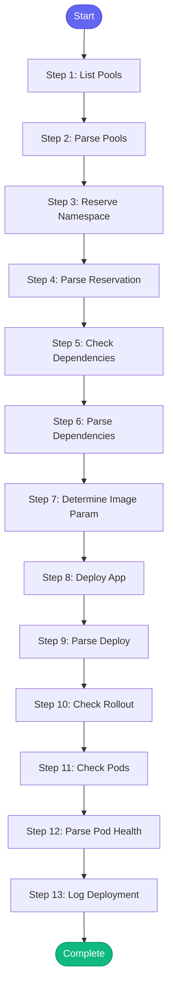

# ⚡ deploy_to_ephemeral

> Deploy application to an ephemeral environment

## Overview

Deploy application to an ephemeral environment.

This skill handles the full deployment workflow:
1. Check available pools and reserve namespace
2. Verify app dependencies
3. Deploy with specified image/parameters
4. Monitor rollout and verify health

Uses: bonfire_pool_list, bonfire_namespace_reserve, bonfire_apps_dependencies,
      bonfire_deploy, kubectl_rollout_status, kubectl_get_pods

**Version:** 1.0

## Quick Start

```bash
skill_run("deploy_to_ephemeral", '{"issue_key": "AAP-12345"}')
```

## Inputs

| Input | Type | Required | Default | Description |
|-------|------|----------|---------|-------------|
| `app` | string | No | `tower-analytics` | Application name to deploy |
| `image_tag` | string | No | `""` | Image tag (git SHA) to deploy. If empty, uses latest. |
| `duration` | string | No | `2h` | Namespace reservation duration |
| `pool` | string | No | `default` | Namespace pool to use |
| `component` | string | No | `main` | Component to deploy (main or billing) |

## Process Flow



## Detailed Steps

### Step 1: List Pools

**Description:** List available namespace pools

**Tool:** `bonfire_pool_list`

### Step 2: Parse Pools

**Description:** Parse pool availability

**Tool:** `compute`

### Step 3: Reserve Namespace

**Description:** Reserve ephemeral namespace

**Tool:** `bonfire_namespace_reserve`

### Step 4: Parse Reservation

**Description:** Extract namespace name from reservation

**Tool:** `compute`

### Step 5: Check Dependencies

**Description:** Check app dependencies

**Tool:** `bonfire_apps_dependencies`

**Condition:** `namespace_info.success`

### Step 6: Parse Dependencies

**Description:** Parse dependency list

**Tool:** `compute`

### Step 7: Determine Image Param

**Description:** Build image parameter if tag provided

**Tool:** `compute`

### Step 8: Deploy App

**Description:** Deploy application to namespace

**Tool:** `bonfire_deploy`

**Condition:** `namespace_info.success`

### Step 9: Parse Deploy

**Description:** Parse deployment result

**Tool:** `compute`

### Step 10: Check Rollout

**Description:** Check deployment rollout status

**Tool:** `kubectl_rollout_status`

**Condition:** `deploy_status.success and namespace_info.namespace`

### Step 11: Check Pods

**Description:** Get pod status

**Tool:** `kubectl_get_pods`

**Condition:** `namespace_info.namespace`

### Step 12: Parse Pod Health

**Description:** Analyze pod health

**Tool:** `compute`

### Step 13: Log Deployment

**Description:** Log deployment to session

**Tool:** `memory_session_log`


## MCP Tools Used (7 total)

- `bonfire_apps_dependencies`
- `bonfire_deploy`
- `bonfire_namespace_reserve`
- `bonfire_pool_list`
- `kubectl_get_pods`
- `kubectl_rollout_status`
- `memory_session_log`

## Related Skills

_(To be determined based on skill relationships)_
