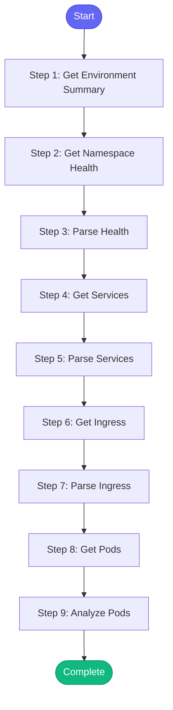

# ⚡ environment_overview

> Get a comprehensive overview of an environment

## Overview

Get a comprehensive overview of an environment.

This skill shows:
- Namespace health
- Service status
- Ingress configuration
- Pod summary

Uses: k8s_environment_summary, k8s_namespace_health, kubectl_get_services,
      kubectl_get_ingress, kubectl_get_pods

**Version:** 1.0

## Quick Start

```bash
skill_run("environment_overview", '{"issue_key": "AAP-12345"}')
```

## Inputs

| Input | Type | Required | Default | Description |
|-------|------|----------|---------|-------------|
| `namespace` | string | ✅ Yes | `-` | Kubernetes namespace |
| `environment` | string | No | `stage` | Environment (stage, production, ephemeral) |

## Process Flow



## Detailed Steps

### Step 1: Get Environment Summary

**Description:** Get environment summary

**Tool:** `k8s_environment_summary`

### Step 2: Get Namespace Health

**Description:** Get namespace health

**Tool:** `k8s_namespace_health`

### Step 3: Parse Health

**Description:** Parse namespace health

**Tool:** `compute`

### Step 4: Get Services

**Description:** List services in namespace

**Tool:** `kubectl_get_services`

### Step 5: Parse Services

**Description:** Parse services

**Tool:** `compute`

### Step 6: Get Ingress

**Description:** Get ingress configuration

**Tool:** `kubectl_get_ingress`

### Step 7: Parse Ingress

**Description:** Parse ingress

**Tool:** `compute`

### Step 8: Get Pods

**Description:** Get pod summary

**Tool:** `kubectl_get_pods`

### Step 9: Analyze Pods

**Description:** Analyze pod health

**Tool:** `compute`


## MCP Tools Used (5 total)

- `k8s_environment_summary`
- `k8s_namespace_health`
- `kubectl_get_ingress`
- `kubectl_get_pods`
- `kubectl_get_services`

## Related Skills

_(To be determined based on skill relationships)_
