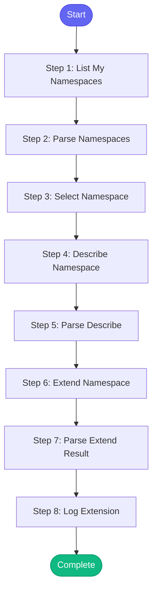

# ⚡ extend_ephemeral

> Extend the duration of an ephemeral namespace reservation

## Overview

Extend the duration of an ephemeral namespace reservation.

Use when:
- Tests are taking longer than expected
- You need more time to debug
- Demo/testing session running long

The skill will:
1. List your current namespaces
2. Get details on the target namespace
3. Extend the reservation
4. Confirm new expiry time

**Version:** 1.0

## Quick Start

```bash
skill_run("extend_ephemeral", '{"issue_key": "AAP-12345"}')
```

## Inputs

| Input | Type | Required | Default | Description |
|-------|------|----------|---------|-------------|
| `namespace` | string | No | `-` | Namespace to extend (will list yours if not specified) |
| `duration` | string | No | `1h` | How much time to add (e.g., '1h', '2h', '4h') |
| `list_only` | boolean | No | `False` | Just list namespaces without extending |

## Process Flow



## Detailed Steps

### Step 1: List My Namespaces

**Description:** List my ephemeral namespaces

**Tool:** `bonfire_namespace_list`

### Step 2: Parse Namespaces

**Description:** Parse namespace list

**Tool:** `compute`

### Step 3: Select Namespace

**Description:** Select namespace to extend

**Tool:** `compute`

### Step 4: Describe Namespace

**Description:** Get namespace details

**Tool:** `bonfire_namespace_describe`

**Condition:** `selected_ns.namespace and not inputs.list_only`

### Step 5: Parse Describe

**Description:** Parse namespace details

**Tool:** `compute`

**Condition:** `ns_describe_raw`

### Step 6: Extend Namespace

**Description:** Extend the namespace reservation

**Tool:** `bonfire_namespace_extend`

**Condition:** `selected_ns.namespace and not inputs.list_only`

### Step 7: Parse Extend Result

**Description:** Parse extend result

**Tool:** `compute`

**Condition:** `extend_result`

### Step 8: Log Extension

**Description:** Log extension to session

**Tool:** `memory_session_log`

**Condition:** `extension_status and extension_status.success`


## MCP Tools Used (4 total)

- `bonfire_namespace_describe`
- `bonfire_namespace_extend`
- `bonfire_namespace_list`
- `memory_session_log`

## Related Skills

_(To be determined based on skill relationships)_
