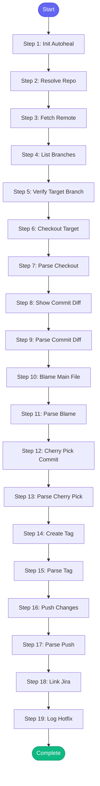

# ⚡ hotfix

> Create a hotfix by cherry-picking a commit to a release branch

## Overview

Create a hotfix by cherry-picking a commit to a release branch.

Use when:
- A bug fix needs to be backported to an older release
- You need to create a patch release quickly
- A fix on main needs to go to a release branch

The skill will:
1. Fetch latest from remote
2. Checkout the target release branch
3. Cherry-pick the specified commit(s)
4. Optionally create a release tag
5. Push to remote

**Version:** 1.0

## Quick Start

```bash
skill_run("hotfix", '{"issue_key": "AAP-12345"}')
```

## Inputs

| Input | Type | Required | Default | Description |
|-------|------|----------|---------|-------------|
| `commit` | string | ✅ Yes | `-` | Commit SHA to cherry-pick (from main branch) |
| `target_branch` | string | ✅ Yes | `-` | Target release branch (e.g., 'release/1.2', 'v1.2-branch') |
| `repo` | string | No | `""` | Repository path (defaults to cwd) |
| `tag` | string | No | `-` | Optional: create a release tag (e.g., 'v1.2.3') |
| `push` | boolean | No | `False` | Push changes to remote after cherry-pick |
| `jira_key` | string | No | `-` | Jira issue key for the hotfix |
| `slack_format` | boolean | No | `False` | Use Slack link format in report |

## Process Flow



## Detailed Steps

### Step 1: Init Autoheal

**Description:** Initialize auto-heal tracking

**Tool:** `compute`

### Step 2: Resolve Repo

**Description:** Determine repository path

**Tool:** `compute`

### Step 3: Fetch Remote

**Description:** Fetch latest from remote

**Tool:** `git_fetch`

### Step 4: List Branches

**Description:** List available branches

**Tool:** `git_branch_list`

### Step 5: Verify Target Branch

**Description:** Verify target branch exists

**Tool:** `compute`

### Step 6: Checkout Target

**Description:** Checkout the target release branch

**Tool:** `git_checkout`

**Condition:** `branch_check.exists`

### Step 7: Parse Checkout

**Description:** Parse checkout result

**Tool:** `compute`

### Step 8: Show Commit Diff

**Description:** Show what the commit changes

**Tool:** `git_diff`

**Condition:** `branch_check.exists`

### Step 9: Parse Commit Diff

**Description:** Parse commit diff

**Tool:** `compute`

### Step 10: Blame Main File

**Description:** Show blame for first changed file

**Tool:** `git_blame`

**Condition:** `commit_changes and commit_changes.file_count > 0`

### Step 11: Parse Blame

**Description:** Parse blame output

**Tool:** `compute`

**Condition:** `blame_raw`

### Step 12: Cherry Pick Commit

**Description:** Cherry-pick the commit

**Tool:** `git_cherry_pick`

**Condition:** `branch_check.exists and checkout_status.success`

### Step 13: Parse Cherry Pick

**Description:** Parse cherry-pick result

**Tool:** `compute`

### Step 14: Create Tag

**Description:** Create release tag

**Tool:** `git_tag`

**Condition:** `inputs.tag and pick_status.success`

### Step 15: Parse Tag

**Description:** Parse tag result

**Tool:** `compute`

**Condition:** `inputs.tag`

### Step 16: Push Changes

**Description:** Push changes and tag to remote

**Tool:** `git_push`

**Condition:** `inputs.push and pick_status.success`

### Step 17: Parse Push

**Description:** Parse push result

**Tool:** `compute`

**Condition:** `inputs.push`

### Step 18: Link Jira

**Description:** Link Jira issue if provided

**Tool:** `jira_add_comment`

**Condition:** `inputs.jira_key and pick_status.success`

### Step 19: Log Hotfix

**Description:** Log hotfix to session

**Tool:** `memory_session_log`

**Condition:** `pick_status.success`


## MCP Tools Used (10 total)

- `git_blame`
- `git_branch_list`
- `git_checkout`
- `git_cherry_pick`
- `git_diff`
- `git_fetch`
- `git_push`
- `git_tag`
- `jira_add_comment`
- `memory_session_log`

## Related Skills

_(To be determined based on skill relationships)_
