# ⚡ investigate_alert

> Quick investigation of a firing Prometheus alert

## Overview

Quick investigation of a firing Prometheus alert.

Steps:
1. Get current firing alerts
2. Quick health check (pods, deployments)
3. Check recent events
4. Look for known patterns
5. Escalate to debug_prod if serious

Use this for quick triage. For deep investigation, use debug_prod directly.

Resolves namespaces and paths from config.json.

**Version:** 2.2

## Quick Start

```bash
skill_run("investigate_alert", '{"issue_key": "AAP-12345"}')
```

## Inputs

| Input | Type | Required | Default | Description |
|-------|------|----------|---------|-------------|
| `environment` | string | ✅ Yes | `-` | Environment to investigate |
| `namespace` | string | No | `-` | Namespace: 'main' or 'billing' (defaults to main) |
| `alert_name` | string | No | `-` | Specific alert to investigate |
| `auto_escalate` | boolean | No | `True` | Auto-run debug_prod if critical issues found |

## Process Flow

```mermaid
flowchart TD
    START([Start])
    STEP1[Step 1: Load Config]
    START --> STEP1
    STEP2[Step 2: Resolve Namespace]
    STEP1 --> STEP2
    STEP3[Step 3: Get Firing Alerts]
    STEP2 --> STEP3
    STEP4[Step 4: Parse Alerts]
    STEP3 --> STEP4
    STEP5[Step 5: Get Namespace Health]
    STEP4 --> STEP5
    STEP6[Step 6: Parse Namespace Health]
    STEP5 --> STEP6
    STEP7[Step 7: Get Pod Status]
    STEP6 --> STEP7
    STEP8[Step 8: Get Resource Usage]
    STEP7 --> STEP8
    STEP9[Step 9: Parse Resource Usage]
    STEP8 --> STEP9
    STEP10[Step 10: Query Error Trend]
    STEP9 --> STEP10
    STEP11[Step 11: Parse Error Trend]
    STEP10 --> STEP11
    STEP12[Step 12: Parse Pod Health]
    STEP11 --> STEP12
    STEP13[Step 13: Get Events]
    STEP12 --> STEP13
    STEP14[Step 14: Parse Events]
    STEP13 --> STEP14
    STEP15[Step 15: Search Kibana Errors]
    STEP14 --> STEP15
    STEP16[Step 16: Parse Kibana Errors]
    STEP15 --> STEP16
    STEP17[Step 17: Get Grafana Link]
    STEP16 --> STEP17
    STEP18[Step 18: Parse Grafana Link]
    STEP17 --> STEP18
    STEP19[Step 19: Check Patterns]
    STEP18 --> STEP19
    STEP20[Step 20: Assess Severity]
    STEP19 --> STEP20
    STEP21[Step 21: Check Existing Silences]
    STEP20 --> STEP21
    STEP22[Step 22: Parse Existing Silences]
    STEP21 --> STEP22
    STEP23[Step 23: Build Silence Info]
    STEP22 --> STEP23
    STEP24[Step 24: Escalate To Debug Prod]
    STEP23 --> STEP24
    STEP25[Step 25: Emit Alert Hooks]
    STEP24 --> STEP25
    STEP26[Step 26: Build Memory Context]
    STEP25 --> STEP26
    STEP27[Step 27: Log Session Investigation]
    STEP26 --> STEP27
    STEP28[Step 28: Update Environment Status]
    STEP27 --> STEP28
    STEP28 --> DONE([Complete])

    style START fill:#6366f1,stroke:#4f46e5,color:#fff
    style DONE fill:#10b981,stroke:#059669,color:#fff
```



## Detailed Steps

### Step 1: Load Config

**Description:** Load namespace configuration

**Tool:** `compute`

### Step 2: Resolve Namespace

**Description:** Determine the target namespace

**Tool:** `compute`

### Step 3: Get Firing Alerts

**Description:** Get currently firing alerts

**Tool:** `prometheus_alerts`

### Step 4: Parse Alerts

**Description:** Parse alert data using shared parser

**Tool:** `compute`

### Step 5: Get Namespace Health

**Description:** Get overall namespace health

**Tool:** `k8s_namespace_health`

### Step 6: Parse Namespace Health

**Description:** Parse namespace health

**Tool:** `compute`

### Step 7: Get Pod Status

**Description:** Get pod status

**Tool:** `kubectl_get_pods`

### Step 8: Get Resource Usage

**Description:** Get CPU/memory usage for pods

**Tool:** `kubectl_top_pods`

### Step 9: Parse Resource Usage

**Description:** Parse resource usage for high consumption

**Tool:** `compute`

### Step 10: Query Error Trend

**Description:** Query error rate trend over last hour

**Tool:** `prometheus_query_range`

### Step 11: Parse Error Trend

**Description:** Analyze error rate trend

**Tool:** `compute`

### Step 12: Parse Pod Health

**Description:** Parse pod health

**Tool:** `compute`

### Step 13: Get Events

**Description:** Get recent warning events

**Tool:** `kubectl_get_events`

### Step 14: Parse Events

**Description:** Parse events

**Tool:** `compute`

### Step 15: Search Kibana Errors

**Description:** Search Kibana for recent errors in namespace

**Tool:** `kibana_search_logs`

### Step 16: Parse Kibana Errors

**Description:** Parse Kibana error results

**Tool:** `compute`

### Step 17: Get Grafana Link

**Description:** Get Grafana dashboard link for namespace

**Tool:** `prometheus_grafana_link`

### Step 18: Parse Grafana Link

**Description:** Extract Grafana URL

**Tool:** `compute`

### Step 19: Check Patterns

**Description:** Match against known error patterns

**Tool:** `compute`

### Step 20: Assess Severity

**Description:** Determine overall severity

**Tool:** `compute`

### Step 21: Check Existing Silences

**Description:** Check if alerts are already silenced

**Tool:** `alertmanager_list_silences`

**Condition:** `alert_info.alerts`

### Step 22: Parse Existing Silences

**Description:** Parse existing silences

**Tool:** `compute`

**Condition:** `existing_silences_raw`

### Step 23: Build Silence Info

**Description:** Build silence recommendation for critical/high alerts

**Tool:** `compute`

**Condition:** `assessment.severity in ['critical', 'high'] and alert_info.alerts`

### Step 24: Escalate To Debug Prod

**Description:** Run full debug_prod for serious issues

**Tool:** `skill_run`

**Condition:** `assessment.needs_escalation and target.is_prod`

### Step 25: Emit Alert Hooks

**Description:** Notify team channel about critical alerts

**Tool:** `compute`

### Step 26: Build Memory Context

**Description:** Build context for memory updates

**Tool:** `compute`

### Step 27: Log Session Investigation

**Description:** Log alert investigation to session

**Tool:** `memory_session_log`

### Step 28: Update Environment Status

**Description:** Update environment status in memory

**Tool:** `compute`


## MCP Tools Used (11 total)

- `alertmanager_list_silences`
- `k8s_namespace_health`
- `kibana_search_logs`
- `kubectl_get_events`
- `kubectl_get_pods`
- `kubectl_top_pods`
- `memory_session_log`
- `prometheus_alerts`
- `prometheus_grafana_link`
- `prometheus_query_range`
- `skill_run`

## Related Skills

_(To be determined based on skill relationships)_
