# 🚨 investigate_alert

> Quick triage of firing Prometheus alerts

## Overview

The `investigate_alert` skill provides rapid triage of Prometheus alerts. It checks pod health, recent events, known patterns, and can escalate to `debug_prod` for deeper investigation.

## Quick Start

```
skill_run("investigate_alert", '{"environment": "production"}')
```

With specific alert:

```
skill_run("investigate_alert", '{"environment": "stage", "alert_name": "HighMemoryUsage"}')
```

## Inputs

| Input | Type | Required | Default | Description |
|-------|------|----------|---------|-------------|
| `environment` | string | ✅ Yes | - | `stage`, `production`, or `prod` |
| `namespace` | string | No | `main` | Namespace: `main` or `billing` |
| `alert_name` | string | No | - | Specific alert to investigate |
| `auto_escalate` | boolean | No | `true` | Auto-run debug_prod if critical |

## Flow

```mermaid
flowchart TD
    START([🚨 Start]) --> CONFIG[Load Config]
    CONFIG --> ENV{Environment}
    
    ENV -->|Stage| NS_STAGE[tower-analytics-stage]
    ENV -->|Prod| NS_PROD[tower-analytics-prod]
    
    NS_STAGE --> ALERTS
    NS_PROD --> ALERTS
    
    ALERTS[Get Firing Alerts] --> FILTER{Alert Name Filter?}
    
    FILTER -->|Yes| SPECIFIC[Focus on Specific Alert]
    FILTER -->|No| ALL[Check All Alerts]
    
    SPECIFIC --> HEALTH
    ALL --> HEALTH
    
    HEALTH[Pod Health Check] --> STATUS[Get Pod Status]
    STATUS --> EVENTS[Check K8s Events]
    EVENTS --> LOGS[Sample Error Logs]
    
    LOGS --> PATTERNS[Match Known Patterns]
    
    PATTERNS --> SEVERITY{Severity?}
    
    SEVERITY -->|Critical| ESCALATE{Auto-escalate?}
    SEVERITY -->|Warning| REPORT[Generate Report]
    SEVERITY -->|OK| CLEAR[All Clear]
    
    ESCALATE -->|Yes| DEBUG[Run debug_prod]
    ESCALATE -->|No| REPORT
    
    DEBUG --> DONE
    REPORT --> DONE([📋 Investigation Complete])
    CLEAR --> DONE
    
    style START fill:#ef4444,stroke:#dc2626,color:#fff
    style DONE fill:#10b981,stroke:#059669,color:#fff
    style DEBUG fill:#f59e0b,stroke:#d97706,color:#fff
```



## Health Checks

| Check | What It Looks For |
|-------|-------------------|
| **Alerts** | Firing alerts from Alertmanager |
| **Pods** | CrashLoopBackOff, OOMKilled, restarts |
| **Events** | Warnings, errors, failed scheduling |
| **Logs** | Error patterns in recent logs |
| **Patterns** | Known issues from memory/runbooks |

## MCP Tools Used

- `alertmanager_alerts` - Get firing alerts
- `kubectl_get_pods` - Pod status
- `kubectl_get_events` - K8s events
- `kubectl_logs` - Container logs
- `prometheus_query` - Metrics

## Known Patterns

The skill checks against learned patterns:

| Pattern | Likely Cause | Quick Fix |
|---------|--------------|-----------|
| OOMKilled | Memory limit exceeded | Increase limits or fix leak |
| CrashLoopBackOff | App crash on startup | Check logs, verify config |
| ImagePullBackOff | Registry auth or missing image | Check Quay, re-login |
| High CPU | Runaway loop or load spike | Check metrics, scale up |

## Example Output

```
You: Investigate production alerts

Claude: 🚨 Investigating production...
        
        ## Active Alerts (2)
        
        | Alert | Severity | Duration | Affected |
        |-------|----------|----------|----------|
        | HighMemoryUsage | critical | 15m | analytics-api |
        | SlowResponses | warning | 8m | analytics-api |
        
        ## Pod Health
        
        | Pod | Status | Restarts | Memory |
        |-----|--------|----------|--------|
        | analytics-api-7d8f9 | Running | 3 | 95% ⚠️ |
        | analytics-worker-abc12 | Running | 0 | 45% |
        | analytics-scheduler-xyz | Running | 0 | 30% |
        
        ## Recent Events
        └── OOMKilled warning for analytics-api (12m ago)
        
        ## Error Logs (last 5m)
        └── OutOfMemoryError in report generation (3 occurrences)
        
        ## 🔍 Analysis
        
        **Root Cause:** Memory exhaustion in analytics-api
        pod causing cascading slow responses.
        
        **Pattern Match:** Known issue - large report queries
        can exhaust memory when unfiltered.
        
        ## 🛠️ Recommended Actions
        
        1. **Immediate:** Restart analytics-api-7d8f9 pod
        2. **Investigate:** Check which report triggered this
        3. **Long-term:** Add query limits to report endpoint
        
        Escalating to debug_prod for deeper analysis...
```

## Related Skills

- [debug_prod](./debug_prod.md) - Deep production debugging
- [investigate_slack_alert](./investigate_slack_alert.md) - Handle Slack alerts


