# ⚡ investigate_slack_alert

> Investigate Prometheus alerts from Slack and create/link Jira issues

## Overview

Investigate Prometheus alerts from Slack and create/link Jira issues.

## Trigger
Called when a message from app-sre-alerts is detected in alert channels:
- C01CPSKFG0P (stage alerts)
- C01L1K82AP5 (prod alerts)

## Behavior
1. Immediately reply to acknowledge ("Looking into this...")
2. Parse alert name, namespace, severity from Slack message
3. Check pod status and logs for errors
4. Search for existing Jira issues matching the alert
5. If no match, create a new Jira issue
6. For billing alerts: use special "BillingEvent XXXXX" format
7. Reply with Jira link and investigation summary

## Billing Alert Special Handling
Billing alerts (containing "billing", "subscription", "vcpu", etc.) get:
- Higher priority
- Special Jira format: "BillingEvent XXXXX - [Processor] Error: ..."
- Numbered sequentially from existing billing events

**Version:** 1.0

## Quick Start

```bash
skill_run("investigate_slack_alert", '{"issue_key": "AAP-12345"}')
```

## Inputs

| Input | Type | Required | Default | Description |
|-------|------|----------|---------|-------------|
| `channel_id` | string | ✅ Yes | `-` | Slack channel ID where alert was posted |
| `message_ts` | string | ✅ Yes | `-` | Slack message timestamp (for threading replies) |
| `message_text` | string | ✅ Yes | `-` | The alert message content (HTML or text) |
| `alert_url` | string | No | `-` | URL to AlertManager (extracted from message) |

## Process Flow

```mermaid
flowchart TD
    START([Start])
    STEP1[Step 1: Init Autoheal]
    START --> STEP1
    STEP2[Step 2: Load Config]
    STEP1 --> STEP2
    STEP3[Step 3: Parse Alert Message]
    STEP2 --> STEP3
    STEP4[Step 4: Acknowledge Alert]
    STEP3 --> STEP4
    STEP5[Step 5: Get Kubeconfig]
    STEP4 --> STEP5
    STEP6[Step 6: Check Pods]
    STEP5 --> STEP6
    STEP7[Step 7: Analyze Pod Status]
    STEP6 --> STEP7
    STEP8[Step 8: Get Recent Errors]
    STEP7 --> STEP8
    STEP9[Step 9: Extract Error Patterns]
    STEP8 --> STEP9
    STEP10[Step 10: Search Existing Jira]
    STEP9 --> STEP10
    STEP11[Step 11: Search Billing Issues]
    STEP10 --> STEP11
    STEP12[Step 12: Analyze Existing Issues]
    STEP11 --> STEP12
    STEP13[Step 13: Build Jira Summary]
    STEP12 --> STEP13
    STEP14[Step 14: Build Jira Description]
    STEP13 --> STEP14
    STEP15[Step 15: Create Jira Issue]
    STEP14 --> STEP15
    STEP16[Step 16: Get Jira Key]
    STEP15 --> STEP16
    STEP17[Step 17: Build Response]
    STEP16 --> STEP17
    STEP18[Step 18: Reply With Findings]
    STEP17 --> STEP18
    STEP19[Step 19: Update Environment Status]
    STEP18 --> STEP19
    STEP20[Step 20: Log Slack Investigation]
    STEP19 --> STEP20
    STEP20 --> DONE([Complete])

    style START fill:#6366f1,stroke:#4f46e5,color:#fff
    style DONE fill:#10b981,stroke:#059669,color:#fff
```



## Detailed Steps

### Step 1: Init Autoheal

**Description:** Initialize failure tracking

**Tool:** `compute`

### Step 2: Load Config

**Description:** Load alert channel configuration

**Tool:** `compute`

### Step 3: Parse Alert Message

**Description:** Extract alert details from Slack message using shared parser

**Tool:** `compute`

### Step 4: Acknowledge Alert

**Description:** Reply to Slack thread to acknowledge we're looking into it

**Tool:** `slack_send_message`

### Step 5: Get Kubeconfig

**Description:** Determine correct kubeconfig for environment

**Tool:** `compute`

### Step 6: Check Pods

**Description:** Get pod status in the affected namespace

**Tool:** `kubectl_get_pods`

### Step 7: Analyze Pod Status

**Description:** Identify unhealthy pods using shared parser

**Tool:** `compute`

### Step 8: Get Recent Errors

**Description:** Get recent error logs from processor pods

**Tool:** `kubectl_logs`

**Condition:** `{{ pod_analysis.get('error_pods') or alert_info.get('alert_name', '').lower().find('processor') >= 0 }}`

### Step 9: Extract Error Patterns

**Description:** Extract error patterns from logs using shared parser

**Tool:** `compute`

### Step 10: Search Existing Jira

**Description:** Search for existing Jira issues matching this alert

**Tool:** `jira_search`

### Step 11: Search Billing Issues

**Description:** Search for billing event issues if this is a billing alert

**Tool:** `jira_search`

**Condition:** `{{ alert_info.is_billing }}`

### Step 12: Analyze Existing Issues

**Description:** Determine if we have a matching issue or need to create one using shared parsers

**Tool:** `compute`

### Step 13: Build Jira Summary

**Description:** Build the Jira issue summary

**Tool:** `compute`

**Condition:** `{{ not jira_analysis.has_existing }}`

### Step 14: Build Jira Description

**Description:** Build the Jira issue description

**Tool:** `compute`

**Condition:** `{{ not jira_analysis.has_existing }}`

### Step 15: Create Jira Issue

**Description:** Create a new Jira issue for this alert

**Tool:** `jira_create_issue`

**Condition:** `{{ not jira_analysis.has_existing }}`

### Step 16: Get Jira Key

**Description:** Extract the Jira issue key using shared parser

**Tool:** `compute`

### Step 17: Build Response

**Description:** Build the Slack response with findings

**Tool:** `compute`

### Step 18: Reply With Findings

**Description:** Reply to Slack with investigation findings

**Tool:** `slack_send_message`

### Step 19: Update Environment Status

**Description:** Update environment status after investigation

**Tool:** `compute`

### Step 20: Log Slack Investigation

**Description:** Log Slack alert investigation to session

**Tool:** `memory_session_log`


## MCP Tools Used (6 total)

- `jira_create_issue`
- `jira_search`
- `kubectl_get_pods`
- `kubectl_logs`
- `memory_session_log`
- `slack_send_message`

## Related Skills

_(To be determined based on skill relationships)_
