# 🚨 investigate_slack_alert

> Handle Prometheus alerts received via Slack

## Overview

The `investigate_slack_alert` skill processes Prometheus alert messages from Slack, investigates the issue, and creates or links Jira issues for tracking.

## Trigger

This skill is triggered automatically by the Slack daemon when it detects an alert message in monitored channels.

## Flow

```mermaid
flowchart TD
    START([🚨 Alert Message]) --> PARSE[Parse Alert Details]
    
    PARSE --> EXTRACT[Extract Alert Info]
    EXTRACT --> ENV[Determine Environment]
    ENV --> NS[Determine Namespace]
    
    NS --> ACK[Acknowledge in Slack]
    ACK --> INVESTIGATE[Run Investigation]
    
    INVESTIGATE --> PODS[Check Pod Status]
    PODS --> LOGS[Get Error Logs]
    LOGS --> EVENTS[Check K8s Events]
    
    EVENTS --> BILLING{Billing Alert?}
    
    BILLING -->|Yes| BILLING_FLOW[Special Billing Flow]
    BILLING -->|No| NORMAL[Normal Flow]
    
    BILLING_FLOW --> SEARCH_BILLING[Search Existing Billing Issues]
    SEARCH_BILLING --> FOUND_BILLING{Found?}
    FOUND_BILLING -->|Yes| LINK_BILLING[Link Existing Issue]
    FOUND_BILLING -->|No| CREATE_BILLING[Create New Billing Issue]
    
    NORMAL --> SEARCH[Search Existing Issues]
    SEARCH --> FOUND{Found?}
    FOUND -->|Yes| LINK[Link Existing Issue]
    FOUND -->|No| CREATE[Create New Issue]
    
    LINK --> RESPOND
    CREATE --> RESPOND
    LINK_BILLING --> RESPOND
    CREATE_BILLING --> RESPOND
    
    RESPOND[Respond in Slack Thread] --> DONE([✅ Alert Handled])
    
    style START fill:#ef4444,stroke:#dc2626,color:#fff
    style DONE fill:#10b981,stroke:#059669,color:#fff
    style ACK fill:#3b82f6,stroke:#2563eb,color:#fff
```



## Alert Detection

The skill identifies alerts by:

- Channel ID (configured in `config.json`)
- Message format (Prometheus alert structure)
- Keywords: "FIRING", "alert", severity indicators

## Billing Alert Handling

Billing alerts get special treatment:

1. **Search pattern:** `BillingEvent XXXXX - Processor`
2. **Auto-increment:** Find highest issue number, increment
3. **Title format:** `BillingEvent 00002 - Processor] Error: Processing skipped`
4. **Include:** Slack thread link in issue

## MCP Tools Used

- `kubectl_get_pods` - Pod status
- `kubectl_logs` - Error logs
- `kubectl_get_events` - K8s events
- `jira_search` - Find existing issues
- `jira_create_issue` - Create tracking issue
- `slack_send_message` - Respond in thread

## Example Interaction

```
# Prometheus Alert in #alerts-aa
[FIRING:1] HighMemoryUsage
Namespace: tower-analytics-prod
Pod: analytics-api-7d8f9
Value: 95%

# Bot Response (in thread)
👀 Looking into this alert...

🔍 Investigation Summary:
- Pod: analytics-api-7d8f9 (95% memory)
- Status: Running, 3 restarts in last hour
- Recent logs: OutOfMemoryError in ReportProcessor

📋 Linked to existing issue: AAP-61245
   "High memory usage in analytics-api"
   https://issues.redhat.com/browse/AAP-61245

🛠️ Suggested action: Consider restarting pod
   or increasing memory limits.
```

## Configuration

In `config.json`:

```json
{
  "slack": {
    "alert_channels": {
      "C07TN7T5KV1": {
        "name": "prometheus-alerts",
        "environment": "stage"
      },
      "C07V3QQCKPV": {
        "name": "automation-analytics-alerts", 
        "environment": "production"
      }
    }
  }
}
```

## Related Skills

- [investigate_alert](./investigate_alert.md) - Manual alert triage
- [debug_prod](./debug_prod.md) - Deep investigation


