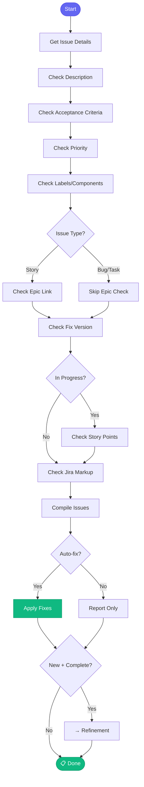

# 📋 jira_hygiene

> Validate and fix Jira issue quality

## Overview

The `jira_hygiene` skill validates that a Jira issue has all required fields properly filled out, and can auto-fix common issues.

## Quick Start

```
skill_run("jira_hygiene", '{"issue_key": "AAP-12345"}')
```

With auto-fix:

```
skill_run("jira_hygiene", '{"issue_key": "AAP-12345", "auto_fix": true}')
```

## Inputs

| Input | Type | Required | Default | Description |
|-------|------|----------|---------|-------------|
| `issue_key` | string | ✅ Yes | - | Jira issue key |
| `auto_fix` | boolean | No | `false` | Auto-fix issues |
| `auto_transition` | boolean | No | `false` | Auto-transition New→Refinement |

## Flow



## Checks Performed

| Check | Required For | Auto-Fixable |
|-------|--------------|--------------|
| Description | All | ⚠️ Template only |
| Acceptance Criteria | Stories | ⚠️ Template only |
| Priority | All | ✅ Default to Medium |
| Labels | All | ❌ |
| Components | All | ❌ |
| Epic Link | Stories | ❌ |
| Fix Version | All | ❌ |
| Story Points | In Progress Stories | ❌ |
| Jira Markup | All | ✅ Convert from Markdown |

## MCP Tools Used

- `jira_view_issue` - Get issue details
- `jira_view_issue_json` - Get raw fields
- `jira_update_issue` - Apply fixes

## Example Output

```
You: Check hygiene for AAP-12345

Claude: 📋 Jira Hygiene Check: AAP-12345
        
        Issue: "Implement new REST API endpoint"
        Type: Story | Status: New
        
        ────────────────────────────────
        
        ## Checks
        
        | Field | Status | Issue |
        |-------|--------|-------|
        | Description | ✅ | - |
        | Acceptance Criteria | ✅ | - |
        | Priority | ⚠️ | Not set |
        | Labels | ✅ | analytics |
        | Components | ✅ | Backend |
        | Epic Link | ❌ | Missing |
        | Fix Version | ⚠️ | Not set |
        
        ────────────────────────────────
        
        ## Summary
        
        - ✅ 4 checks passed
        - ⚠️ 2 warnings (fixable)
        - ❌ 1 error (needs manual fix)
        
        **Auto-fixable:** Priority (→ Medium)
        
        **Needs manual fix:**
        - Epic Link: Add to appropriate epic
```

## Related Skills

- [create_mr](./create_mr.md) - Runs hygiene before MR
- [start_work](./start_work.md) - Check when starting


