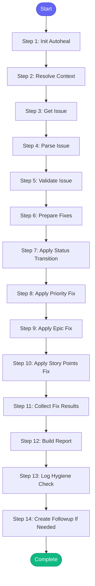

# ⚡ jira_hygiene

> Check and fix Jira issue hygiene - ensures issues have proper details,
acceptance criteria, priority, labels, epic links, and formatting

## Overview

Check and fix Jira issue hygiene - ensures issues have proper details,
acceptance criteria, priority, labels, epic links, and formatting.
Transitions New issues to Refinement when complete.

Resolves project and component from issue_key prefix or repo_name.

**Version:** 1.2

## Quick Start

```bash
skill_run("jira_hygiene", '{"issue_key": "AAP-12345"}')
```

## Inputs

| Input | Type | Required | Default | Description |
|-------|------|----------|---------|-------------|
| `issue_key` | string | ✅ Yes | `-` | Jira issue key to check (e.g., AAP-12345) |
| `repo_name` | string | No | `-` | Repository name from config to determine component |
| `auto_fix` | boolean | No | `True` | Automatically fix issues where possible |
| `auto_transition` | boolean | No | `True` | Auto-transition New → Refinement when ready |
| `epic_key` | string | No | `-` | Epic key to link issue to (e.g., AAP-50000). If provided with auto_fix, will set epic. |
| `story_points` | integer | No | `-` | Story points to set (e.g., 3). If provided with auto_fix, will set points. |
| `priority` | string | No | `-` | Priority to set (e.g., 'Major'). If provided with auto_fix, will set priority. |

## Process Flow



## Detailed Steps

### Step 1: Init Autoheal

**Description:** Initialize failure tracking

**Tool:** `compute`

### Step 2: Resolve Context

**Description:** Determine Jira project and default component from issue key

**Tool:** `compute`

### Step 3: Get Issue

**Description:** Fetch issue details from Jira

**Tool:** `jira_view_issue_json`

### Step 4: Parse Issue

**Description:** Parse issue fields for validation using shared parser

**Tool:** `compute`

### Step 5: Validate Issue

**Description:** Check issue against hygiene rules

**Tool:** `compute`

### Step 6: Prepare Fixes

**Description:** Determine which fixes to apply automatically

**Tool:** `compute`

**Condition:** `{{ inputs.auto_fix }}`

### Step 7: Apply Status Transition

**Description:** Transition issue status to Refinement

**Tool:** `jira_set_status`

**Condition:** `{{ fixes_to_apply.status }}`

### Step 8: Apply Priority Fix

**Description:** Set missing priority

**Tool:** `jira_set_priority`

**Condition:** `{{ fixes_to_apply.priority }}`

### Step 9: Apply Epic Fix

**Description:** Link issue to epic

**Tool:** `jira_set_epic`

**Condition:** `{{ fixes_to_apply.epic }}`

### Step 10: Apply Story Points Fix

**Description:** Set story points

**Tool:** `jira_set_story_points`

**Condition:** `{{ fixes_to_apply.story_points }}`

### Step 11: Collect Fix Results

**Description:** Summarize what was fixed

**Tool:** `compute`

### Step 12: Build Report

**Tool:** `compute`

### Step 13: Log Hygiene Check

**Description:** Log hygiene check to session

**Tool:** `memory_session_log`

### Step 14: Create Followup If Needed

**Description:** Create follow-up task if issues need manual input

**Tool:** `compute`

**Condition:** `validation.needs_input`


## MCP Tools Used (6 total)

- `jira_set_epic`
- `jira_set_priority`
- `jira_set_status`
- `jira_set_story_points`
- `jira_view_issue_json`
- `memory_session_log`

## Related Skills

_(To be determined based on skill relationships)_
