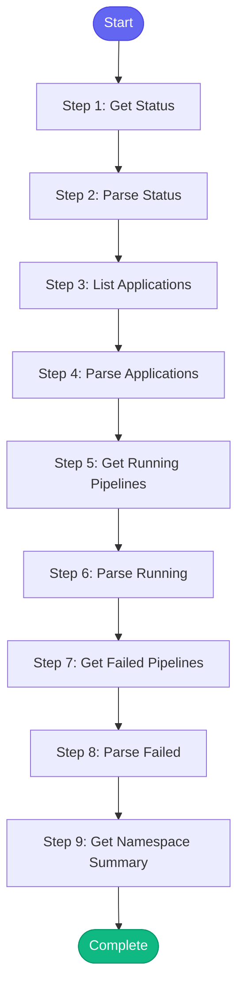

# ⚡ konflux_status

> Get overall Konflux build system status

## Overview

Get overall Konflux build system status.

This skill shows:
- Application status
- Running pipelines
- Failed pipelines
- Namespace summary

Uses: konflux_status, konflux_list_applications, konflux_namespace_summary,
      konflux_running_pipelines, konflux_failed_pipelines

**Version:** 1.0

## Quick Start

```bash
skill_run("konflux_status", '{"issue_key": "AAP-12345"}')
```

## Inputs

| Input | Type | Required | Default | Description |
|-------|------|----------|---------|-------------|
| `namespace` | string | No | `aap-aa-tenant` | Konflux namespace |
| `application` | string | No | `""` | Specific application to check (optional) |

## Process Flow



## Detailed Steps

### Step 1: Get Status

**Description:** Get Konflux overall status

**Tool:** `konflux_status`

### Step 2: Parse Status

**Description:** Parse status

**Tool:** `compute`

### Step 3: List Applications

**Description:** List applications in namespace

**Tool:** `konflux_list_applications`

### Step 4: Parse Applications

**Description:** Parse application list

**Tool:** `compute`

### Step 5: Get Running Pipelines

**Description:** Get running pipelines

**Tool:** `konflux_running_pipelines`

### Step 6: Parse Running

**Description:** Parse running pipelines

**Tool:** `compute`

### Step 7: Get Failed Pipelines

**Description:** Get failed pipelines

**Tool:** `konflux_failed_pipelines`

### Step 8: Parse Failed

**Description:** Parse failed pipelines

**Tool:** `compute`

### Step 9: Get Namespace Summary

**Description:** Get namespace summary

**Tool:** `konflux_namespace_summary`


## MCP Tools Used (5 total)

- `konflux_failed_pipelines`
- `konflux_list_applications`
- `konflux_namespace_summary`
- `konflux_running_pipelines`
- `konflux_status`

## Related Skills

_(To be determined based on skill relationships)_
