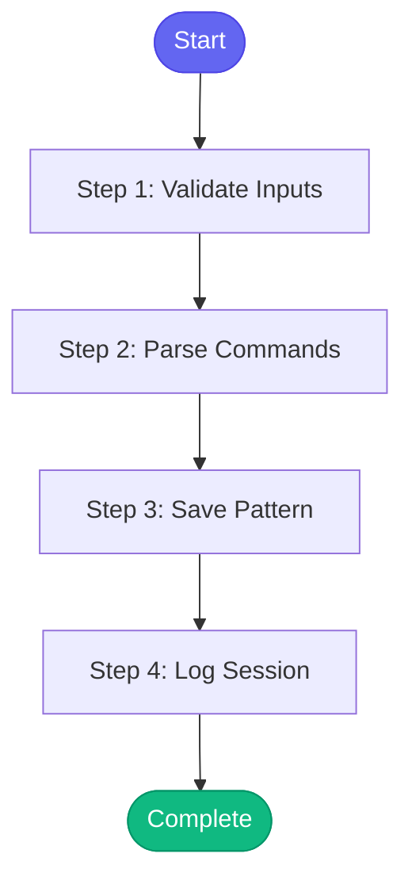

# ⚡ learn_pattern

> Save a new error pattern to memory

## Overview

Save a new error pattern to memory.

When you discover a new error pattern and its fix, use this skill
to remember it for future debugging sessions.

The pattern is saved to memory/learned/patterns.yaml and will be
automatically matched during investigate_alert and debug_prod skills.

**Version:** 1.0

## Quick Start

```bash
skill_run("learn_pattern", '{"issue_key": "AAP-12345"}')
```

## Inputs

| Input | Type | Required | Default | Description |
|-------|------|----------|---------|-------------|
| `pattern` | string | ✅ Yes | `-` | Short name for the pattern (e.g., 'OOMKilled', 'ImagePullBackOff') |
| `meaning` | string | ✅ Yes | `-` | What this error means (e.g., 'Container exceeded memory limit') |
| `fix` | string | ✅ Yes | `-` | How to fix this error (e.g., 'Increase memory limits in deployment') |
| `commands` | string | No | `-` | Comma-separated commands to run for diagnosis (e.g., 'kubectl describe pod X,kubectl logs X') |
| `category` | string | No | `general` | Category: pod_errors, log_patterns, network, general |

## Process Flow



## Detailed Steps

### Step 1: Validate Inputs

**Description:** Validate inputs

**Tool:** `compute`

### Step 2: Parse Commands

**Description:** Parse comma-separated commands

**Tool:** `compute`

**Condition:** `validation.valid`

### Step 3: Save Pattern

**Description:** Save pattern to memory

**Tool:** `compute`

**Condition:** `validation.valid`

### Step 4: Log Session

**Description:** Log pattern learning to session

**Tool:** `memory_session_log`

**Condition:** `save_result.success`


## MCP Tools Used (1 total)

- `memory_session_log`

## Related Skills

_(To be determined based on skill relationships)_
