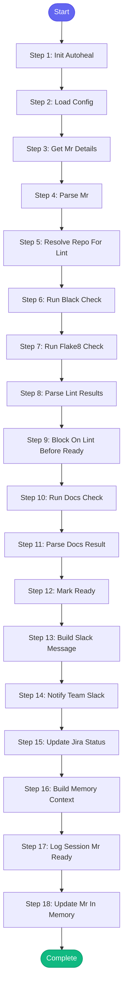

# ⚡ mark_mr_ready

> Mark a draft merge request as ready for review

## Overview

Mark a draft merge request as ready for review.
- Removes draft status from the MR
- Posts to team Slack channel asking for review
- Optionally updates Jira status to "In Review"

**Version:** 1.0

## Quick Start

```bash
skill_run("mark_mr_ready", '{"issue_key": "AAP-12345"}')
```

## Inputs

| Input | Type | Required | Default | Description |
|-------|------|----------|---------|-------------|
| `mr_id` | string | ✅ Yes | `-` | MR ID (e.g., '1459' or '!1459') |
| `project` | string | No | `automation-analytics/automation-analytics-backend` | GitLab project path |
| `issue_key` | string | No | `-` | Jira issue key to update status (e.g., AAP-12345) |
| `update_jira` | boolean | No | `True` | Update Jira status to In Review |
| `run_linting` | boolean | No | `True` | Run linting checks before marking MR ready |
| `repo` | string | No | `""` | Repository path for linting (auto-detected if not provided) |
| `check_docs` | boolean | No | `True` | Check documentation before marking ready (if docs.check_on_mr=true in config) |

## Process Flow



## Detailed Steps

### Step 1: Init Autoheal

**Description:** Initialize failure tracking

**Tool:** `compute`

### Step 2: Load Config

**Tool:** `compute`

### Step 3: Get Mr Details

**Description:** Get current MR details

**Tool:** `gitlab_mr_view`

### Step 4: Parse Mr

**Tool:** `compute`

### Step 5: Resolve Repo For Lint

**Description:** Resolve repo path for linting

**Tool:** `compute`

**Condition:** `inputs.run_linting`

### Step 6: Run Black Check

**Description:** Check code formatting before marking ready

**Tool:** `code_format`

**Condition:** `inputs.run_linting and lint_repo and lint_repo.get('path')`

### Step 7: Run Flake8 Check

**Description:** Run flake8 linting before marking ready

**Tool:** `code_lint`

**Condition:** `inputs.run_linting and lint_repo and lint_repo.get('path')`

### Step 8: Parse Lint Results

**Description:** Parse lint results

**Tool:** `compute`

**Condition:** `inputs.run_linting and lint_repo and lint_repo.get('path')`

### Step 9: Block On Lint Before Ready

**Description:** Block marking ready if lint fails

**Tool:** `compute`

**Condition:** `inputs.run_linting and lint_result and not lint_result.get('passed', True)`

### Step 10: Run Docs Check

**Description:** Check documentation before marking ready

**Tool:** `skill_run`

**Condition:** `inputs.check_docs and lint_repo and lint_repo.get('path')`

### Step 11: Parse Docs Result

**Description:** Parse documentation check results

**Tool:** `compute`

**Condition:** `inputs.check_docs`

### Step 12: Mark Ready

**Description:** Remove draft status from MR

**Tool:** `gitlab_mr_update`

### Step 13: Build Slack Message

**Description:** Build Slack message with proper team mention

**Tool:** `compute`

**Condition:** `'Updated' in str(update_result) or 'success' in str(update_result).lower()`

### Step 14: Notify Team Slack

**Description:** Post to team channel asking for review

**Tool:** `slack_post_team`

**Condition:** `slack_message`

### Step 15: Update Jira Status

**Description:** Move Jira to In Review

**Tool:** `jira_set_status`

**Condition:** `inputs.update_jira and mr_info.jira_key`

### Step 16: Build Memory Context

**Description:** Build timestamp for memory

**Tool:** `compute`

### Step 17: Log Session Mr Ready

**Description:** Log MR ready to session log

**Tool:** `memory_session_log`

**Condition:** `'Updated' in str(update_result)`

### Step 18: Update Mr In Memory

**Description:** Update MR status in memory to needs_review

**Tool:** `memory_update`

**Condition:** `'Updated' in str(update_result)`


## MCP Tools Used (9 total)

- `code_format`
- `code_lint`
- `gitlab_mr_update`
- `gitlab_mr_view`
- `jira_set_status`
- `memory_session_log`
- `memory_update`
- `skill_run`
- `slack_post_team`

## Related Skills

_(To be determined based on skill relationships)_
