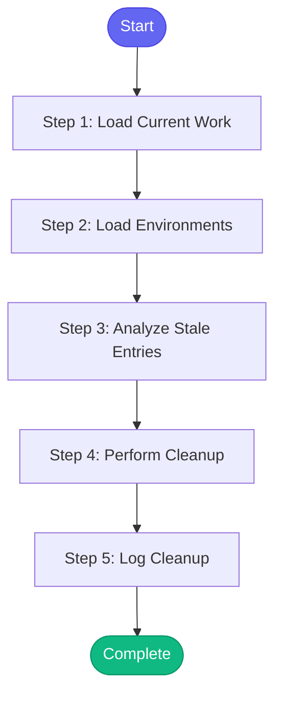

# ⚡ memory_cleanup

> Clean up stale entries from memory

## Overview

Clean up stale entries from memory.

Removes:
- Closed issues that are still in active_issues
- Merged MRs that are still in open_mrs
- Expired ephemeral namespaces
- Old session logs (older than 7 days)

Use with --dry-run to preview what would be removed.

**Version:** 1.0

## Quick Start

```bash
skill_run("memory_cleanup", '{"issue_key": "AAP-12345"}')
```

## Inputs

| Input | Type | Required | Default | Description |
|-------|------|----------|---------|-------------|
| `dry_run` | boolean | No | `True` | Preview changes without applying them (default: true) |
| `days` | integer | No | `7` | Remove session logs older than this many days (default: 7) |

## Process Flow



## Detailed Steps

### Step 1: Load Current Work

**Description:** Load current work state from memory

**Tool:** `memory_read`

### Step 2: Load Environments

**Description:** Load environment state from memory

**Tool:** `memory_read`

### Step 3: Analyze Stale Entries

**Description:** Find stale entries that should be removed

**Tool:** `compute`

### Step 4: Perform Cleanup

**Description:** Remove stale entries from memory

**Tool:** `compute`

**Condition:** `not inputs.dry_run and analysis.total > 0`

### Step 5: Log Cleanup

**Description:** Log cleanup to session

**Tool:** `memory_session_log`

**Condition:** `not inputs.dry_run and analysis.total > 0`


## MCP Tools Used (2 total)

- `memory_read`
- `memory_session_log`

## Related Skills

_(To be determined based on skill relationships)_
