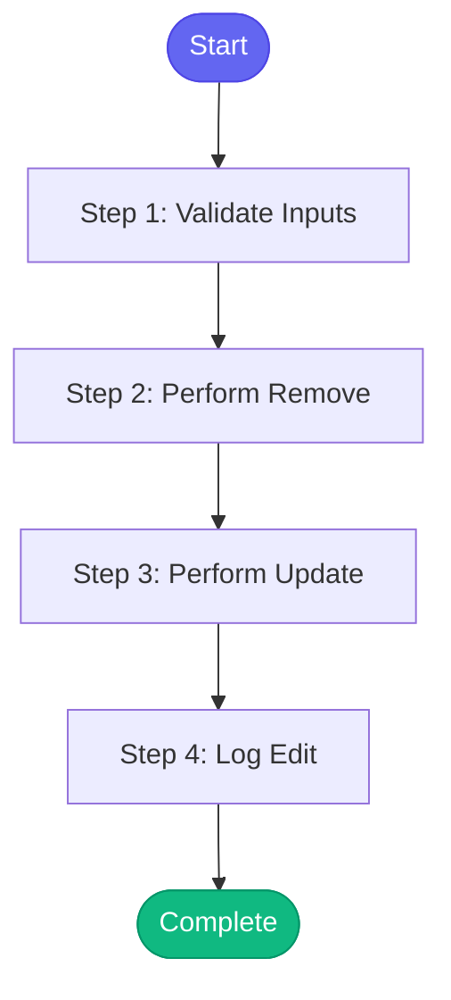

# ⚡ memory_edit

> Modify or remove entries from memory

## Overview

Modify or remove entries from memory.

Actions:
- remove: Remove an item from a list (e.g., remove closed issue from active_issues)
- update: Update a field value

Use memory_view to inspect memory before editing.
Use memory_cleanup for automatic cleanup of stale entries.

**Version:** 1.0

## Quick Start

```bash
skill_run("memory_edit", '{"issue_key": "AAP-12345"}')
```

## Inputs

| Input | Type | Required | Default | Description |
|-------|------|----------|---------|-------------|
| `file` | string | ✅ Yes | `-` | Memory file to edit (e.g., 'state/current_work', 'learned/patterns') |
| `action` | string | ✅ Yes | `-` | Action: 'remove' or 'update' |
| `list_path` | string | No | `-` | Path to list for remove action (e.g., 'active_issues', 'open_mrs') |
| `match_key` | string | No | `-` | Key to match for remove action (e.g., 'key' for issues, 'id' for MRs) |
| `match_value` | string | No | `-` | Value to match for remove action (e.g., 'AAP-12345', '123') |
| `field_path` | string | No | `-` | Dot-separated path for update action (e.g., 'environments.stage.status') |
| `new_value` | string | No | `-` | New value for update action |

## Process Flow



## Detailed Steps

### Step 1: Validate Inputs

**Description:** Validate inputs based on action

**Tool:** `compute`

### Step 2: Perform Remove

**Description:** Remove item from list in memory

**Tool:** `compute`

**Condition:** `validation.valid and validation.action == 'remove'`

### Step 3: Perform Update

**Description:** Update field in memory

**Tool:** `compute`

**Condition:** `validation.valid and validation.action == 'update'`

### Step 4: Log Edit

**Description:** Log memory edit to session

**Tool:** `memory_session_log`

**Condition:** `(remove_result and remove_result.success) or (update_result and update_result.success)`


## MCP Tools Used (1 total)

- `memory_session_log`

## Related Skills

_(To be determined based on skill relationships)_
