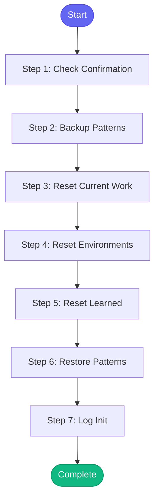

# ⚡ memory_init

> Initialize or reset memory files to a clean state

## Overview

Initialize or reset memory files to a clean state.

Use this for:
- Fresh start on a new project/sprint
- Clearing stale data after extended absence
- Setting up memory on a new machine

By default, preserves learned patterns and runbooks.
Use reset_learned=true to also reset those.

**Version:** 1.0

## Quick Start

```bash
skill_run("memory_init", '{"issue_key": "AAP-12345"}')
```

## Inputs

| Input | Type | Required | Default | Description |
|-------|------|----------|---------|-------------|
| `confirm` | boolean | ✅ Yes | `-` | Must be true to proceed (safety check) |
| `reset_learned` | boolean | No | `False` | Also reset learned patterns and runbooks (default: false) |
| `preserve_patterns` | boolean | No | `True` | Keep learned patterns even if reset_learned is true |

## Process Flow



## Detailed Steps

### Step 1: Check Confirmation

**Description:** Verify user confirmed the action

**Tool:** `compute`

### Step 2: Backup Patterns

**Description:** Backup patterns if preserving them

**Tool:** `compute`

**Condition:** `confirmation.proceed and inputs.preserve_patterns`

### Step 3: Reset Current Work

**Description:** Reset current work state

**Tool:** `compute`

**Condition:** `confirmation.proceed`

### Step 4: Reset Environments

**Description:** Reset environment state

**Tool:** `compute`

**Condition:** `confirmation.proceed`

### Step 5: Reset Learned

**Description:** Reset learned memory (patterns, runbooks, etc)

**Tool:** `compute`

**Condition:** `confirmation.proceed and inputs.reset_learned`

### Step 6: Restore Patterns

**Description:** Restore patterns from backup if preserved

**Tool:** `compute`

**Condition:** `confirmation.proceed and inputs.reset_learned and inputs.preserve_patterns and patterns_backup`

### Step 7: Log Init

**Description:** Log initialization to session

**Tool:** `memory_session_log`

**Condition:** `confirmation.proceed`


## MCP Tools Used (1 total)

- `memory_session_log`

## Related Skills

_(To be determined based on skill relationships)_
