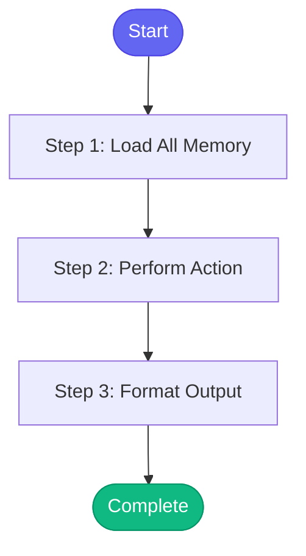

# ⚡ memory_view

> View and manage the persistent memory system

## Overview

View and manage the persistent memory system.

Shows:
- Active issues you're working on
- Open MRs and their status
- Follow-up tasks
- Environment health summary
- Recent session activity

Actions:
- Clear completed items
- Add follow-up tasks
- View learned patterns

**Version:** 1.0

## Quick Start

```bash
skill_run("memory_view", '{"issue_key": "AAP-12345"}')
```

## Inputs

| Input | Type | Required | Default | Description |
|-------|------|----------|---------|-------------|
| `section` | string | No | `all` | Which section to view:
- all: Everything
- work: Active issues and MRs
- followups: Follow-up tasks
- environments: Environment health
- patterns: Learned error patterns
- sessions: Recent session logs
 |
| `action` | string | No | `-` | Optional action to perform:
- clear_completed: Remove completed items
- add_followup: Add a follow-up task (requires followup_text)
- clear_old_sessions: Remove sessions older than 7 days
 |
| `followup_text` | string | No | `-` | Text for new follow-up task (used with action=add_followup) |
| `followup_priority` | string | No | `normal` | Priority for new follow-up: high, medium, normal |
| `slack_format` | boolean | No | `False` | Use Slack link format |

## Process Flow



## Detailed Steps

### Step 1: Load All Memory

**Description:** Load all memory files

**Tool:** `compute`

### Step 2: Perform Action

**Description:** Perform any requested action

**Tool:** `compute`

**Condition:** `inputs.action`

### Step 3: Format Output

**Description:** Format memory view output

**Tool:** `compute`


## MCP Tools Used (0 total)

No external tools (compute-only skill)

## Related Skills

_(To be determined based on skill relationships)_
