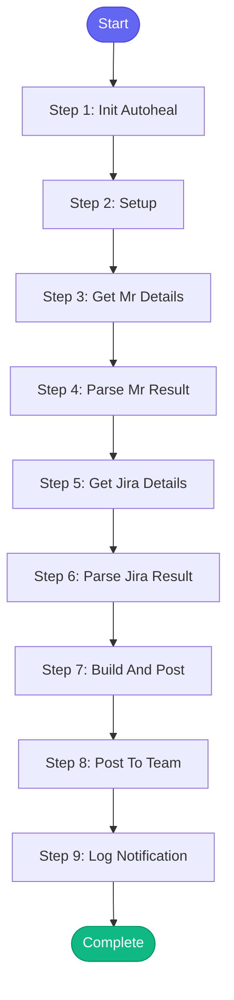

# ⚡ notify_mr

> Notify the team Slack channel about an existing MR that's ready for review

## Overview

Notify the team Slack channel about an existing MR that's ready for review.

Use this when:
- You created a draft MR and it's now ready
- You want to remind the team about a pending review
- You marked an MR as ready after initial work

Uses MCP tools: gitlab_mr_view, jira_view_issue, slack_post_team

**Version:** 1.0

## Quick Start

```bash
skill_run("notify_mr", '{"issue_key": "AAP-12345"}')
```

## Inputs

| Input | Type | Required | Default | Description |
|-------|------|----------|---------|-------------|
| `mr_id` | string | No | `-` | GitLab MR IID (e.g., 1459). If not provided, will try to find from current branch. |
| `project` | string | No | `""` | GitLab project path (e.g., 'automation-analytics/automation-analytics-backend') |
| `issue_key` | string | No | `""` | Jira issue key for additional context |
| `message` | string | No | `""` | Custom message to include (optional) |
| `reminder` | boolean | No | `False` | If true, formats as a reminder rather than new MR notification |
| `slack_format` | boolean | No | `False` | Use Slack link format in summary |

## Process Flow



## Detailed Steps

### Step 1: Init Autoheal

**Description:** Initialize failure tracking

**Tool:** `compute`

### Step 2: Setup

**Description:** Load configuration and resolve inputs

**Tool:** `compute`

### Step 3: Get Mr Details

**Description:** Get MR details from GitLab

**Tool:** `gitlab_mr_view`

### Step 4: Parse Mr Result

**Description:** Parse MR details from glab output

**Tool:** `compute`

### Step 5: Get Jira Details

**Description:** Get Jira issue details for context

**Tool:** `jira_view_issue`

**Condition:** `mr.get('issue_key')`

### Step 6: Parse Jira Result

**Description:** Parse Jira issue summary

**Tool:** `compute`

### Step 7: Build And Post

**Description:** Build Slack message and post to team channel

**Tool:** `compute`

### Step 8: Post To Team

**Description:** Post notification to team channel

**Tool:** `slack_post_team`

### Step 9: Log Notification

**Description:** Log notification to session

**Tool:** `memory_session_log`


## MCP Tools Used (4 total)

- `gitlab_mr_view`
- `jira_view_issue`
- `memory_session_log`
- `slack_post_team`

## Related Skills

_(To be determined based on skill relationships)_
