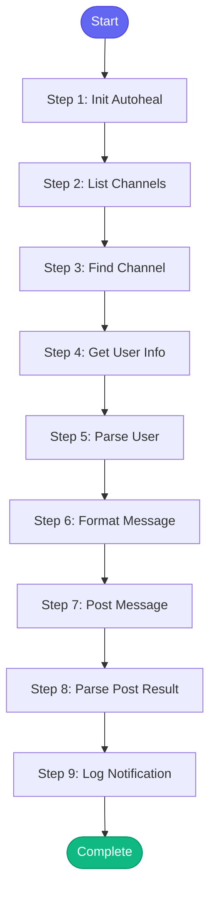

# ⚡ notify_team

> Send notifications to Slack channels for key workflow events

## Overview

Send notifications to Slack channels for key workflow events.

Use for:
- Deployment completed notifications
- MR ready for review
- Alert resolved
- Release announcements
- General team updates

The skill will:
1. Find the appropriate channel
2. Format the message nicely
3. Post to Slack
4. Optionally mention specific users

**Version:** 1.0

## Quick Start

```bash
skill_run("notify_team", '{"issue_key": "AAP-12345"}')
```

## Inputs

| Input | Type | Required | Default | Description |
|-------|------|----------|---------|-------------|
| `message` | string | ✅ Yes | `-` | Message to send |
| `channel` | string | No | `team-automation-analytics` | Slack channel name (without #) |
| `type` | string | No | `info` | Message type: 'info', 'success', 'warning', 'error', 'deployment', 'release' |
| `mention` | string | No | `-` | User to mention (Slack username or email) |
| `thread_ts` | string | No | `-` | Thread timestamp to reply to (for threaded messages) |
| `context` | string | No | `-` | Additional context (e.g., MR ID, namespace, issue key) |

## Process Flow



## Detailed Steps

### Step 1: Init Autoheal

**Description:** Initialize failure tracking

**Tool:** `compute`

### Step 2: List Channels

**Description:** List available Slack channels

**Tool:** `slack_list_channels`

### Step 3: Find Channel

**Description:** Find the target channel

**Tool:** `compute`

### Step 4: Get User Info

**Description:** Get Slack user info for mentions

**Tool:** `slack_get_user`

**Condition:** `inputs.mention`

### Step 5: Parse User

**Description:** Parse user info for mention

**Tool:** `compute`

**Condition:** `inputs.mention`

### Step 6: Format Message

**Description:** Format the Slack message with emoji and structure

**Tool:** `compute`

### Step 7: Post Message

**Description:** Post the message to Slack

**Tool:** `slack_post_message`

### Step 8: Parse Post Result

**Description:** Parse post result

**Tool:** `compute`

### Step 9: Log Notification

**Description:** Log notification to session

**Tool:** `memory_session_log`

**Condition:** `post_status.success`


## MCP Tools Used (4 total)

- `memory_session_log`
- `slack_get_user`
- `slack_list_channels`
- `slack_post_message`

## Related Skills

_(To be determined based on skill relationships)_
