# ⚡ rebase_pr

> Rebase a PR branch onto main to clean up merge commits

## Overview

Rebase a PR branch onto main to clean up merge commits.

If 'repo_path' is not provided, resolves from issue_key or repo_name via config.

Steps:
1. Check for merge commits on the PR
2. Checkout the branch locally
3. Pull latest from remote
4. Rebase onto main
5. If conflicts: guide user through resolution
6. Force push rebased branch

Handles merge conflicts by pausing and showing what needs to be fixed.

**Version:** 1.2

## Quick Start

```bash
skill_run("rebase_pr", '{"issue_key": "AAP-12345"}')
```

## Inputs

| Input | Type | Required | Default | Description |
|-------|------|----------|---------|-------------|
| `mr_id` | integer | No | `-` | GitLab MR ID - will find the branch |
| `issue_key` | string | No | `-` | Jira issue key - will find the branch and resolve repo |
| `branch` | string | No | `-` | Branch name directly (if known) |
| `repo_path` | string | No | `""` | Path to repository - if not provided, resolved from issue_key or repo_name |
| `repo_name` | string | No | `-` | Repository name from config (e.g., 'automation-analytics-backend') |
| `base_branch` | string | No | `""` | Branch to rebase onto (default: repo's default_branch from config) |
| `force_push` | boolean | No | `False` | Auto force-push after successful rebase (asks if false) |
| `run_linting` | boolean | No | `True` | Run linting (black/flake8) before pushing (default: true) |

## Process Flow

```mermaid
flowchart TD
    START([Start])
    STEP1[Step 1: Init Autoheal]
    START --> STEP1
    STEP2[Step 2: Resolve Repo]
    STEP1 --> STEP2
    STEP3[Step 3: Validate Input]
    STEP2 --> STEP3
    STEP4[Step 4: Get Branch From Mr]
    STEP3 --> STEP4
    STEP5[Step 5: List Branches]
    STEP4 --> STEP5
    STEP6[Step 6: Extract Branch]
    STEP5 --> STEP6
    STEP7[Step 7: Fetch All]
    STEP6 --> STEP7
    STEP8[Step 8: Get Merge Commits]
    STEP7 --> STEP8
    STEP9[Step 9: Get Total Commits]
    STEP8 --> STEP9
    STEP10[Step 10: Check Merge Commits]
    STEP9 --> STEP10
    STEP11[Step 11: Check Status]
    STEP10 --> STEP11
    STEP12[Step 12: Stash Changes]
    STEP11 --> STEP12
    STEP13[Step 13: Checkout Branch]
    STEP12 --> STEP13
    STEP14[Step 14: Checkout Fallback]
    STEP13 --> STEP14
    STEP15[Step 15: Pull Latest]
    STEP14 --> STEP15
    STEP16[Step 16: Sync With Remote]
    STEP15 --> STEP16
    STEP17[Step 17: Sync Status]
    STEP16 --> STEP17
    STEP18[Step 18: Update Base]
    STEP17 --> STEP18
    STEP19[Step 19: Start Rebase]
    STEP18 --> STEP19
    STEP20[Step 20: Parse Rebase Result]
    STEP19 --> STEP20
    STEP21[Step 21: Analyze And Resolve Conflicts]
    STEP20 --> STEP21
    STEP22[Step 22: Stage Resolved Files]
    STEP21 --> STEP22
    STEP23[Step 23: Continue Rebase If Resolved]
    STEP22 --> STEP23
    STEP24[Step 24: Check New Conflicts]
    STEP23 --> STEP24
    STEP25[Step 25: Parse Continue Result]
    STEP24 --> STEP25
    STEP26[Step 26: Update Rebase Result]
    STEP25 --> STEP26
    STEP27[Step 27: Run Flake8]
    STEP26 --> STEP27
    STEP28[Step 28: Run Black Check]
    STEP27 --> STEP28
    STEP29[Step 29: Check Lint Results]
    STEP28 --> STEP29
    STEP30[Step 30: Check Branch Protection]
    STEP29 --> STEP30
    STEP31[Step 31: Analyze Protection]
    STEP30 --> STEP31
    STEP32[Step 32: Force Push]
    STEP31 --> STEP32
    STEP33[Step 33: Build Summary]
    STEP32 --> STEP33
    STEP34[Step 34: Emit Rebase Hook]
    STEP33 --> STEP34
    STEP35[Step 35: Log Rebase]
    STEP34 --> STEP35
    STEP36[Step 36: Session Log Rebase]
    STEP35 --> STEP36
    STEP36 --> DONE([Complete])

    style START fill:#6366f1,stroke:#4f46e5,color:#fff
    style DONE fill:#10b981,stroke:#059669,color:#fff
```



## Detailed Steps

### Step 1: Init Autoheal

**Description:** Initialize failure tracking

**Tool:** `compute`

### Step 2: Resolve Repo

**Description:** Determine which repo and GitLab project to use

**Tool:** `compute`

### Step 3: Validate Input

**Description:** Ensure we have a way to identify the branch

**Tool:** `compute`

### Step 4: Get Branch From Mr

**Description:** Get branch name from MR

**Tool:** `gitlab_mr_view`

**Condition:** `inputs.get('mr_id') and not inputs.get('branch')`

### Step 5: List Branches

**Description:** List all branches for issue key lookup

**Tool:** `git_branch_list`

**Condition:** `inputs.get('issue_key') and not inputs.get('branch')`

### Step 6: Extract Branch

**Description:** Extract branch name from MR or issue key using shared parsers

**Tool:** `compute`

### Step 7: Fetch All

**Description:** Fetch latest from all remotes

**Tool:** `git_fetch`

### Step 8: Get Merge Commits

**Description:** Get merge commits on the branch

**Tool:** `git_log`

### Step 9: Get Total Commits

**Description:** Get total commit count

**Tool:** `git_log`

### Step 10: Check Merge Commits

**Description:** Parse merge commit info using shared parser

**Tool:** `compute`

### Step 11: Check Status

**Description:** Check for uncommitted changes

**Tool:** `git_status`

### Step 12: Stash Changes

**Description:** Stash any local changes

**Tool:** `git_stash`

**Condition:** `git_status_raw and ('Changes not staged' in str(git_status_raw) or 'Changes to be committed' in str(git_status_raw))`

### Step 13: Checkout Branch

**Description:** Checkout the target branch

**Tool:** `git_checkout`

### Step 14: Checkout Fallback

**Description:** Fallback: force checkout from remote if local failed

**Tool:** `git_checkout`

**Condition:** `checkout_result and 'error' in str(checkout_result).lower()`

### Step 15: Pull Latest

**Description:** Pull latest from remote

**Tool:** `git_pull`

### Step 16: Sync With Remote

**Description:** Reset to remote if pull failed

**Tool:** `git_reset`

**Condition:** `pull_result_raw and 'error' in str(pull_result_raw).lower()`

### Step 17: Sync Status

**Description:** Record sync status

**Tool:** `compute`

### Step 18: Update Base

**Description:** Fetch base branch from remote

**Tool:** `git_fetch`

### Step 19: Start Rebase

**Description:** Start the rebase onto base branch

**Tool:** `git_rebase`

### Step 20: Parse Rebase Result

**Description:** Parse rebase output into structured result using shared parser

**Tool:** `compute`

### Step 21: Analyze And Resolve Conflicts

**Description:** Analyze conflicts and auto-resolve obvious ones

**Tool:** `compute`

**Condition:** `rebase_result.get('conflicts')`

### Step 22: Stage Resolved Files

**Description:** Stage auto-resolved conflict files

**Tool:** `git_add`

**Condition:** `conflict_resolution and conflict_resolution.get('auto_resolved')`

### Step 23: Continue Rebase If Resolved

**Description:** Continue rebase if all conflicts auto-resolved

**Tool:** `git_rebase`

**Condition:** `conflict_resolution and conflict_resolution.get('all_resolved')`

### Step 24: Check New Conflicts

**Description:** Check if new conflicts emerged after continue

**Tool:** `git_status`

**Condition:** `continue_raw and 'conflict' in str(continue_raw).lower()`

### Step 25: Parse Continue Result

**Description:** Parse the rebase continue result

**Tool:** `compute`

**Condition:** `conflict_resolution and conflict_resolution.get('all_resolved')`

### Step 26: Update Rebase Result

**Description:** Update rebase result after auto-resolution

**Tool:** `compute`

**Condition:** `continue_result`

### Step 27: Run Flake8

**Description:** Run flake8 linting on changed files

**Tool:** `lint_python`

**Condition:** `(rebase_result.get('success') or (final_rebase_result and final_rebase_result.get('success'))) and inputs.get('run_linting', True)`

### Step 28: Run Black Check

**Description:** Run black formatting check on changed files

**Tool:** `lint_python`

**Condition:** `(rebase_result.get('success') or (final_rebase_result and final_rebase_result.get('success'))) and inputs.get('run_linting', True)`

### Step 29: Check Lint Results

**Description:** Check if linting passed

**Tool:** `compute`

**Condition:** `(rebase_result.get('success') or (final_rebase_result and final_rebase_result.get('success'))) and inputs.get('run_linting', True)`

### Step 30: Check Branch Protection

**Description:** Dry-run to check if force push is allowed

**Tool:** `git_push`

**Condition:** `(rebase_result.get('success') or (final_rebase_result and final_rebase_result.get('success'))) and inputs.force_push`

### Step 31: Analyze Protection

**Description:** Check dry-run result for protection issues

**Tool:** `compute`

**Condition:** `(rebase_result.get('success') or (final_rebase_result and final_rebase_result.get('success'))) and inputs.force_push`

### Step 32: Force Push

**Description:** Force push rebased branch

**Tool:** `git_push`

**Condition:** `(rebase_result.get('success') or (final_rebase_result and final_rebase_result.get('success'))) and inputs.force_push and (not protection_check or protection_check.get('allowed', True)) and (not lint_check or lint_check.get('passed', True))
`

### Step 33: Build Summary

**Description:** Build result summary

**Tool:** `compute`

### Step 34: Emit Rebase Hook

**Description:** Notify author about rebase result

**Tool:** `compute`

### Step 35: Log Rebase

**Description:** Log rebase to session

**Tool:** `compute`

### Step 36: Session Log Rebase

**Description:** Log rebase to session

**Tool:** `memory_session_log`


## MCP Tools Used (14 total)

- `git_add`
- `git_branch_list`
- `git_checkout`
- `git_fetch`
- `git_log`
- `git_pull`
- `git_push`
- `git_rebase`
- `git_reset`
- `git_stash`
- `git_status`
- `gitlab_mr_view`
- `lint_python`
- `memory_session_log`

## Related Skills

_(To be determined based on skill relationships)_
