# 🔄 rebase_pr

> Rebase a PR branch onto main with conflict resolution

## Overview

The `rebase_pr` skill performs a thorough rebase of a PR branch onto main, automatically resolving obvious conflicts and guiding you through complex ones.

## Quick Start

```
skill_run("rebase_pr", '{"mr_id": 123}')
```

Or by issue:

```
skill_run("rebase_pr", '{"issue_key": "AAP-12345"}')
```

## Inputs

| Input | Type | Required | Default | Description |
|-------|------|----------|---------|-------------|
| `mr_id` | integer | No* | - | GitLab MR ID |
| `issue_key` | string | No* | - | Jira issue key |
| `branch` | string | No* | - | Branch name directly |
| `base_branch` | string | No | `main` | Branch to rebase onto |
| `force_push` | boolean | No | `false` | Auto force-push when done |

*One of `mr_id`, `issue_key`, or `branch` is required

## Flow

```mermaid
flowchart TD
    START([Start]) --> FIND[Find Branch]
    FIND --> CHECK_MERGE[Check for Merge Commits]
    CHECK_MERGE --> STASH[Stash Local Changes]
    STASH --> CHECKOUT[Checkout Branch]
    CHECKOUT --> PULL[Pull Latest]
    PULL --> REBASE[Rebase onto main]
    
    REBASE --> CONFLICT{Conflicts?}
    
    CONFLICT -->|No| PUSH[Force Push]
    CONFLICT -->|Yes| ANALYZE[Analyze Conflicts]
    
    ANALYZE --> TYPE{Conflict Type?}
    
    TYPE -->|Obvious| AUTO[Auto-Resolve]
    TYPE -->|Complex| SHOW[Show to User]
    
    AUTO --> CONTINUE[git rebase --continue]
    SHOW --> USER[User Resolves]
    USER --> ADD[git add files]
    ADD --> CONTINUE
    
    CONTINUE --> CONFLICT
    
    PUSH --> DONE([✅ Rebased])
    
    style START fill:#6366f1,stroke:#4f46e5,color:#fff
    style DONE fill:#10b981,stroke:#059669,color:#fff
    style AUTO fill:#10b981,stroke:#059669,color:#fff
    style SHOW fill:#f59e0b,stroke:#d97706,color:#fff
```



## Auto-Resolution Strategies

| Conflict Type | Action | Example |
|--------------|--------|---------|
| **Ours empty** | Accept theirs | New file added on main |
| **Theirs empty** | Keep ours | File deleted on main |
| **Identical** | Remove markers | Same change both sides |
| **Whitespace** | Accept theirs | Formatting only |
| **Subset** | Merge content | One side adds, one modifies |
| **Complex** | ⚠️ Ask user | Different changes same lines |

## MCP Tools Used

- `git_branch_list` - Find branches
- `git_fetch` - Update refs
- `git_stash` - Save/restore changes
- `git_checkout` - Switch branches
- `git_pull` - Update branch
- `git_rebase` - Perform rebase
- `git_status` - Check conflicts
- `git_push` - Push result

## Example Output

```
You: Rebase PR 123

Claude: 🔄 Rebasing MR !123...
        
        📋 Branch: aap-61214-feature
        📊 Behind main: 12 commits
        📊 Ahead of main: 5 commits
        
        🔄 Rebasing onto main...
        
        ⚠️ Conflicts detected in 3 files
        
        🤖 Auto-Resolved: 2 file(s)
        ├── ✅ src/config.py (accept_theirs - new config option)
        └── ✅ tests/test_api.py (whitespace_only)
        
        🙋 Needs Your Help: 1 file(s)
        └── ⚠️ src/api/views.py (3 conflicts)
            Complex changes on both sides
        
        ## 🛠️ To Complete
        
        1. Edit src/api/views.py (look for <<<<<<< markers)
        2. git add src/api/views.py
        3. git rebase --continue
        4. git push --force-with-lease origin aap-61214-feature
```

## Related Skills

- [sync_branch](./sync_branch.md) - Quick daily sync
- [create_mr](./create_mr.md) - Create MR (checks conflicts first)


