# ⚡ release_aa_backend_prod

> Release Automation Analytics backend to production

## Overview

Release Automation Analytics backend to production.
This skill guides you through the promotion process from stage to production
by updating the commit SHA in app-interface and creating a PR for approval.

Resolves paths and Quay images from config.json.

**Version:** 1.2

## Quick Start

```bash
skill_run("release_aa_backend_prod", '{"issue_key": "AAP-12345"}')
```

## Inputs

| Input | Type | Required | Default | Description |
|-------|------|----------|---------|-------------|
| `commit_sha` | string | ✅ Yes | `-` | Full SHA1 commit to release (must exist in automation-analytics-backend repo and have image in Quay) |
| `release_date` | string | No | `{{ today }}` | Release date for Jira title (YYYY-MM-DD format, defaults to today) |
| `include_billing` | boolean | No | `False` | Also promote the billing component to production |

## Process Flow

```mermaid
flowchart TD
    START([Start])
    STEP1[Step 1: Init Autoheal]
    START --> STEP1
    STEP2[Step 2: Load Config]
    STEP1 --> STEP2
    STEP3[Step 3: Verify Commit Exists]
    STEP2 --> STEP3
    STEP4[Step 4: Verify Quay Image]
    STEP3 --> STEP4
    STEP5[Step 5: Get Current Prod Sha]
    STEP4 --> STEP5
    STEP6[Step 6: Get Changelog Log]
    STEP5 --> STEP6
    STEP7[Step 7: Format Changelog]
    STEP6 --> STEP7
    STEP8[Step 8: Create Jira Issue]
    STEP7 --> STEP8
    STEP9[Step 9: Check Appinterface Status]
    STEP8 --> STEP9
    STEP10[Step 10: Validate Clean Repo]
    STEP9 --> STEP10
    STEP11[Step 11: Checkout Master]
    STEP10 --> STEP11
    STEP12[Step 12: Fetch Upstream]
    STEP11 --> STEP12
    STEP13[Step 13: Rebase Upstream]
    STEP12 --> STEP13
    STEP14[Step 14: List Existing Branches]
    STEP13 --> STEP14
    STEP15[Step 15: Create Branch Name]
    STEP14 --> STEP15
    STEP16[Step 16: Create Release Branch]
    STEP15 --> STEP16
    STEP17[Step 17: Set Branch Name]
    STEP16 --> STEP17
    STEP18[Step 18: Update Prod Ref]
    STEP17 --> STEP18
    STEP19[Step 19: Update Billing Ref]
    STEP18 --> STEP19
    STEP20[Step 20: Stage Changes]
    STEP19 --> STEP20
    STEP21[Step 21: Build Commit Message]
    STEP20 --> STEP21
    STEP22[Step 22: Commit Changes]
    STEP21 --> STEP22
    STEP23[Step 23: Push Branch]
    STEP22 --> STEP23
    STEP24[Step 24: Build Mr Title]
    STEP23 --> STEP24
    STEP25[Step 25: Create Mr]
    STEP24 --> STEP25
    STEP26[Step 26: Update Jira With Mr]
    STEP25 --> STEP26
    STEP27[Step 27: Emit Release Started Hook]
    STEP26 --> STEP27
    STEP28[Step 28: Log Release]
    STEP27 --> STEP28
    STEP29[Step 29: Session Log Release]
    STEP28 --> STEP29
    STEP29 --> DONE([Complete])

    style START fill:#6366f1,stroke:#4f46e5,color:#fff
    style DONE fill:#10b981,stroke:#059669,color:#fff
```



## Detailed Steps

### Step 1: Init Autoheal

**Description:** Initialize failure tracking

**Tool:** `compute`

### Step 2: Load Config

**Description:** Load release configuration from config.json

**Tool:** `compute`

### Step 3: Verify Commit Exists

**Description:** Verify the commit SHA exists in automation-analytics-backend

**Tool:** `git_log`

### Step 4: Verify Quay Image

**Description:** Verify the container image exists in Quay.io

**Tool:** `quay_get_tag`

### Step 5: Get Current Prod Sha

**Description:** Read current production SHA from app-interface using shared parser

**Tool:** `compute`

### Step 6: Get Changelog Log

**Description:** Get list of commits being released

**Tool:** `git_log`

### Step 7: Format Changelog

**Description:** Format changelog output

**Tool:** `compute`

### Step 8: Create Jira Issue

**Description:** Create Jira story for tracking this release

**Tool:** `jira_create_issue`

### Step 9: Check Appinterface Status

**Description:** Check app-interface repo status

**Tool:** `git_status`

### Step 10: Validate Clean Repo

**Description:** Ensure no uncommitted changes

**Tool:** `unknown`

### Step 11: Checkout Master

**Description:** Switch to master branch

**Tool:** `git_checkout`

### Step 12: Fetch Upstream

**Description:** Fetch latest from upstream

**Tool:** `git_fetch`

### Step 13: Rebase Upstream

**Description:** Rebase on upstream master

**Tool:** `git_rebase`

### Step 14: List Existing Branches

**Description:** Check for existing release branches

**Tool:** `git_branch_list`

### Step 15: Create Branch Name

**Description:** Determine branch name (handle existing versions)

**Tool:** `compute`

### Step 16: Create Release Branch

**Description:** Create branch for this release

**Tool:** `git_checkout`

### Step 17: Set Branch Name

**Tool:** `compute`

### Step 18: Update Prod Ref

**Description:** Update production namespace ref to new SHA using shared parser

**Tool:** `compute`

### Step 19: Update Billing Ref

**Description:** Update billing production namespace ref (if requested) using shared parser

**Tool:** `compute`

**Condition:** `{{ inputs.include_billing }}`

### Step 20: Stage Changes

**Description:** Stage the deploy file changes

**Tool:** `git_add`

### Step 21: Build Commit Message

**Description:** Build commit message following commit lint rules

**Tool:** `compute`

### Step 22: Commit Changes

**Description:** Commit the release changes following commit lint rules

**Tool:** `git_commit`

### Step 23: Push Branch

**Description:** Push release branch to origin

**Tool:** `git_push`

### Step 24: Build Mr Title

**Description:** Build MR title using config.json commit format

**Tool:** `compute`

### Step 25: Create Mr

**Description:** Create merge request for team approval

**Tool:** `gitlab_mr_create`

### Step 26: Update Jira With Mr

**Description:** Add MR link to Jira issue

**Tool:** `jira_add_comment`

**Condition:** `{{ jira_issue }}`

### Step 27: Emit Release Started Hook

**Description:** Notify team channel about release

**Tool:** `compute`

**Condition:** `mr_result`

### Step 28: Log Release

**Description:** Log release to session and track deployment

**Tool:** `compute`

### Step 29: Session Log Release

**Description:** Log release to session

**Tool:** `memory_session_log`


## MCP Tools Used (14 total)

- `git_add`
- `git_branch_list`
- `git_checkout`
- `git_commit`
- `git_fetch`
- `git_log`
- `git_push`
- `git_rebase`
- `git_status`
- `gitlab_mr_create`
- `jira_add_comment`
- `jira_create_issue`
- `memory_session_log`
- `quay_get_tag`

## Related Skills

_(To be determined based on skill relationships)_
