# 📦 release_aa_backend_prod

> Release Automation Analytics backend to production

## Overview

The `release_aa_backend_prod` skill handles the full production release workflow via app-interface. It verifies images, creates release issues, and prepares the MR for deployment.

## Quick Start

```
skill_run("release_aa_backend_prod", '{"commit_sha": "abc123def456789..."}')
```

With billing:

```
skill_run("release_aa_backend_prod", '{"commit_sha": "abc123...", "include_billing": true}')
```

## Inputs

| Input | Type | Required | Default | Description |
|-------|------|----------|---------|-------------|
| `commit_sha` | string | ✅ Yes | - | Full commit SHA to release |
| `release_date` | string | No | today | Release date for Jira |
| `include_billing` | boolean | No | `false` | Also update billing namespace |

## Flow

```mermaid
flowchart TD
    START([Start]) --> VERIFY_COMMIT[Verify Commit Exists]
    VERIFY_COMMIT --> VERIFY_IMAGE[Verify Image in Quay]
    
    VERIFY_IMAGE --> EXISTS{Image Ready?}
    EXISTS -->|No| ERROR[❌ Build First]
    EXISTS -->|Yes| CURRENT[Get Current Prod SHA]
    
    CURRENT --> DIFF[Generate Release Summary]
    DIFF --> COMMITS["Commits since last release"]
    
    COMMITS --> JIRA[Create Jira Issue]
    JIRA --> TITLE["YYYY-MM-DD Analytics HCC Service Release"]
    
    TITLE --> CHECKOUT[Checkout app-interface]
    CHECKOUT --> BRANCH[Create Release Branch]
    BRANCH --> UPDATE[Update deploy-clowder.yml]
    
    UPDATE --> YAML["tower-analytics-prod.yml ref: NEW_SHA"]
    
    YAML --> BILLING{Include Billing?}
    BILLING -->|Yes| UPDATE_BILLING[Update billing ref too]
    BILLING -->|No| COMMIT
    UPDATE_BILLING --> COMMIT
    
    COMMIT[Commit Changes] --> PUSH[Push Branch]
    PUSH --> MR[Create GitLab MR]
    MR --> LINK[Link MR to Jira]
    
    LINK --> AWAIT([⏳ Await Team Approval])
    
    style START fill:#6366f1,stroke:#4f46e5,color:#fff
    style AWAIT fill:#f59e0b,stroke:#d97706,color:#fff
    style ERROR fill:#ef4444,stroke:#dc2626,color:#fff
```



## Files Modified

```
app-interface/data/services/insights/tower-analytics/cicd/deploy-clowder.yml
```

Update:
```yaml
# tower-analytics-prod.yml
ref: NEW_COMMIT_SHA

# If include_billing:
# tower-analytics-prod-billing.yml  
ref: NEW_COMMIT_SHA
```

## MCP Tools Used

- `git_log` - Verify commit
- `quay_get_tag` - Verify image
- `jira_create_issue` - Create release issue
- `git_checkout` - Checkout app-interface
- `git_branch_create` - Create release branch
- `git_commit` - Commit changes
- `git_push` - Push branch
- `gitlab_mr_create` - Create MR

## Example Output

```
You: Release abc123def456 to production

Claude: 📦 Preparing production release...
        
        ✅ Commit verified: abc123def456789...
        ✅ Image found in Quay
        
        ## Release Summary
        
        **From:** def789abc123... (current prod)
        **To:** abc123def456...
        
        **Commits included (5):**
        - AAP-61214: feat(api): Add validation
        - AAP-61220: fix(db): Handle nulls
        - AAP-61225: docs: Update API guide
        - AAP-61230: perf: Optimize queries
        - AAP-61235: test: Add integration tests
        
        ✅ Created Jira: AAP-61250
           "2025-01-15 Analytics HCC Service Release"
        
        ✅ Created app-interface MR: !789
           Branch: release-2025-01-15-abc123
        
        ## Next Steps
        
        1. Get team approval on MR !789
        2. Merge when approved
        3. SRE will deploy
        4. Verify in production
        
        Release MR: https://gitlab.../app-interface/-/merge_requests/789
```

## ⚠️ Warning

This skill modifies production configuration. Always:

1. Verify the commit SHA is correct
2. Check the release summary
3. Get team approval before merging
4. Monitor after deployment

## Related Skills

- [test_mr_ephemeral](./test_mr_ephemeral.md) - Test before releasing
- [investigate_alert](./investigate_alert.md) - Debug after release


