# ⚡ release_to_prod

> Create a Konflux release to push images from staging to production

## Overview

Create a Konflux release to push images from staging to production.

This skill handles the full release workflow:
1. Verify the image exists in staging (redhat-user-workloads)
2. Check current release status in Konflux
3. Get component information
4. Create the release to production
5. Monitor release status

Prerequisites:
- Image must be built and available in Quay staging
- User must have Konflux access

**Version:** 1.0

## Quick Start

```bash
skill_run("release_to_prod", '{"issue_key": "AAP-12345"}')
```

## Inputs

| Input | Type | Required | Default | Description |
|-------|------|----------|---------|-------------|
| `commit_sha` | string | ✅ Yes | `-` | Git commit SHA to release (40-char full SHA) |
| `component` | string | No | `automation-analytics-backend-main` | Konflux component name |
| `namespace` | string | No | `aap-aa-tenant` | Konflux tenant namespace |
| `application` | string | No | `aap-aa-main` | Konflux application name |
| `dry_run` | boolean | No | `False` | If true, just show what would be released without creating |

## Process Flow

```mermaid
flowchart TD
    START([Start])
    STEP1[Step 1: Validate Sha]
    START --> STEP1
    STEP2[Step 2: Check Staging Image]
    STEP1 --> STEP2
    STEP3[Step 3: Parse Staging Check]
    STEP2 --> STEP3
    STEP4[Step 4: Scan Vulnerabilities]
    STEP3 --> STEP4
    STEP5[Step 5: Parse Vulnerabilities]
    STEP4 --> STEP5
    STEP6[Step 6: Get Component]
    STEP5 --> STEP6
    STEP7[Step 7: List Components]
    STEP6 --> STEP7
    STEP8[Step 8: Parse Component Info]
    STEP7 --> STEP8
    STEP9[Step 9: List Releases]
    STEP8 --> STEP9
    STEP10[Step 10: Get Latest Release]
    STEP9 --> STEP10
    STEP11[Step 11: Parse Releases]
    STEP10 --> STEP11
    STEP12[Step 12: Validate Appinterface]
    STEP11 --> STEP12
    STEP13[Step 13: Parse Appinterface Validation]
    STEP12 --> STEP13
    STEP14[Step 14: Create Release]
    STEP13 --> STEP14
    STEP15[Step 15: Parse Release Result]
    STEP14 --> STEP15
    STEP16[Step 16: Log Release]
    STEP15 --> STEP16
    STEP17[Step 17: Create Grafana Annotation]
    STEP16 --> STEP17
    STEP18[Step 18: Announce Release]
    STEP17 --> STEP18
    STEP18 --> DONE([Complete])

    style START fill:#6366f1,stroke:#4f46e5,color:#fff
    style DONE fill:#10b981,stroke:#059669,color:#fff
```



## Detailed Steps

### Step 1: Validate Sha

**Description:** Validate commit SHA format

**Tool:** `compute`

### Step 2: Check Staging Image

**Description:** Verify image exists in staging Quay

**Tool:** `quay_check_image_exists`

### Step 3: Parse Staging Check

**Description:** Parse staging image check result

**Tool:** `compute`

### Step 4: Scan Vulnerabilities

**Description:** Scan image for security vulnerabilities

**Tool:** `quay_get_vulnerabilities`

**Condition:** `staging_status.exists`

### Step 5: Parse Vulnerabilities

**Description:** Parse vulnerability scan results

**Tool:** `compute`

**Condition:** `vuln_scan_raw`

### Step 6: Get Component

**Description:** Get Konflux component details

**Tool:** `konflux_get_component`

### Step 7: List Components

**Description:** List all components in application

**Tool:** `konflux_list_components`

### Step 8: Parse Component Info

**Description:** Parse component information

**Tool:** `compute`

### Step 9: List Releases

**Description:** List recent releases

**Tool:** `konflux_list_releases`

### Step 10: Get Latest Release

**Description:** Get details of latest release

**Tool:** `konflux_get_release`

**Condition:** `releases_list_raw`

### Step 11: Parse Releases

**Description:** Parse release information

**Tool:** `compute`

### Step 12: Validate Appinterface

**Description:** Validate app-interface configuration before release

**Tool:** `appinterface_validate`

**Condition:** `not inputs.dry_run and staging_status.exists`

### Step 13: Parse Appinterface Validation

**Description:** Parse validation result

**Tool:** `compute`

### Step 14: Create Release

**Description:** Create Konflux release

**Tool:** `konflux_create_release`

**Condition:** `not inputs.dry_run and staging_status.exists and not release_status.already_released`

### Step 15: Parse Release Result

**Description:** Parse release creation result

**Tool:** `compute`

**Condition:** `create_release_result`

### Step 16: Log Release

**Description:** Log release to session

**Tool:** `memory_session_log`

**Condition:** `release_result and release_result.success`

### Step 17: Create Grafana Annotation

**Description:** Mark release on Grafana dashboards

**Tool:** `grafana_annotation_create`

**Condition:** `release_result and release_result.success`

### Step 18: Announce Release

**Description:** Announce release to team channel

**Tool:** `slack_post_message`

**Condition:** `release_result and release_result.success`


## MCP Tools Used (11 total)

- `appinterface_validate`
- `grafana_annotation_create`
- `konflux_create_release`
- `konflux_get_component`
- `konflux_get_release`
- `konflux_list_components`
- `konflux_list_releases`
- `memory_session_log`
- `quay_check_image_exists`
- `quay_get_vulnerabilities`
- `slack_post_message`

## Related Skills

_(To be determined based on skill relationships)_
