# ⚡ review_all_prs

> Review all open MRs in a project

## Overview

Review all open MRs in a project.

Resolves project from repo_name or current directory if not explicitly provided.

Automatically excludes your own MRs (detected from system username).

For each MR (authored by others):
- If I gave feedback and author addressed it → approve
- If I gave feedback and author didn't respond → skip
- If I gave feedback and author responded but issues remain → more feedback
- If no previous review from me → run full review

Also shows your own MRs that have feedback from others.

**Version:** 1.3

## Quick Start

```bash
skill_run("review_all_prs", '{"issue_key": "AAP-12345"}')
```

## Inputs

| Input | Type | Required | Default | Description |
|-------|------|----------|---------|-------------|
| `project` | string | No | `""` | GitLab project path (resolved from repo_name if not provided) |
| `repo_name` | string | No | `-` | Repository name from config (e.g., 'automation-analytics-backend') |
| `reviewer` | string | No | `""` | Filter by reviewer username (leave empty for all open MRs) |
| `limit` | integer | No | `10` | Maximum number of MRs to process |
| `dry_run` | boolean | No | `False` | If true, show what would happen without taking action |
| `include_my_mrs` | boolean | No | `True` | Show my own MRs that have feedback to respond to |
| `auto_rebase` | boolean | No | `True` | Automatically rebase my MRs that have merge conflicts |
| `slack_format` | boolean | No | `False` | Use Slack link format in summary |

## Process Flow

```mermaid
flowchart TD
    START([Start])
    STEP1[Step 1: Init Autoheal]
    START --> STEP1
    STEP2[Step 2: Resolve Project]
    STEP1 --> STEP2
    STEP3[Step 3: Get Username]
    STEP2 --> STEP3
    STEP4[Step 4: List Open Mrs]
    STEP3 --> STEP4
    STEP5[Step 5: Parse Mrs]
    STEP4 --> STEP5
    STEP6[Step 6: Prep My First Mr]
    STEP5 --> STEP6
    STEP7[Step 7: Check My Mr Status]
    STEP6 --> STEP7
    STEP8[Step 8: Detect Merge Conflicts]
    STEP7 --> STEP8
    STEP9[Step 9: Auto Rebase My Mr]
    STEP8 --> STEP9
    STEP10[Step 10: Process Mrs]
    STEP9 --> STEP10
    STEP11[Step 11: Analyze Review Status]
    STEP10 --> STEP11
    STEP12[Step 12: Prep First Mr]
    STEP11 --> STEP12
    STEP13[Step 13: Get Mr Comments]
    STEP12 --> STEP13
    STEP14[Step 14: Analyze First Mr]
    STEP13 --> STEP14
    STEP15[Step 15: Run Full Review]
    STEP14 --> STEP15
    STEP16[Step 16: Auto Approve]
    STEP15 --> STEP16
    STEP17[Step 17: Post Followup]
    STEP16 --> STEP17
    STEP18[Step 18: Build Summary]
    STEP17 --> STEP18
    STEP19[Step 19: Emit Batch Review Hook]
    STEP18 --> STEP19
    STEP20[Step 20: Build Memory Context]
    STEP19 --> STEP20
    STEP21[Step 21: Log Batch Review]
    STEP20 --> STEP21
    STEP22[Step 22: Update Teammate Prefs]
    STEP21 --> STEP22
    STEP22 --> DONE([Complete])

    style START fill:#6366f1,stroke:#4f46e5,color:#fff
    style DONE fill:#10b981,stroke:#059669,color:#fff
```



## Detailed Steps

### Step 1: Init Autoheal

**Description:** Initialize failure tracking

**Tool:** `compute`

### Step 2: Resolve Project

**Description:** Determine which GitLab project to check

**Tool:** `compute`

### Step 3: Get Username

**Description:** Get current system username to exclude own MRs

**Tool:** `compute`

### Step 4: List Open Mrs

**Description:** Fetch all open MRs from GitLab

**Tool:** `gitlab_mr_list`

### Step 5: Parse Mrs

**Description:** Extract MR IDs, separate own MRs from others to review using shared parsers

**Tool:** `compute`

### Step 6: Prep My First Mr

**Description:** Extract my first MR info for subsequent tool calls

**Tool:** `compute`

**Condition:** `parsed_mrs.get('my_mrs') and len(parsed_mrs.get('my_mrs', [])) > 0 and inputs.get('include_my_mrs', True)`

### Step 7: Check My Mr Status

**Description:** Check if any of my MRs have merge conflicts

**Tool:** `gitlab_mr_view`

**Condition:** `my_first_mr_info and my_first_mr_info.get('iid', 0) > 0`

### Step 8: Detect Merge Conflicts

**Description:** Check for merge conflicts or needs rebase using shared parser

**Tool:** `compute`

**Condition:** `my_first_mr_details and isinstance(my_first_mr_details, str)`

### Step 9: Auto Rebase My Mr

**Description:** Automatically rebase my MR if it has conflicts

**Tool:** `skill_run`

**Condition:** `my_mr_conflict_status and isinstance(my_mr_conflict_status, dict) and my_mr_conflict_status.get('needs_rebase') and inputs.get('auto_rebase', True) and not inputs.get('dry_run', False)`

### Step 10: Process Mrs

**Description:** Analyze each MR for review status

**Tool:** `compute`

### Step 11: Analyze Review Status

**Description:** Determine review status for each MR

**Tool:** `compute`

### Step 12: Prep First Mr

**Description:** Extract first MR info for subsequent tool calls

**Tool:** `compute`

**Condition:** `len(mr_analysis) > 0`

### Step 13: Get Mr Comments

**Description:** Get comments for MRs to check review status

**Tool:** `gitlab_mr_view`

**Condition:** `first_mr_info and first_mr_info.get('iid', 0) > 0`

### Step 14: Analyze First Mr

**Description:** Check if first MR needs action using shared parsers

**Tool:** `compute`

**Condition:** `isinstance(mr_analysis, list) and len(mr_analysis) > 0 and 'first_mr_details' in dir() and first_mr_details and isinstance(first_mr_details, str)`

### Step 15: Run Full Review

**Description:** Run full review for MR that needs it

**Tool:** `skill_run`

**Condition:** `first_mr_action and isinstance(first_mr_action, dict) and first_mr_action.get('action') == 'needs_full_review' and not inputs.get('dry_run', False)`

### Step 16: Auto Approve

**Description:** Approve MR where author addressed feedback

**Tool:** `gitlab_mr_approve`

**Condition:** `first_mr_action and isinstance(first_mr_action, dict) and first_mr_action.get('action') == 'can_approve' and not inputs.get('dry_run', False)`

### Step 17: Post Followup

**Description:** Post follow-up comment for unresolved issues

**Tool:** `gitlab_mr_comment`

**Condition:** `first_mr_action and isinstance(first_mr_action, dict) and first_mr_action.get('action') == 'needs_followup' and not inputs.get('dry_run', False)`

### Step 18: Build Summary

**Description:** Compile batch review results

**Tool:** `compute`

### Step 19: Emit Batch Review Hook

**Description:** Notify team channel about batch review

**Tool:** `compute`

**Condition:** `not inputs.get('dry_run', False)`

### Step 20: Build Memory Context

**Description:** Build context for memory updates

**Tool:** `compute`

### Step 21: Log Batch Review

**Description:** Log batch review to session

**Tool:** `memory_session_log`

**Condition:** `isinstance(memory_context, dict) and memory_context.get('total', 0) > 0`

### Step 22: Update Teammate Prefs

**Description:** Update teammate preferences with review counts

**Tool:** `compute`

**Condition:** `isinstance(memory_context, dict) and memory_context.get('total', 0) > 0 and isinstance(mr_analysis, list)`


## MCP Tools Used (6 total)

- `gitlab_mr_approve`
- `gitlab_mr_comment`
- `gitlab_mr_list`
- `gitlab_mr_view`
- `memory_session_log`
- `skill_run`

## Related Skills

_(To be determined based on skill relationships)_
