# 📋 review_all_prs

> Batch review all open PRs with intelligent follow-up

## Overview

The `review_all_prs` skill reviews multiple open merge requests in a single session. It skips PRs you've already reviewed (unless there's new activity), and can auto-rebase your own PRs with conflicts.

## Quick Start

```
skill_run("review_all_prs", '{}')
```

Dry run first:

```
skill_run("review_all_prs", '{"dry_run": true}')
```

## Inputs

| Input | Type | Required | Default | Description |
|-------|------|----------|---------|-------------|
| `project` | string | No | From config | GitLab project |
| `reviewer` | string | No | - | Filter by reviewer |
| `limit` | integer | No | `10` | Max MRs to process |
| `dry_run` | boolean | No | `false` | Preview without action |
| `include_my_mrs` | boolean | No | `true` | Show your own MRs |
| `auto_rebase` | boolean | No | `true` | Auto-rebase your conflicting MRs |

## Flow

```mermaid
flowchart TD
    START([Start]) --> LIST[List Open MRs]
    LIST --> LOOP[For Each MR]
    
    LOOP --> MINE{My MR?}
    
    MINE -->|Yes| CONFLICT{Has Conflicts?}
    CONFLICT -->|Yes| REBASE{Auto-rebase?}
    REBASE -->|Yes| DO_REBASE[Call rebase_pr]
    REBASE -->|No| SHOW_CONFLICT[Show Conflict Notice]
    CONFLICT -->|No| STATUS[Show Status]
    
    MINE -->|No| REVIEWED{My Previous Review?}
    
    REVIEWED -->|No| FULL[Run Full Review]
    REVIEWED -->|Yes| RESPONSE{Author Responded?}
    
    RESPONSE -->|No| SKIP[Skip - Waiting]
    RESPONSE -->|Yes| RESOLVED{Issues Resolved?}
    
    RESOLVED -->|Yes| APPROVE[Approve MR]
    RESOLVED -->|No| FOLLOWUP[Post Follow-up]
    
    FULL --> NEXT
    DO_REBASE --> NEXT
    SHOW_CONFLICT --> NEXT
    STATUS --> NEXT
    SKIP --> NEXT
    APPROVE --> NEXT
    FOLLOWUP --> NEXT
    
    NEXT{More MRs?}
    NEXT -->|Yes| LOOP
    NEXT -->|No| SUMMARY[Generate Summary]
    
    SUMMARY --> DONE([📋 Batch Complete])
    
    style START fill:#6366f1,stroke:#4f46e5,color:#fff
    style DONE fill:#10b981,stroke:#059669,color:#fff
    style APPROVE fill:#10b981,stroke:#059669,color:#fff
```



## Decision Logic

**For PRs by others:**

| Scenario | Action |
|----------|--------|
| No previous review from me | Run full review |
| I gave feedback, author didn't respond | Skip (waiting) |
| I gave feedback, author addressed it | Approve |
| I gave feedback, unresolved issues | Post follow-up |

**For your own PRs:**

| Scenario | Action |
|----------|--------|
| Has merge conflicts | Call `rebase_pr` skill |
| Has merge commits | Suggest rebase |
| Other | Show feedback status |

## MCP Tools Used

- `gitlab_mr_list` - Get open MRs
- `gitlab_mr_view` - Get MR details
- `gitlab_mr_comments` - Get discussion
- `gitlab_mr_approve` - Approve MR
- `gitlab_mr_comment` - Post feedback

## Example Output

```
You: Review all open PRs

Claude: 📋 Reviewing 6 open MRs...
        
        ## PRs by Others (4)
        
        ### !445: AAP-61200 - feat(api): New endpoint
        **Author:** jsmith | **Previous Review:** Yes
        **Status:** Author addressed feedback ✅
        **Action:** Approved
        
        ### !447: AAP-61205 - fix(db): Handle nulls
        **Author:** mwilson | **Previous Review:** Yes
        **Status:** Waiting for author response
        **Action:** Skipped
        
        ### !449: AAP-61210 - docs: Update guide
        **Author:** bthomas | **Previous Review:** No
        **Action:** Full review...
        ✅ Approved - No issues found
        
        ### !451: AAP-61215 - test: Add coverage
        **Author:** sjones | **Previous Review:** No
        **Action:** Full review...
        📝 Posted feedback (minor suggestions)
        
        ────────────────────────────────
        
        ## Your MRs (2)
        
        ### !456: AAP-12345 - feat(api): Validation
        **Status:** ⚠️ Has merge conflicts
        **Action:** Rebasing...
        ✅ Rebased successfully
        
        ### !458: AAP-12348 - fix(billing): Edge case
        **Status:** Awaiting review (no feedback yet)
        
        ────────────────────────────────
        
        ## Summary
        
        | Action | Count |
        |--------|-------|
        | Approved | 2 |
        | Skipped (waiting) | 1 |
        | Feedback posted | 1 |
        | Rebased | 1 |
```

## Related Skills

- [review_pr](./review_pr.md) - Review single MR
- [check_my_prs](./check_my_prs.md) - Focus on your PRs
- [rebase_pr](./rebase_pr.md) - Rebase conflicts


