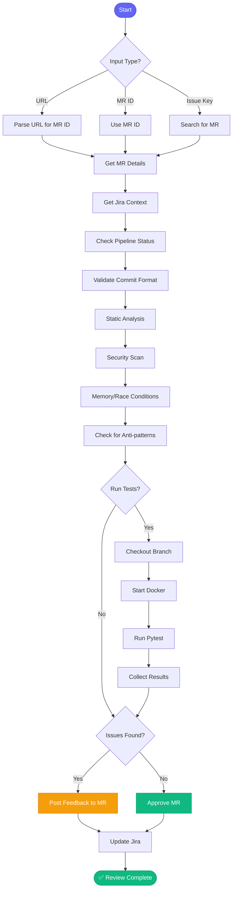

# 👀 review_pr

> Review a merge request with static analysis and optional local testing

## Overview

The `review_pr` skill provides structured code review for GitLab merge requests. It checks code quality, runs pipelines, validates commits, and optionally runs local tests before automatically approving or posting feedback.

## Quick Start

```
skill_run("review_pr", '{"mr_id": 1234}')
```

From Jira issue:

```
skill_run("review_pr", '{"issue_key": "AAP-12345"}')
```

With local tests:

```
skill_run("review_pr", '{"mr_id": 1234, "run_tests": true}')
```

## Inputs

| Input | Type | Required | Default | Description |
|-------|------|----------|---------|-------------|
| `mr_id` | integer | No* | - | GitLab MR ID |
| `url` | string | No* | - | Full GitLab MR URL |
| `issue_key` | string | No* | - | Jira issue key (finds associated MR) |
| `repo_name` | string | No | - | Repository name from config |
| `run_tests` | boolean | No | `false` | Checkout and run local tests |

*One of `mr_id`, `url`, or `issue_key` is required

## Flow



## Checks Performed

| Check | What It Looks For |
|-------|-------------------|
| **Pipeline** | CI status, failed jobs |
| **Commits** | AAP-XXXXX format, meaningful messages |
| **Security** | SQL injection, hardcoded secrets |
| **Memory** | Unbounded lists, missing cleanup |
| **Concurrency** | Race conditions, deadlocks |
| **Patterns** | Code smells, anti-patterns |

## Auto-Actions

| Scenario | Action |
|----------|--------|
| All checks pass | ✅ Approve MR |
| Security issues | ❌ Request changes |
| Test failures | 📝 Post feedback |
| Minor issues | 📝 Post suggestions |
| Pipeline failed | ⚠️ Note, don't approve |

## MCP Tools Used

- `gitlab_mr_view` - Get MR details
- `gitlab_mr_diff` - Get code changes
- `gitlab_pipeline_status` - Check CI
- `gitlab_mr_approve` - Approve MR
- `gitlab_mr_comment` - Post feedback
- `jira_view_issue` - Get issue context
- `jira_add_comment` - Update issue

## Example Output

```
You: Review MR 1234

Claude: 👀 Reviewing MR !1234...
        
        📋 MR Details:
        ├── Title: AAP-61214 - feat(api): Add validation
        ├── Author: jsmith
        ├── Branch: aap-61214-add-validation
        └── Target: main
        
        ✅ Pipeline Status: Passed
        ✅ Commit Format: Valid
        ✅ Jira Issue: Found (Story, In Progress)
        
        🔍 Static Analysis:
        ├── Security: No issues
        ├── Memory: No issues
        └── Patterns: 1 suggestion
        
        📝 Suggestions:
        └── Line 45: Consider using constants for magic numbers
        
        ✅ **Approved** - Minor suggestion posted as comment
        
        Updated Jira AAP-61214 with review status.
```

## With Local Tests

```
You: Review MR 1234 with tests

Claude: 👀 Reviewing MR !1234 with local testing...
        
        [Previous checks...]
        
        🧪 Local Testing:
        ├── Checked out branch
        ├── Started docker-compose
        ├── Ran migrations
        └── Running pytest...
        
        ✅ Tests: 156 passed, 0 failed
        
        ✅ **Approved** - All checks pass
```

## Related Skills

- [review_all_prs](./review_all_prs.md) - Batch review multiple PRs
- [check_my_prs](./check_my_prs.md) - Check your own PRs
- [create_mr](./create_mr.md) - Create an MR


