# ⚡ review_pr

> Review a colleague's PR/MR

## Overview

Review a colleague's PR/MR.

Resolves repository from issue_key, repo_name, or current directory.

Accepts EITHER:
- mr_id: GitLab MR number (e.g., 123)
- issue_key: Jira issue key (e.g., AAP-61214) - will find the MR

Checks MR description, commit format, pipelines, Jira context,
runs local tests, and provides brief focused feedback.

Automatically approves or posts feedback based on findings.

**Version:** 1.3

## Quick Start

```bash
skill_run("review_pr", '{"issue_key": "AAP-12345"}')
```

## Inputs

| Input | Type | Required | Default | Description |
|-------|------|----------|---------|-------------|
| `mr_id` | integer | No | `-` | GitLab MR ID (e.g., 1234) |
| `url` | string | No | `-` | Full GitLab MR URL (e.g., https://gitlab.cee.redhat.com/org/repo/-/merge_requests/123) |
| `issue_key` | string | No | `-` | Jira issue key (e.g., AAP-61214) - will search for associated MR |
| `repo_name` | string | No | `-` | Repository name from config (e.g., 'automation-analytics-backend') |
| `run_tests` | boolean | No | `False` | Checkout branch and run local tests (default: false, static analysis only) |
| `auto_merge` | boolean | No | `False` | Automatically merge if approved (default: false) |
| `slack_format` | boolean | No | `False` | Use Slack link format in summary |

## Process Flow

```mermaid
flowchart TD
    START([Start])
    STEP1[Step 1: Resolve Repo]
    START --> STEP1
    STEP2[Step 2: Validate Input]
    STEP1 --> STEP2
    STEP3[Step 3: Find Mr By Jira]
    STEP2 --> STEP3
    STEP4[Step 4: Extract Mr Id]
    STEP3 --> STEP4
    STEP5[Step 5: Set Mr Id]
    STEP4 --> STEP5
    STEP6[Step 6: Get Mr]
    STEP5 --> STEP6
    STEP7[Step 7: Get Mr Commits]
    STEP6 --> STEP7
    STEP8[Step 8: Parse Commits]
    STEP7 --> STEP8
    STEP9[Step 9: Get Mr Diff]
    STEP8 --> STEP9
    STEP10[Step 10: Parse Diff]
    STEP9 --> STEP10
    STEP11[Step 11: Blame Key File]
    STEP10 --> STEP11
    STEP12[Step 12: Parse Blame Info]
    STEP11 --> STEP12
    STEP13[Step 13: Extract Jira Key]
    STEP12 --> STEP13
    STEP14[Step 14: Get Jira Issue]
    STEP13 --> STEP14
    STEP15[Step 15: Get Diff]
    STEP14 --> STEP15
    STEP16[Step 16: Check Diff Size]
    STEP15 --> STEP16
    STEP17[Step 17: Set Mr Diff]
    STEP16 --> STEP17
    STEP18[Step 18: Check Gitlab Pipeline]
    STEP17 --> STEP18
    STEP19[Step 19: Get Pipeline Trace]
    STEP18 --> STEP19
    STEP20[Step 20: Get Approvers]
    STEP19 --> STEP20
    STEP21[Step 21: Parse Approvers]
    STEP20 --> STEP21
    STEP22[Step 22: Check Konflux]
    STEP21 --> STEP22
    STEP23[Step 23: Validate Commit Format]
    STEP22 --> STEP23
    STEP24[Step 24: Check Description]
    STEP23 --> STEP24
    STEP25[Step 25: Extract Branch Name]
    STEP24 --> STEP25
    STEP26[Step 26: Fetch Origin]
    STEP25 --> STEP26
    STEP27[Step 27: Checkout Branch]
    STEP26 --> STEP27
    STEP28[Step 28: Fetch Mr Ref]
    STEP27 --> STEP28
    STEP29[Step 29: Checkout Mr Branch]
    STEP28 --> STEP29
    STEP30[Step 30: Check Docker]
    STEP29 --> STEP30
    STEP31[Step 31: Start Docker If Needed]
    STEP30 --> STEP31
    STEP32[Step 32: Set Docker Status]
    STEP31 --> STEP32
    STEP33[Step 33: Run Migrations]
    STEP32 --> STEP33
    STEP34[Step 34: Run Data]
    STEP33 --> STEP34
    STEP35[Step 35: Summarize Setup]
    STEP34 --> STEP35
    STEP36[Step 36: Run Tests]
    STEP35 --> STEP36
    STEP37[Step 37: Copy Test Script]
    STEP36 --> STEP37
    STEP38[Step 38: Execute Tests]
    STEP37 --> STEP38
    STEP39[Step 39: Parse Test Results]
    STEP38 --> STEP39
    STEP40[Step 40: Analyze Code]
    STEP39 --> STEP40
    STEP41[Step 41: Prepare Summary]
    STEP40 --> STEP41
    STEP42[Step 42: Determine Action]
    STEP41 --> STEP42
    STEP43[Step 43: Build Feedback]
    STEP42 --> STEP43
    STEP44[Step 44: Post Feedback]
    STEP43 --> STEP44
    STEP45[Step 45: Approve Mr]
    STEP44 --> STEP45
    STEP46[Step 46: Emit Approval Hook]
    STEP45 --> STEP46
    STEP47[Step 47: Emit Feedback Hook]
    STEP46 --> STEP47
    STEP48[Step 48: Extract Mr Author]
    STEP47 --> STEP48
    STEP49[Step 49: Slack Notify Approval]
    STEP48 --> STEP49
    STEP50[Step 50: Slack Notify Feedback]
    STEP49 --> STEP50
    STEP51[Step 51: Jira Comment]
    STEP50 --> STEP51
    STEP52[Step 52: Build Memory Context]
    STEP51 --> STEP52
    STEP53[Step 53: Log Session Review]
    STEP52 --> STEP53
    STEP54[Step 54: Track Review Given]
    STEP53 --> STEP54
    STEP54 --> DONE([Complete])

    style START fill:#6366f1,stroke:#4f46e5,color:#fff
    style DONE fill:#10b981,stroke:#059669,color:#fff
```



## Detailed Steps

### Step 1: Resolve Repo

**Description:** Determine which repo, GitLab project, and settings to use

**Tool:** `compute`

### Step 2: Validate Input

**Description:** Ensure we have mr_id, url, or issue_key

**Tool:** `compute`

### Step 3: Find Mr By Jira

**Description:** Find MR associated with Jira issue

**Tool:** `gitlab_mr_list`

**Condition:** `not inputs.get('mr_id') and not resolved.get('mr_id_from_url') and inputs.get('issue_key')`

### Step 4: Extract Mr Id

**Description:** Extract MR ID from inputs, URL, or search results using shared parser

**Tool:** `compute`

### Step 5: Set Mr Id

**Description:** Set the MR ID for remaining steps

**Tool:** `compute`

### Step 6: Get Mr

**Description:** Fetch MR details from GitLab

**Tool:** `gitlab_mr_view`

### Step 7: Get Mr Commits

**Description:** Get commit history for the MR

**Tool:** `gitlab_commit_list`

### Step 8: Parse Commits

**Description:** Parse commit history

**Tool:** `compute`

### Step 9: Get Mr Diff

**Description:** Get the code diff for the MR

**Tool:** `git_diff`

### Step 10: Parse Diff

**Description:** Parse diff to identify changed files

**Tool:** `compute`

### Step 11: Blame Key File

**Description:** Get blame info for main changed file

**Tool:** `git_blame`

**Condition:** `diff_analysis and diff_analysis.file_count > 0`

### Step 12: Parse Blame Info

**Description:** Extract authorship info from blame

**Tool:** `compute`

### Step 13: Extract Jira Key

**Description:** Extract AAP-XXXXX from MR title

**Tool:** `compute`

### Step 14: Get Jira Issue

**Description:** Get Jira issue context

**Tool:** `jira_view_issue`

**Condition:** `{{ jira_key != 'NOT_FOUND' }}`

### Step 15: Get Diff

**Description:** Get code changes

**Tool:** `gitlab_mr_diff`

### Step 16: Check Diff Size

**Description:** Validate diff size to avoid context overflow

**Tool:** `compute`

### Step 17: Set Mr Diff

**Tool:** `compute`

### Step 18: Check Gitlab Pipeline

**Description:** Check GitLab CI status

**Tool:** `gitlab_ci_status`

### Step 19: Get Pipeline Trace

**Description:** Get pipeline trace if failed

**Tool:** `gitlab_ci_trace`

**Condition:** `gitlab_pipeline and 'failed' in str(gitlab_pipeline).lower()`

### Step 20: Get Approvers

**Description:** Get MR approvers list

**Tool:** `gitlab_mr_approvers`

### Step 21: Parse Approvers

**Description:** Parse approvers list

**Tool:** `compute`

### Step 22: Check Konflux

**Description:** Check Konflux integration tests

**Tool:** `konflux_list_pipelines`

### Step 23: Validate Commit Format

**Description:** Check commit title matches commit_format pattern from config.json

**Tool:** `compute`

### Step 24: Check Description

**Description:** Verify MR has adequate description

**Tool:** `compute`

### Step 25: Extract Branch Name

**Description:** Extract source branch from MR details using shared parser

**Tool:** `compute`

**Condition:** `{{ inputs.run_tests }}`

### Step 26: Fetch Origin

**Description:** Fetch latest from origin

**Tool:** `git_fetch`

**Condition:** `{{ inputs.run_tests }}`

### Step 27: Checkout Branch

**Description:** Checkout MR branch locally

**Tool:** `git_checkout`

**Condition:** `{{ inputs.run_tests }}`

### Step 28: Fetch Mr Ref

**Description:** Fallback: fetch MR directly

**Tool:** `git_fetch`

**Condition:** `{{ inputs.run_tests and checkout_result and 'error' in str(checkout_result).lower() }}`

### Step 29: Checkout Mr Branch

**Description:** Checkout after MR fetch

**Tool:** `git_checkout`

**Condition:** `{{ inputs.run_tests and mr_fetch_result }}`

### Step 30: Check Docker

**Description:** Verify docker-compose is running

**Tool:** `docker_compose_status`

**Condition:** `{{ inputs.run_tests }}`

### Step 31: Start Docker If Needed

**Description:** Start docker-compose if containers not running

**Tool:** `docker_compose_up`

**Condition:** `{{ inputs.run_tests and ('No containers' in str(docker_status_raw) or not docker_status_raw) }}`

### Step 32: Set Docker Status

**Description:** Set docker status

**Tool:** `compute`

**Condition:** `{{ inputs.run_tests }}`

### Step 33: Run Migrations

**Description:** Run make migrations

**Tool:** `make_target`

**Condition:** `{{ inputs.run_tests }}`

### Step 34: Run Data

**Description:** Run make data

**Tool:** `make_target`

**Condition:** `{{ inputs.run_tests }}`

### Step 35: Summarize Setup

**Description:** Summarize setup results

**Tool:** `compute`

**Condition:** `{{ inputs.run_tests }}`

### Step 36: Run Tests

**Description:** Run pytest in FastAPI container

**Tool:** `compute`

**Condition:** `{{ inputs.run_tests }}`

### Step 37: Copy Test Script

**Description:** Copy test script to container

**Tool:** `docker_cp`

**Condition:** `{{ test_prep }}`

### Step 38: Execute Tests

**Description:** Run tests in container

**Tool:** `docker_exec`

**Condition:** `{{ test_prep and copy_result }}`

### Step 39: Parse Test Results

**Description:** Parse test execution results

**Tool:** `compute`

### Step 40: Analyze Code

**Description:** Static analysis for security, memory, race conditions

**Tool:** `compute`

### Step 41: Prepare Summary

**Description:** Compile review findings

**Tool:** `compute`

### Step 42: Determine Action

**Description:** Decide whether to approve or request changes

**Tool:** `compute`

### Step 43: Build Feedback

**Description:** Build feedback message for GitLab

**Tool:** `compute`

**Condition:** `review_action.get('action') == 'request_changes'`

### Step 44: Post Feedback

**Description:** Post review feedback to MR

**Tool:** `gitlab_mr_comment`

**Condition:** `review_action.get('action') == 'request_changes'`

### Step 45: Approve Mr

**Description:** Approve the MR on GitLab

**Tool:** `gitlab_mr_approve`

**Condition:** `review_action.get('action') == 'approve'`

### Step 46: Emit Approval Hook

**Description:** Notify author that MR was approved

**Tool:** `compute`

**Condition:** `review_action.get('action') == 'approve' and approval_result`

### Step 47: Emit Feedback Hook

**Description:** Notify author that feedback was posted

**Tool:** `compute`

**Condition:** `review_action.get('action') == 'request_changes' and feedback_posted`

### Step 48: Extract Mr Author

**Description:** Extract MR author GitLab username for Slack notification

**Tool:** `compute`

### Step 49: Slack Notify Approval

**Description:** Send Slack DM to author that MR was approved

**Tool:** `slack_dm_gitlab_user`

**Condition:** `review_action.get('action') == 'approve' and author_info.get('author')`

### Step 50: Slack Notify Feedback

**Description:** Send Slack DM to author that feedback was posted

**Tool:** `slack_dm_gitlab_user`

**Condition:** `review_action.get('action') == 'request_changes' and author_info.get('author')`

### Step 51: Jira Comment

**Description:** Add review note to Jira issue

**Tool:** `jira_add_comment`

**Condition:** `{{ jira_key != 'NOT_FOUND' }}`

### Step 52: Build Memory Context

**Description:** Build context for memory updates

**Tool:** `compute`

### Step 53: Log Session Review

**Description:** Log review to session

**Tool:** `memory_session_log`

### Step 54: Track Review Given

**Description:** Track review in teammate preferences (learn reviewer patterns)

**Tool:** `compute`

**Condition:** `memory_context.action == 'approve' or memory_context.action == 'feedback'`


## MCP Tools Used (23 total)

- `docker_compose_status`
- `docker_compose_up`
- `docker_cp`
- `docker_exec`
- `git_blame`
- `git_checkout`
- `git_diff`
- `git_fetch`
- `gitlab_ci_status`
- `gitlab_ci_trace`
- `gitlab_commit_list`
- `gitlab_mr_approve`
- `gitlab_mr_approvers`
- `gitlab_mr_comment`
- `gitlab_mr_diff`
- `gitlab_mr_list`
- `gitlab_mr_view`
- `jira_add_comment`
- `jira_view_issue`
- `konflux_list_pipelines`
- `make_target`
- `memory_session_log`
- `slack_dm_gitlab_user`

## Related Skills

_(To be determined based on skill relationships)_
