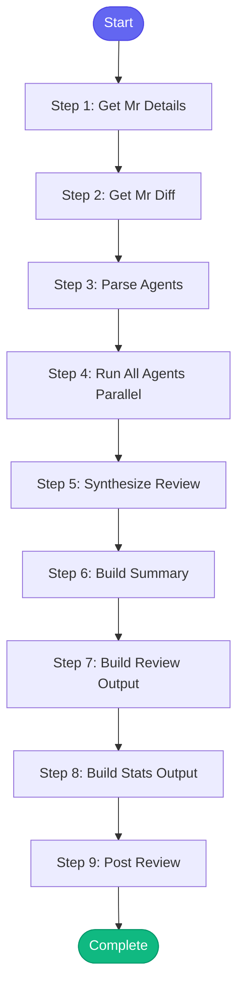

# ⚡ review_pr_multiagent

> Multi-agent code review system that coordinates specialized reviewers:

**Review Agents (Hybrid Claude + Gemini):**
- 🏗️ **Architecture Agent** (Claude): Design patterns, SOLID principles, architectural decisions
- 🔒 **Security Agent** (Gemini): Security vulnerabilities, auth issues, data validation
- ⚡ **Performance Agent** (Claude): Performance bottlenecks, inefficient algorithms, resource usage
- 🧪 **Testing Agent** (Gemini): Test coverage, test quality, edge cases
- 📝 **Documentation Agent** (Claude): Code comments, API docs, README updates
- 🎨 **Style Agent** (Gemini): Code style, naming conventions, formatting

**Coordinator**: Synthesizes all reviews into comprehensive feedback

Uses Claude + Gemini CLI with Vertex AI - no API keys required!

## Overview

Multi-agent code review system that coordinates specialized reviewers:

**Review Agents (Hybrid Claude + Gemini):**
- 🏗️ **Architecture Agent** (Claude): Design patterns, SOLID principles, architectural decisions
- 🔒 **Security Agent** (Gemini): Security vulnerabilities, auth issues, data validation
- ⚡ **Performance Agent** (Claude): Performance bottlenecks, inefficient algorithms, resource usage
- 🧪 **Testing Agent** (Gemini): Test coverage, test quality, edge cases
- 📝 **Documentation Agent** (Claude): Code comments, API docs, README updates
- 🎨 **Style Agent** (Gemini): Code style, naming conventions, formatting

**Coordinator**: Synthesizes all reviews into comprehensive feedback

Uses Claude + Gemini CLI with Vertex AI - no API keys required!

**Version:** 2.0

## Quick Start

```bash
skill_run("review_pr_multiagent", '{"issue_key": "AAP-12345"}')
```

## Inputs

| Input | Type | Required | Default | Description |
|-------|------|----------|---------|-------------|
| `mr_id` | integer | ✅ Yes | `-` | GitLab MR ID (e.g., 1483) |
| `agents` | string | No | `architecture,security,performance,testing,documentation,style` | Comma-separated list of agents |
| `post_combined` | boolean | No | `True` | Post review to MR |
| `debug` | boolean | No | `False` | Debug mode - shows full review output without posting |
| `model` | string | No | `sonnet` | Model to use |

## Process Flow



## Detailed Steps

### Step 1: Get Mr Details

**Description:** Get MR details

**Tool:** `gitlab_mr_view`

### Step 2: Get Mr Diff

**Description:** Get MR diff

**Tool:** `gitlab_mr_diff`

### Step 3: Parse Agents

**Description:** Parse enabled agents

**Tool:** `compute`

### Step 4: Run All Agents Parallel

**Description:** Run all agents in parallel

**Tool:** `compute`

### Step 5: Synthesize Review

**Description:** Synthesize final personalized review

**Tool:** `compute`

### Step 6: Build Summary

**Description:** Build summary

**Tool:** `compute`

### Step 7: Build Review Output

**Description:** Build review output

**Tool:** `compute`

### Step 8: Build Stats Output

**Description:** Build stats output

**Tool:** `compute`

### Step 9: Post Review

**Description:** Post review to MR

**Tool:** `gitlab_mr_comment`

**Condition:** `inputs.get("post_combined", False) and "API Error" not in str(review) and "Error" not in str(review)[:20]`


## MCP Tools Used (3 total)

- `gitlab_mr_comment`
- `gitlab_mr_diff`
- `gitlab_mr_view`

## Related Skills

_(To be determined based on skill relationships)_
