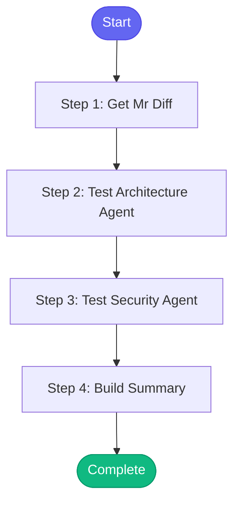

# ⚡ review_pr_multiagent

> Multi-agent code review system using hybrid Claude + Gemini agents

## Overview

Multi-agent code review system using hybrid Claude + Gemini agents.

Uses Claude/Gemini CLI with Vertex AI - no API keys required!

**Version:** 2.0

## Quick Start

```bash
skill_run("review_pr_multiagent", '{"issue_key": "AAP-12345"}')
```

## Inputs

| Input | Type | Required | Default | Description |
|-------|------|----------|---------|-------------|
| `mr_id` | integer | ✅ Yes | `-` | GitLab MR ID |
| `agents` | string | No | `architecture,security,performance` | Comma-separated agents (architecture,security,performance,testing,documentation,style) |
| `post_combined` | boolean | No | `False` | Post combined review to MR (default: false for testing) |
| `model` | string | No | `sonnet` | Model to use (sonnet, opus, haiku) |

## Process Flow



## Detailed Steps

### Step 1: Get Mr Diff

**Description:** Get MR diff

**Tool:** `gitlab_mr_diff`

### Step 2: Test Architecture Agent

**Description:** Test Architecture Agent (Claude)

**Tool:** `compute`

### Step 3: Test Security Agent

**Description:** Test Security Agent (Gemini)

**Tool:** `compute`

### Step 4: Build Summary

**Description:** Build summary

**Tool:** `compute`


## MCP Tools Used (1 total)

- `gitlab_mr_diff`

## Related Skills

_(To be determined based on skill relationships)_
