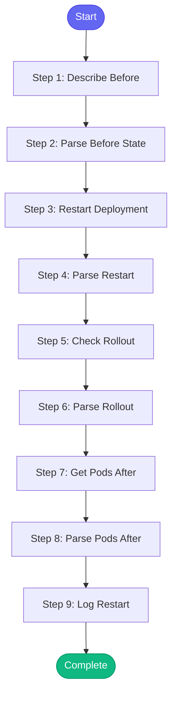

# ⚡ rollout_restart

> Restart a Kubernetes deployment and monitor its rollout

## Overview

Restart a Kubernetes deployment and monitor its rollout.

This is useful for:
- Picking up new ConfigMap/Secret changes
- Recovering from stuck pods
- Forcing a fresh start without redeploying

Uses: kubectl_rollout_restart, kubectl_rollout_status, kubectl_describe_deployment,
      kubectl_get_pods

**Version:** 1.0

## Quick Start

```bash
skill_run("rollout_restart", '{"issue_key": "AAP-12345"}')
```

## Inputs

| Input | Type | Required | Default | Description |
|-------|------|----------|---------|-------------|
| `deployment` | string | ✅ Yes | `-` | Deployment name to restart |
| `namespace` | string | ✅ Yes | `-` | Kubernetes namespace |
| `environment` | string | No | `stage` | Environment (stage, production, ephemeral) |
| `wait` | boolean | No | `True` | Wait for rollout to complete |

## Process Flow



## Detailed Steps

### Step 1: Describe Before

**Description:** Get deployment state before restart

**Tool:** `kubectl_describe_deployment`

### Step 2: Parse Before State

**Description:** Parse current deployment state

**Tool:** `compute`

### Step 3: Restart Deployment

**Description:** Trigger rolling restart

**Tool:** `kubectl_rollout_restart`

**Condition:** `before_state.exists`

### Step 4: Parse Restart

**Description:** Parse restart result

**Tool:** `compute`

### Step 5: Check Rollout

**Description:** Monitor rollout progress

**Tool:** `kubectl_rollout_status`

**Condition:** `restart_status.success and inputs.wait`

### Step 6: Parse Rollout

**Description:** Parse rollout status

**Tool:** `compute`

### Step 7: Get Pods After

**Description:** Get pod status after restart

**Tool:** `kubectl_get_pods`

**Condition:** `restart_status.success`

### Step 8: Parse Pods After

**Description:** Analyze pod health after restart

**Tool:** `compute`

### Step 9: Log Restart

**Description:** Log restart to session

**Tool:** `memory_session_log`


## MCP Tools Used (5 total)

- `kubectl_describe_deployment`
- `kubectl_get_pods`
- `kubectl_rollout_restart`
- `kubectl_rollout_status`
- `memory_session_log`

## Related Skills

_(To be determined based on skill relationships)_
