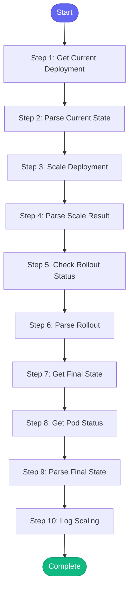

# ⚡ scale_deployment

> Scale a Kubernetes deployment and monitor the rollout

## Overview

Scale a Kubernetes deployment and monitor the rollout.

Use for:
- Scaling up for high traffic
- Scaling down to save resources
- Testing with different replica counts
- Recovering from OOM by increasing replicas

The skill will:
1. Get current deployment state
2. Scale to desired replicas
3. Monitor rollout progress
4. Report final state

**Version:** 1.0

## Quick Start

```bash
skill_run("scale_deployment", '{"issue_key": "AAP-12345"}')
```

## Inputs

| Input | Type | Required | Default | Description |
|-------|------|----------|---------|-------------|
| `deployment` | string | ✅ Yes | `-` | Deployment name to scale |
| `replicas` | integer | ✅ Yes | `-` | Desired number of replicas |
| `namespace` | string | No | `tower-analytics-stage` | Kubernetes namespace |
| `environment` | string | No | `stage` | Environment: 'stage', 'production', 'ephemeral' |
| `wait` | boolean | No | `True` | Wait for rollout to complete |

## Process Flow



## Detailed Steps

### Step 1: Get Current Deployment

**Description:** Get current deployment info

**Tool:** `kubectl_get_deployments`

### Step 2: Parse Current State

**Description:** Parse current deployment state

**Tool:** `compute`

### Step 3: Scale Deployment

**Description:** Scale the deployment to desired replicas

**Tool:** `kubectl_scale`

**Condition:** `current_state.found`

### Step 4: Parse Scale Result

**Description:** Parse scale result

**Tool:** `compute`

### Step 5: Check Rollout Status

**Description:** Check rollout status

**Tool:** `kubectl_rollout`

**Condition:** `scale_status.success and inputs.wait`

### Step 6: Parse Rollout

**Description:** Parse rollout status

**Tool:** `compute`

**Condition:** `rollout_status_raw`

### Step 7: Get Final State

**Description:** Get final deployment state

**Tool:** `kubectl_get_deployments`

**Condition:** `scale_status.success`

### Step 8: Get Pod Status

**Description:** Get pod status after scaling

**Tool:** `kubectl_get_pods`

**Condition:** `scale_status.success`

### Step 9: Parse Final State

**Description:** Parse final state

**Tool:** `compute`

### Step 10: Log Scaling

**Description:** Log scaling action

**Tool:** `memory_session_log`

**Condition:** `scale_status.success`


## MCP Tools Used (5 total)

- `kubectl_get_deployments`
- `kubectl_get_pods`
- `kubectl_rollout`
- `kubectl_scale`
- `memory_session_log`

## Related Skills

_(To be determined based on skill relationships)_
