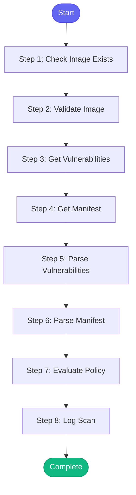

# ⚡ scan_vulnerabilities

> Scan a container image for security vulnerabilities before deployment

## Overview

Scan a container image for security vulnerabilities before deployment.

Uses Quay.io vulnerability scanning and optional local security tools.

Steps:
1. Verify image exists in Quay
2. Get vulnerability report from Quay
3. Analyze severity and count
4. Provide recommendations

Useful before:
- Releasing to production
- Deploying to ephemeral
- Approving MRs with image changes

**Version:** 1.0

## Quick Start

```bash
skill_run("scan_vulnerabilities", '{"issue_key": "AAP-12345"}')
```

## Inputs

| Input | Type | Required | Default | Description |
|-------|------|----------|---------|-------------|
| `image_tag` | string | ✅ Yes | `-` | Image tag (commit SHA or version) to scan |
| `repository` | string | No | `aap-aa-tenant/aap-aa-main/automation-analytics-backend-main` | Quay repository path |
| `namespace` | string | No | `redhat-user-workloads` | Quay namespace (redhat-user-workloads for PR, redhat-services-prod for releases) |
| `fail_on_critical` | boolean | No | `True` | Return error if critical vulnerabilities found |
| `fail_on_high` | boolean | No | `False` | Return error if high severity vulnerabilities found |

## Process Flow



## Detailed Steps

### Step 1: Check Image Exists

**Description:** Verify the image exists in Quay

**Tool:** `quay_check_image_exists`

### Step 2: Validate Image

**Description:** Stop if image doesn't exist

**Tool:** `compute`

### Step 3: Get Vulnerabilities

**Description:** Fetch vulnerability report from Quay

**Tool:** `quay_get_vulnerabilities`

**Condition:** `image_status.exists`

### Step 4: Get Manifest

**Description:** Get image manifest for metadata

**Tool:** `quay_get_manifest`

**Condition:** `image_status.exists`

### Step 5: Parse Vulnerabilities

**Description:** Parse and categorize vulnerabilities

**Tool:** `compute`

**Condition:** `image_status.exists`

### Step 6: Parse Manifest

**Description:** Extract manifest metadata

**Tool:** `compute`

**Condition:** `image_status.exists`

### Step 7: Evaluate Policy

**Description:** Check against security policy

**Tool:** `compute`

**Condition:** `image_status.exists`

### Step 8: Log Scan

**Description:** Log security scan to session

**Tool:** `memory_session_log`


## MCP Tools Used (4 total)

- `memory_session_log`
- `quay_check_image_exists`
- `quay_get_manifest`
- `quay_get_vulnerabilities`

## Related Skills

_(To be determined based on skill relationships)_
