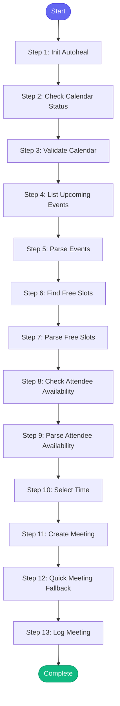

# ⚡ schedule_meeting

> Schedule a meeting by finding mutual availability and creating calendar event

## Overview

Schedule a meeting by finding mutual availability and creating calendar event.

Uses Google Calendar API to:
1. Check your calendar status
2. Find free time slots
3. Check attendee availability (optional)
4. Create the meeting

Prerequisites:
- Google Calendar API credentials configured
- OAuth token for calendar access

**Version:** 1.0

## Quick Start

```bash
skill_run("schedule_meeting", '{"issue_key": "AAP-12345"}')
```

## Inputs

| Input | Type | Required | Default | Description |
|-------|------|----------|---------|-------------|
| `title` | string | ✅ Yes | `-` | Meeting title |
| `duration_minutes` | integer | No | `30` | Meeting duration in minutes |
| `attendees` | string | No | `-` | Comma-separated email addresses of attendees |
| `preferred_time` | string | No | `-` | Preferred time like 'tomorrow 2pm' or 'next Monday morning' |
| `days_ahead` | integer | No | `5` | How many days ahead to search for free slots |
| `description` | string | No | `""` | Meeting description/agenda |

## Process Flow



## Detailed Steps

### Step 1: Init Autoheal

**Description:** Initialize failure tracking

**Tool:** `compute`

### Step 2: Check Calendar Status

**Description:** Verify calendar API is accessible

**Tool:** `google_calendar_status`

### Step 3: Validate Calendar

**Description:** Check if calendar is accessible

**Tool:** `compute`

### Step 4: List Upcoming Events

**Description:** Get upcoming calendar events

**Tool:** `google_calendar_list_events`

**Condition:** `calendar_check.available`

### Step 5: Parse Events

**Description:** Parse existing events to find busy times

**Tool:** `compute`

**Condition:** `calendar_check.available`

### Step 6: Find Free Slots

**Description:** Find available time slots

**Tool:** `google_calendar_find_meeting`

**Condition:** `calendar_check.available`

### Step 7: Parse Free Slots

**Description:** Parse available time slots

**Tool:** `compute`

**Condition:** `calendar_check.available`

### Step 8: Check Attendee Availability

**Description:** Check if attendees are free

**Tool:** `google_calendar_check_mutual_availability`

**Condition:** `calendar_check.available and inputs.attendees`

### Step 9: Parse Attendee Availability

**Description:** Parse attendee availability

**Tool:** `compute`

**Condition:** `calendar_check.available and inputs.attendees`

### Step 10: Select Time

**Description:** Select best meeting time

**Tool:** `compute`

**Condition:** `calendar_check.available`

### Step 11: Create Meeting

**Description:** Create the calendar event

**Tool:** `google_calendar_schedule_meeting`

**Condition:** `calendar_check.available and meeting_time.selected_time`

### Step 12: Quick Meeting Fallback

**Description:** Try quick meeting if schedule_meeting failed

**Tool:** `google_calendar_quick_meeting`

**Condition:** `calendar_check.available and not meeting_result and meeting_time.selected_time`

### Step 13: Log Meeting

**Description:** Log meeting scheduling

**Tool:** `memory_session_log`

**Condition:** `meeting_result or quick_meeting_result`


## MCP Tools Used (7 total)

- `google_calendar_check_mutual_availability`
- `google_calendar_find_meeting`
- `google_calendar_list_events`
- `google_calendar_quick_meeting`
- `google_calendar_schedule_meeting`
- `google_calendar_status`
- `memory_session_log`

## Related Skills

_(To be determined based on skill relationships)_
