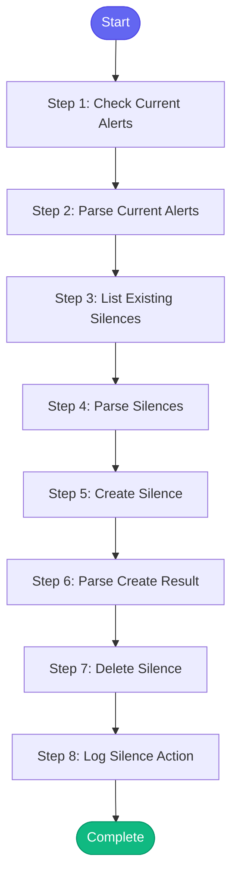

# ⚡ silence_alert

> Silence a Prometheus alert in Alertmanager

## Overview

Silence a Prometheus alert in Alertmanager.

Use when:
- You're working on a known issue and don't want alert noise
- Performing maintenance and expect alerts
- Need to temporarily suppress false positives

The skill will:
1. Verify the alert exists/is firing
2. Create a silence with appropriate duration
3. Optionally list existing silences
4. Provide commands to extend or remove the silence

**Version:** 1.0

## Quick Start

```bash
skill_run("silence_alert", '{"issue_key": "AAP-12345"}')
```

## Inputs

| Input | Type | Required | Default | Description |
|-------|------|----------|---------|-------------|
| `alert_name` | string | ✅ Yes | `-` | Name of the alert to silence (e.g., 'HighErrorRate', 'PodCrashLooping') |
| `duration` | string | No | `2h` | How long to silence (e.g., '1h', '2h', '4h', '24h') |
| `reason` | string | No | `Investigating issue` | Reason for silencing (for audit trail) |
| `environment` | string | No | `production` | Environment: 'production' or 'stage' |
| `namespace` | string | No | `-` | Optionally scope silence to specific namespace |
| `action` | string | No | `create` | Action: 'create', 'list', or 'delete' |
| `silence_id` | string | No | `-` | Silence ID (required for 'delete' action) |

## Process Flow



## Detailed Steps

### Step 1: Check Current Alerts

**Description:** Check if the alert is currently firing

**Tool:** `alertmanager_alerts`

**Condition:** `inputs.action == 'create'`

### Step 2: Parse Current Alerts

**Description:** Check if our target alert is firing

**Tool:** `compute`

**Condition:** `inputs.action == 'create'`

### Step 3: List Existing Silences

**Description:** List all current silences

**Tool:** `alertmanager_list_silences`

### Step 4: Parse Silences

**Description:** Parse existing silences

**Tool:** `compute`

### Step 5: Create Silence

**Description:** Create new silence for the alert

**Tool:** `alertmanager_create_silence`

**Condition:** `inputs.action == 'create' and not silences_info.already_silenced`

### Step 6: Parse Create Result

**Description:** Parse silence creation result

**Tool:** `compute`

**Condition:** `inputs.action == 'create'`

### Step 7: Delete Silence

**Description:** Delete an existing silence

**Tool:** `alertmanager_delete_silence`

**Condition:** `inputs.action == 'delete' and inputs.silence_id`

### Step 8: Log Silence Action

**Description:** Log silence action to session

**Tool:** `memory_session_log`

**Condition:** `(create_status and create_status.success) or delete_result`


## MCP Tools Used (5 total)

- `alertmanager_alerts`
- `alertmanager_create_silence`
- `alertmanager_delete_silence`
- `alertmanager_list_silences`
- `memory_session_log`

## Related Skills

_(To be determined based on skill relationships)_
