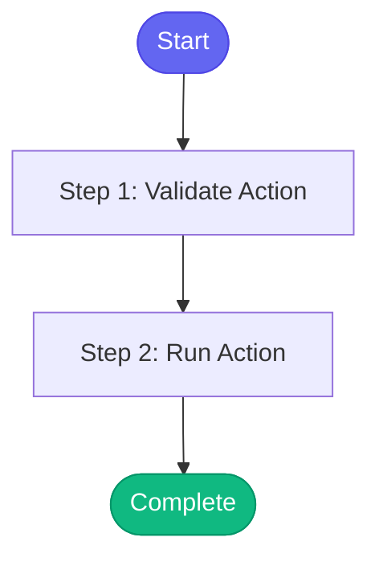

# ⚡ slack_daemon_control

> Control the autonomous Slack daemon via D-Bus IPC

## Overview

Control the autonomous Slack daemon via D-Bus IPC.

Actions:
- start: Launch daemon in background with nohup
- stop: Gracefully shutdown the daemon
- status: Get daemon status and stats
- pending: List messages awaiting approval
- approve <id>: Approve and send a pending message
- approve_all: Approve all pending messages
- reject <id>: Reject a pending message
- history: Get message history with filters
- send: Send a direct message to Slack
- reload: Reload configuration

**Version:** 1.0

## Quick Start

```bash
skill_run("slack_daemon_control", '{"issue_key": "AAP-12345"}')
```

## Inputs

| Input | Type | Required | Default | Description |
|-------|------|----------|---------|-------------|
| `action` | string | ✅ Yes | `-` | Action to perform: start, stop, status, pending, approve, approve_all, reject, history, send, reload |
| `message_id` | string | No | `-` | Message ID for approve/reject actions |
| `target` | string | No | `-` | Target for send action: Channel (C123), User ID (U123), or @username |
| `channel` | string | No | `-` | Alias for target (deprecated, use target instead) |
| `message` | string | No | `-` | Message text for send action |
| `thread` | string | No | `-` | Thread timestamp for send action |
| `limit` | integer | No | `50` | Limit for history query (default: 50) |
| `filter_channel` | string | No | `-` | Channel ID filter for history |
| `filter_user` | string | No | `-` | User ID filter for history |
| `filter_status` | string | No | `-` | Status filter for history (pending, sent, skipped, etc.) |
| `enable_llm` | boolean | No | `False` | Enable LLM for start action |
| `verbose` | boolean | No | `False` | Enable verbose output for start action |

## Process Flow



## Detailed Steps

### Step 1: Validate Action

**Description:** Validate the action and required parameters

**Tool:** `compute`

### Step 2: Run Action

**Description:** Execute the daemon control action

**Tool:** `compute`


## MCP Tools Used (0 total)

No external tools (compute-only skill)

## Related Skills

_(To be determined based on skill relationships)_
