# 🤖 slack_daemon_control

> Control the Slack daemon process

## Overview

The `slack_daemon_control` skill manages the Slack daemon systemd service, allowing you to start, stop, restart, and check status.

## Quick Start

```
skill_run("slack_daemon_control", '{"action": "status"}')
```

## Inputs

| Input | Type | Required | Default | Description |
|-------|------|----------|---------|-------------|
| `action` | string | ✅ Yes | - | start, stop, restart, status, logs |
| `lines` | integer | No | `50` | Number of log lines to show |

## Actions

| Action | Description |
|--------|-------------|
| `start` | Start the daemon service |
| `stop` | Stop the daemon service |
| `restart` | Restart the daemon service |
| `status` | Check service status |
| `logs` | View recent logs |

## Flow

```mermaid
flowchart TD
    START([Start]) --> ACTION{Action?}
    
    ACTION -->|start| START_SVC[systemctl start]
    ACTION -->|stop| STOP_SVC[systemctl stop]
    ACTION -->|restart| RESTART_SVC[systemctl restart]
    ACTION -->|status| STATUS_SVC[systemctl status]
    ACTION -->|logs| LOGS_SVC[journalctl -u]
    
    START_SVC --> CHECK[Check Result]
    STOP_SVC --> CHECK
    RESTART_SVC --> CHECK
    STATUS_SVC --> SHOW[Show Status]
    LOGS_SVC --> SHOW_LOGS[Show Logs]
    
    CHECK --> DONE([✅ Done])
    SHOW --> DONE
    SHOW_LOGS --> DONE
    
    style START fill:#6366f1,stroke:#4f46e5,color:#fff
    style DONE fill:#10b981,stroke:#059669,color:#fff
```



## Example Output

```
You: Check slack daemon status

Claude: 🤖 Slack Daemon Status
        
        ● aa-slack.service - AI Workflow Slack Agent
           Loaded: loaded
           Active: active (running) since Mon 2025-01-15 09:00:00
           Main PID: 12345
           Memory: 145.2M
        
        📊 Stats:
        - Uptime: 4h 23m
        - Messages processed: 47
        - Responses sent: 35
        - Errors: 0
        
        📡 Watching:
        - #dev-help
        - #automation-analytics
```

## Related Skills

This is a control skill, not typically used directly. The Slack daemon runs independently and uses other skills like:

- [investigate_slack_alert](./investigate_slack_alert.md) - Handle alerts
- [start_work](./start_work.md) - Start work from Slack
- [check_my_prs](./check_my_prs.md) - Check PRs from Slack


