# 🤖 slack_daemon_control

> Control the Slack daemon process

## Overview

The `slack_daemon_control` skill manages the Slack daemon, allowing you to start, stop, restart, and check status via D-Bus IPC.

## Quick Start

```
skill_run("slack_daemon_control", '{"action": "status"}')
```

## Inputs

| Input | Type | Required | Default | Description |
|-------|------|----------|---------|-------------|
| `action` | string | ✅ Yes | - | start, stop, status, pending, approve, approve_all, reject, history, send, reload |
| `message_id` | string | No | - | Message ID for approve/reject actions |
| `target` | string | No | - | Target for send: Channel (C123), User ID (U123), or @username |
| `message` | string | No | - | Message text for send action |
| `thread` | string | No | - | Thread timestamp for send action |
| `limit` | integer | No | `50` | Number of history entries to show |
| `enable_llm` | boolean | No | `false` | Enable Claude AI for autonomous responses |
| `verbose` | boolean | No | `false` | Enable verbose logging |

## Actions

| Action | Description |
|--------|-------------|
| `start` | Start the daemon in background with nohup |
| `stop` | Gracefully shutdown the daemon |
| `status` | Get daemon status and stats |
| `pending` | List messages awaiting approval |
| `approve` | Approve a specific pending message |
| `approve_all` | Approve all pending messages |
| `reject` | Reject a specific message |
| `history` | View message history |
| `send` | Send a message to Slack |
| `reload` | Reload configuration |

## Flow

```mermaid
flowchart TD
    START([Start]) --> ACTION{Action?}

    ACTION -->|start| START_SVC[nohup daemon.py]
    ACTION -->|stop| STOP_SVC[Send SIGTERM]
    ACTION -->|status| STATUS_SVC[Query D-Bus]
    ACTION -->|pending| PENDING[Get pending msgs]
    ACTION -->|send| SEND_MSG[Send via D-Bus]

    START_SVC --> CHECK[Check PID]
    STOP_SVC --> CHECK
    STATUS_SVC --> SHOW[Show Status]
    PENDING --> SHOW_PENDING[List Messages]
    SEND_MSG --> CONFIRM[Confirm Sent]

    CHECK --> DONE([✅ Done])
    SHOW --> DONE
    SHOW_PENDING --> DONE
    CONFIRM --> DONE

    style START fill:#6366f1,stroke:#4f46e5,color:#fff
    style DONE fill:#10b981,stroke:#059669,color:#fff
```



## Example Output

```
You: Check slack daemon status

Claude: 🤖 Slack Daemon Status

        ✅ Daemon running (PID: 12345)
        D-Bus: com.aiworkflow.SlackAgent

        📊 Stats:
        - Uptime: 4h 23m
        - Messages processed: 47
        - Responses sent: 35
        - Errors: 0

        📡 Watching:
        - #aleets (alerts)
        - #aa-api-team
        - #aa-api-team-test
```

## Related Skills

This is a control skill, not typically used directly. The Slack daemon runs independently and uses other skills like:

- [investigate_slack_alert](./investigate_slack_alert.md) - Handle alerts
- [start_work](./start_work.md) - Start work from Slack
- [check_my_prs](./check_my_prs.md) - Check PRs from Slack
