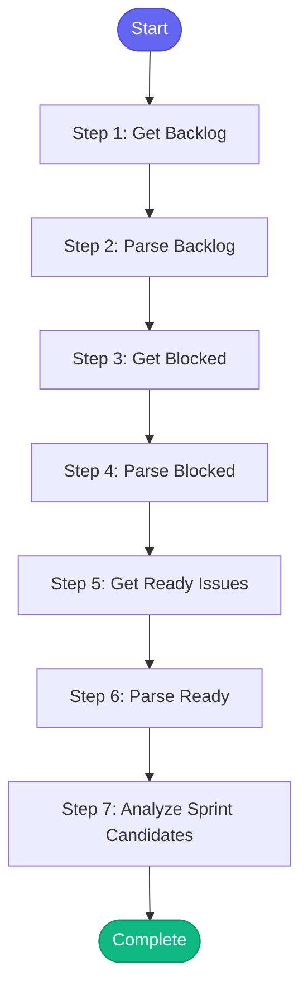

# ⚡ sprint_planning

> Help with sprint planning by analyzing the backlog

## Overview

Help with sprint planning by analyzing the backlog.

This skill:
- Lists unassigned issues in the backlog
- Identifies blocked items
- Shows issues ready for sprint
- Can add issues to a sprint

Uses: jira_list_issues, jira_list_blocked, jira_add_to_sprint, jira_add_flag

**Version:** 1.0

## Quick Start

```bash
skill_run("sprint_planning", '{"issue_key": "AAP-12345"}')
```

## Inputs

| Input | Type | Required | Default | Description |
|-------|------|----------|---------|-------------|
| `project` | string | No | `AAP` | Jira project key |
| `sprint` | string | No | `""` | Sprint name to add issues to (optional) |
| `limit` | integer | No | `20` | Max issues to show |

## Process Flow



## Detailed Steps

### Step 1: Get Backlog

**Description:** Get backlog issues

**Tool:** `jira_list_issues`

### Step 2: Parse Backlog

**Description:** Parse backlog issues

**Tool:** `compute`

### Step 3: Get Blocked

**Description:** Get blocked issues

**Tool:** `jira_list_blocked`

### Step 4: Parse Blocked

**Description:** Parse blocked issues

**Tool:** `compute`

### Step 5: Get Ready Issues

**Description:** Get issues ready for development

**Tool:** `jira_list_issues`

### Step 6: Parse Ready

**Description:** Parse ready issues

**Tool:** `compute`

### Step 7: Analyze Sprint Candidates

**Description:** Identify best candidates for sprint

**Tool:** `compute`


## MCP Tools Used (2 total)

- `jira_list_blocked`
- `jira_list_issues`

## Related Skills

_(To be determined based on skill relationships)_
