# ⚡ standup_summary

> Generate a standup summary from recent activity:
- Git commits from yesterday/today
- Jira issues worked on (In Progress, In Review)
- MRs created/reviewed
- Issues closed

If 'repo' is not provided, can be resolved from 'repo_name' or 'issue_key' via config

## Overview

Generate a standup summary from recent activity:
- Git commits from yesterday/today
- Jira issues worked on (In Progress, In Review)
- MRs created/reviewed
- Issues closed

If 'repo' is not provided, can be resolved from 'repo_name' or 'issue_key' via config.

Perfect for daily standups or status updates.

**Version:** 1.1

## Quick Start

```bash
skill_run("standup_summary", '{"issue_key": "AAP-12345"}')
```

## Inputs

| Input | Type | Required | Default | Description |
|-------|------|----------|---------|-------------|
| `repo` | string | No | `""` | Repository path - if not provided, resolved from repo_name or issue_key |
| `repo_name` | string | No | `-` | Repository name from config (e.g., 'automation-analytics-backend') |
| `issue_key` | string | No | `-` | Jira issue key - used to resolve repo and Jira project |
| `days` | integer | No | `1` | How many days back to look (default: 1 for yesterday) |
| `include_jira` | boolean | No | `True` | Include Jira issues |
| `include_gitlab` | boolean | No | `True` | Include GitLab MR activity |
| `author` | string | No | `-` | Git author email (defaults to git config) |
| `slack_format` | boolean | No | `False` | Use Slack link format in summary |

## Process Flow

```mermaid
flowchart TD
    START([Start])
    STEP1[Step 1: Init Autoheal]
    START --> STEP1
    STEP2[Step 2: Resolve Repo]
    STEP1 --> STEP2
    STEP3[Step 3: Get Author Email]
    STEP2 --> STEP3
    STEP4[Step 4: Get Author Name]
    STEP3 --> STEP4
    STEP5[Step 5: Parse Author]
    STEP4 --> STEP5
    STEP6[Step 6: Get Commit Log]
    STEP5 --> STEP6
    STEP7[Step 7: Parse Commits]
    STEP6 --> STEP7
    STEP8[Step 8: Get Todays Meetings]
    STEP7 --> STEP8
    STEP9[Step 9: Parse Calendar Events]
    STEP8 --> STEP9
    STEP10[Step 10: Get Slack Mentions]
    STEP9 --> STEP10
    STEP11[Step 11: Parse Slack Mentions]
    STEP10 --> STEP11
    STEP12[Step 12: Get My Jira Issues]
    STEP11 --> STEP12
    STEP13[Step 13: Get Jira In Progress]
    STEP12 --> STEP13
    STEP14[Step 14: Get Jira Done Recently]
    STEP13 --> STEP14
    STEP15[Step 15: Parse Jira Issues]
    STEP14 --> STEP15
    STEP16[Step 16: Get My Mrs]
    STEP15 --> STEP16
    STEP17[Step 17: Get Mr Reviews]
    STEP16 --> STEP17
    STEP18[Step 18: Parse Gitlab Activity]
    STEP17 --> STEP18
    STEP19[Step 19: Build Summary]
    STEP18 --> STEP19
    STEP20[Step 20: Load Memory]
    STEP19 --> STEP20
    STEP21[Step 21: Enhance With Memory]
    STEP20 --> STEP21
    STEP22[Step 22: Log Standup]
    STEP21 --> STEP22
    STEP22 --> DONE([Complete])

    style START fill:#6366f1,stroke:#4f46e5,color:#fff
    style DONE fill:#10b981,stroke:#059669,color:#fff
```



## Detailed Steps

### Step 1: Init Autoheal

**Description:** Initialize failure tracking

**Tool:** `compute`

### Step 2: Resolve Repo

**Description:** Determine which repo and GitLab project to use

**Tool:** `compute`

### Step 3: Get Author Email

**Description:** Get git author email

**Tool:** `git_config_get`

**Condition:** `not inputs.author`

### Step 4: Get Author Name

**Description:** Get git author name

**Tool:** `git_config_get`

### Step 5: Parse Author

**Description:** Parse author info

**Tool:** `compute`

### Step 6: Get Commit Log

**Description:** Get recent commits

**Tool:** `git_log`

### Step 7: Parse Commits

**Description:** Parse commit log for standup

**Tool:** `compute`

### Step 8: Get Todays Meetings

**Description:** Get today's calendar events

**Tool:** `google_calendar_list_events`

### Step 9: Parse Calendar Events

**Description:** Parse calendar events

**Tool:** `compute`

### Step 10: Get Slack Mentions

**Description:** Get recent Slack mentions

**Tool:** `slack_channel_read`

### Step 11: Parse Slack Mentions

**Description:** Parse Slack messages

**Tool:** `compute`

### Step 12: Get My Jira Issues

**Description:** Get all my assigned issues (quick query)

**Tool:** `jira_my_issues`

**Condition:** `inputs.include_jira`

### Step 13: Get Jira In Progress

**Description:** Get my issues in progress

**Tool:** `jira_search`

**Condition:** `inputs.include_jira`

### Step 14: Get Jira Done Recently

**Description:** Get recently closed issues

**Tool:** `jira_search`

**Condition:** `inputs.include_jira`

### Step 15: Parse Jira Issues

**Description:** Parse Jira issues using shared parser

**Tool:** `compute`

**Condition:** `inputs.include_jira`

### Step 16: Get My Mrs

**Description:** Get MRs I created

**Tool:** `gitlab_mr_list`

**Condition:** `inputs.include_gitlab`

### Step 17: Get Mr Reviews

**Description:** Get MRs I reviewed

**Tool:** `gitlab_mr_list`

**Condition:** `inputs.include_gitlab`

### Step 18: Parse Gitlab Activity

**Description:** Parse GitLab MR activity using shared parser

**Tool:** `compute`

**Condition:** `inputs.include_gitlab`

### Step 19: Build Summary

**Description:** Build standup summary

**Tool:** `compute`

### Step 20: Load Memory

**Description:** Load current work state from memory

**Tool:** `memory_read`

### Step 21: Enhance With Memory

**Description:** Enhance standup with memory context

**Tool:** `compute`

### Step 22: Log Standup

**Description:** Log standup generation to session

**Tool:** `memory_session_log`


## MCP Tools Used (9 total)

- `git_config_get`
- `git_log`
- `gitlab_mr_list`
- `google_calendar_list_events`
- `jira_my_issues`
- `jira_search`
- `memory_read`
- `memory_session_log`
- `slack_channel_read`

## Related Skills

_(To be determined based on skill relationships)_
