# 📊 standup_summary

> Generate standup summary from recent activity

## Overview

The `standup_summary` skill generates a ready-to-paste standup update by analyzing your recent Git commits, Jira activity, and MR status.

## Quick Start

```
skill_run("standup_summary", '{}')
```

Look back further:

```
skill_run("standup_summary", '{"days": 2}')
```

## Inputs

| Input | Type | Required | Default | Description |
|-------|------|----------|---------|-------------|
| `repo` | string | No | `.` | Repository path |
| `days` | integer | No | `1` | Days to look back |
| `include_jira` | boolean | No | `true` | Include Jira issues |
| `include_gitlab` | boolean | No | `true` | Include MR activity |

## Flow

```mermaid
flowchart TD
    START([Start]) --> AUTHOR[Get Git Author]
    AUTHOR --> COMMITS[Get Recent Commits]
    
    COMMITS --> JIRA{Include Jira?}
    JIRA -->|Yes| ISSUES[Get Active Issues]
    JIRA -->|No| GITLAB_CHECK
    ISSUES --> GITLAB_CHECK
    
    GITLAB_CHECK{Include GitLab?}
    GITLAB_CHECK -->|Yes| MRS[Get Open MRs]
    GITLAB_CHECK -->|No| FORMAT
    MRS --> REVIEWS[Get Review Activity]
    REVIEWS --> FORMAT
    
    FORMAT[Format Summary] --> YESTERDAY[What I Did]
    YESTERDAY --> TODAY[What I'm Doing]
    TODAY --> BLOCKERS[Any Blockers]
    
    BLOCKERS --> DONE([📋 Standup Ready])
    
    style START fill:#6366f1,stroke:#4f46e5,color:#fff
    style DONE fill:#10b981,stroke:#059669,color:#fff
```



## MCP Tools Used

- `git_config_get` - Get author info
- `git_log` - Get recent commits
- `jira_search` - Find active issues
- `gitlab_mr_list` - Get MRs
- `gitlab_mr_comments` - Get review activity

## Example Output

```
You: Generate my standup

Claude: 📋 Standup Summary
        Date: 2025-01-15
        Author: Dave O'Neill
        
        ────────────────────────────────
        
        ## ✅ What I Did (Yesterday)
        
        **Commits:** 5
        - `a1b2c3d` AAP-61214 - feat: Add user validation
        - `e4f5g6h` AAP-61214 - fix: Handle edge case
        - `i7j8k9l` AAP-61214 - test: Add unit tests
        
        **Issues Closed:**
        - [AAP-61200] Fix memory leak in processor
        
        **PRs Reviewed:**
        - !245: AAP-61210 - docs: Update API guide ✅
        
        ────────────────────────────────
        
        ## 🔄 What I'm Working On (Today)
        
        **In Progress Issues:**
        - [AAP-61214] Implement user validation
        - [AAP-61220] Refactor auth module
        
        **Open MRs:**
        - !248: AAP-61214 - feat: Add user validation
          └── Pipeline: Passed ✅
        
        ────────────────────────────────
        
        ## 🚧 Blockers
        
        - None
        
        ────────────────────────────────
```

## Copy-Paste Format

The skill also provides a compact format:

```
**Yesterday:** Completed AAP-61200 fix, worked on AAP-61214 validation
**Today:** Continue AAP-61214, address MR feedback
**Blockers:** None
```

## Related Skills

- [coffee](./coffee.md) - Full morning briefing
- [beer](./beer.md) - End of day summary


