# ⚡ sync_branch

> Quickly sync current branch with main using rebase

## Overview

Quickly sync current branch with main using rebase.

Less aggressive than rebase_pr - good for ongoing work:
- Fetches latest main
- Rebases current branch onto main
- Auto-resolves simple conflicts
- Reports status

Uses MCP tools: git_status, git_fetch, git_stash, git_push

**Version:** 1.3

## Quick Start

```bash
skill_run("sync_branch", '{"issue_key": "AAP-12345"}')
```

## Inputs

| Input | Type | Required | Default | Description |
|-------|------|----------|---------|-------------|
| `repo` | string | No | `""` | Repository path - if not provided, resolved from issue_key or repo_name |
| `repo_name` | string | No | `-` | Repository name from config (e.g., 'automation-analytics-backend') |
| `issue_key` | string | No | `-` | Jira issue key - used to resolve repo if repo not specified |
| `base_branch` | string | No | `""` | Branch to sync with (default: repo's default_branch from config) |
| `stash_changes` | boolean | No | `True` | Stash uncommitted changes before rebase |
| `force_push` | boolean | No | `False` | Force push after successful rebase |
| `run_linting` | boolean | No | `True` | Run linting before force push (if force_push is true) |

## Process Flow

```mermaid
flowchart TD
    START([Start])
    STEP1[Step 1: Init Autoheal]
    START --> STEP1
    STEP2[Step 2: Resolve Repo]
    STEP1 --> STEP2
    STEP3[Step 3: Check Git Status]
    STEP2 --> STEP3
    STEP4[Step 4: Parse Git Status]
    STEP3 --> STEP4
    STEP5[Step 5: Stash Changes]
    STEP4 --> STEP5
    STEP6[Step 6: Fetch Base]
    STEP5 --> STEP6
    STEP7[Step 7: Get Commits Behind]
    STEP6 --> STEP7
    STEP8[Step 8: Get Commits Ahead]
    STEP7 --> STEP8
    STEP9[Step 9: Parse Commit Status]
    STEP8 --> STEP9
    STEP10[Step 10: Rebase]
    STEP9 --> STEP10
    STEP11[Step 11: Check Conflicts]
    STEP10 --> STEP11
    STEP12[Step 12: Parse Rebase Result]
    STEP11 --> STEP12
    STEP13[Step 13: Skip Rebase Up To Date]
    STEP12 --> STEP13
    STEP14[Step 14: Pop Stash]
    STEP13 --> STEP14
    STEP15[Step 15: Run Black Check]
    STEP14 --> STEP15
    STEP16[Step 16: Run Flake8 Check]
    STEP15 --> STEP16
    STEP17[Step 17: Parse Lint Results]
    STEP16 --> STEP17
    STEP18[Step 18: Block On Lint Before Push]
    STEP17 --> STEP18
    STEP19[Step 19: Do Force Push]
    STEP18 --> STEP19
    STEP20[Step 20: Log Sync]
    STEP19 --> STEP20
    STEP20 --> DONE([Complete])

    style START fill:#6366f1,stroke:#4f46e5,color:#fff
    style DONE fill:#10b981,stroke:#059669,color:#fff
```



## Detailed Steps

### Step 1: Init Autoheal

**Description:** Initialize failure tracking

**Tool:** `compute`

### Step 2: Resolve Repo

**Description:** Determine which repo to use

**Tool:** `compute`

### Step 3: Check Git Status

**Description:** Get current branch and check for uncommitted changes

**Tool:** `git_status`

### Step 4: Parse Git Status

**Description:** Parse git status output using shared parser

**Tool:** `compute`

### Step 5: Stash Changes

**Description:** Stash uncommitted changes

**Tool:** `git_stash`

**Condition:** `branch_status.has_changes and inputs.stash_changes`

### Step 6: Fetch Base

**Description:** Fetch latest from remote

**Tool:** `git_fetch`

### Step 7: Get Commits Behind

**Description:** Check how many commits behind

**Tool:** `git_log`

### Step 8: Get Commits Ahead

**Description:** Check how many commits ahead

**Tool:** `git_log`

### Step 9: Parse Commit Status

**Description:** Parse commit counts

**Tool:** `compute`

### Step 10: Rebase

**Description:** Rebase onto base branch

**Tool:** `git_rebase`

**Condition:** `commit_status.behind > 0`

### Step 11: Check Conflicts

**Description:** Check for conflicts after rebase

**Tool:** `git_status`

**Condition:** `commit_status.behind > 0 and rebase_raw and 'conflict' in str(rebase_raw).lower()`

### Step 12: Parse Rebase Result

**Description:** Parse rebase result

**Tool:** `compute`

**Condition:** `commit_status.behind > 0`

### Step 13: Skip Rebase Up To Date

**Description:** Branch is already up to date

**Tool:** `compute`

**Condition:** `commit_status.behind == 0`

### Step 14: Pop Stash

**Description:** Restore stashed changes

**Tool:** `git_stash`

**Condition:** `stash_result and rebase_result.success`

### Step 15: Run Black Check

**Description:** Check code formatting before push

**Tool:** `code_format`

**Condition:** `rebase_result.success and inputs.force_push and inputs.run_linting`

### Step 16: Run Flake8 Check

**Description:** Run flake8 linting before push

**Tool:** `code_lint`

**Condition:** `rebase_result.success and inputs.force_push and inputs.run_linting`

### Step 17: Parse Lint Results

**Description:** Parse lint results and warn if issues

**Tool:** `compute`

**Condition:** `rebase_result.success and inputs.force_push and inputs.run_linting`

### Step 18: Block On Lint Before Push

**Description:** Block push if lint fails

**Tool:** `compute`

**Condition:** `rebase_result.success and inputs.force_push and inputs.run_linting and lint_result and not lint_result.get('passed', True)`

### Step 19: Do Force Push

**Description:** Force push rebased branch

**Tool:** `git_push`

**Condition:** `rebase_result.success and inputs.force_push and commit_status.behind > 0`

### Step 20: Log Sync

**Description:** Log branch sync to session

**Tool:** `memory_session_log`


## MCP Tools Used (9 total)

- `code_format`
- `code_lint`
- `git_fetch`
- `git_log`
- `git_push`
- `git_rebase`
- `git_stash`
- `git_status`
- `memory_session_log`

## Related Skills

_(To be determined based on skill relationships)_
