# 🔁 sync_branch

> Quick sync with main using rebase

## Overview

The `sync_branch` skill is a fast daily sync operation. It rebases your current branch onto the latest main, handling stashing and cleanup automatically.

## Quick Start

```
skill_run("sync_branch", '{}')
```

With force push:

```
skill_run("sync_branch", '{"force_push": true}')
```

## Inputs

| Input | Type | Required | Default | Description |
|-------|------|----------|---------|-------------|
| `repo` | string | No | `.` | Repository path |
| `base_branch` | string | No | `main` | Branch to sync with |
| `stash_changes` | boolean | No | `true` | Stash uncommitted changes |
| `force_push` | boolean | No | `false` | Force push after rebase |

## Flow

```mermaid
flowchart TD
    START([Start]) --> CURRENT[Get Current Branch]
    CURRENT --> MAIN{On main?}
    
    MAIN -->|Yes| ERROR[❌ Can't sync main]
    MAIN -->|No| CHANGES{Uncommitted Changes?}
    
    CHANGES -->|Yes| STASH[Stash Changes]
    CHANGES -->|No| FETCH
    STASH --> FETCH
    
    FETCH[Fetch origin/main] --> BEHIND{Behind main?}
    
    BEHIND -->|No| UPTODATE[✅ Already up to date]
    BEHIND -->|Yes| REBASE[Rebase onto main]
    
    REBASE --> CONFLICT{Conflicts?}
    
    CONFLICT -->|Yes| SHOW[Show Conflict Files]
    CONFLICT -->|No| POP{Stashed Changes?}
    
    POP -->|Yes| UNSTASH[Pop Stash]
    POP -->|No| PUSH_CHECK
    UNSTASH --> PUSH_CHECK
    
    PUSH_CHECK{Force Push?}
    PUSH_CHECK -->|Yes| PUSH[Push with --force-with-lease]
    PUSH_CHECK -->|No| READY[Ready to Push]
    
    PUSH --> DONE([✅ Synced])
    READY --> DONE
    UPTODATE --> DONE
    SHOW --> MANUAL([⚠️ Manual resolution needed])
    
    style START fill:#6366f1,stroke:#4f46e5,color:#fff
    style DONE fill:#10b981,stroke:#059669,color:#fff
    style ERROR fill:#ef4444,stroke:#dc2626,color:#fff
    style MANUAL fill:#f59e0b,stroke:#d97706,color:#fff
```



## MCP Tools Used

- `git_branch_list` - Get current branch
- `git_status` - Check for changes
- `git_stash` - Stash/pop changes
- `git_fetch` - Update refs
- `git_log` - Count commits behind
- `git_rebase` - Perform rebase
- `git_push` - Push changes

## Example Output

```
You: Sync my branch with main

Claude: 🔁 Syncing branch aap-12345-feature...
        
        📊 Status:
        ├── Current: aap-12345-feature
        ├── Behind main by: 5 commits
        └── Ahead of main by: 3 commits
        
        💾 Stashed 2 uncommitted files
        
        🔄 Rebasing...
        ✅ Rebase successful
        
        📤 Ready to push (use --force-with-lease)
        
        💾 Restored stashed changes
```

## Related Skills

- [rebase_pr](./rebase_pr.md) - Full rebase with conflict resolution
- [start_work](./start_work.md) - Resume work on issue


