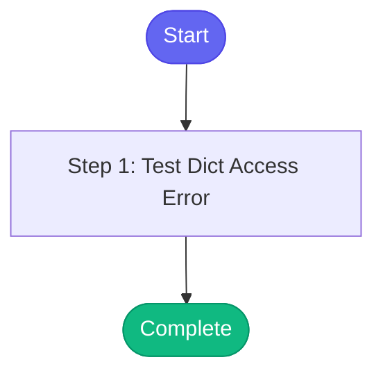

# ⚡ test_error_recovery

> Test skill to demonstrate interactive error recovery

## Overview

Test skill to demonstrate interactive error recovery

**Version:** 1.0

## Quick Start

```bash
skill_run("test_error_recovery", '{"issue_key": "AAP-12345"}')
```

## Inputs

| Input | Type | Required | Default | Description |
|-------|------|----------|---------|-------------|
| `test_value` | string | No | `hello` |  |

## Process Flow



## Detailed Steps

### Step 1: Test Dict Access Error

**Description:** Deliberately trigger dict attribute error

**Tool:** `compute`


## MCP Tools Used (0 total)

No external tools (compute-only skill)

## Related Skills

_(To be determined based on skill relationships)_
