# 🧪 test_mr_ephemeral

> Deploy an MR to ephemeral environment and run tests

## Overview

The `test_mr_ephemeral` skill deploys a merge request's Docker image to an ephemeral Kubernetes namespace for testing. It handles the entire workflow from image verification to test execution.

## Quick Start

```
skill_run("test_mr_ephemeral", '{"mr_id": 1450}')
```

With billing ClowdApp:

```
skill_run("test_mr_ephemeral", '{"mr_id": 1450, "billing": true}')
```

## Inputs

| Input | Type | Required | Default | Description |
|-------|------|----------|---------|-------------|
| `mr_id` | integer | No* | - | GitLab MR ID |
| `commit_sha` | string | No* | - | Specific commit SHA |
| `duration` | string | No | `2h` | Namespace duration (1h, 2h, 4h) |
| `run_tests` | boolean | No | `true` | Run pytest after deploy |
| `billing` | boolean | No | `null` | Force billing ClowdApp (null = auto-detect) |
| `cleanup_on_failure` | boolean | No | `true` | Release namespace on failure |
| `cleanup_on_success` | boolean | No | `false` | Release after tests pass |

*One of `mr_id` or `commit_sha` is required

## Flow

```mermaid
flowchart TD
    START([Start]) --> INPUT{MR or SHA?}
    
    INPUT -->|MR ID| GET_MR[Get MR from GitLab]
    INPUT -->|SHA| USE_SHA[Use SHA Directly]
    
    GET_MR --> MERGED{MR Merged?}
    MERGED -->|Yes| MERGE_SHA[Use merge_commit_sha]
    MERGED -->|No| HEAD_SHA[Use head SHA]
    MERGE_SHA --> FULL_SHA
    HEAD_SHA --> FULL_SHA
    USE_SHA --> FULL_SHA
    
    FULL_SHA[Expand to Full 40-char SHA] --> QUAY[Check Quay for Image]
    
    QUAY --> EXISTS{Image Exists?}
    EXISTS -->|No| STOP[❌ STOP: Wait for Konflux build]
    EXISTS -->|Yes| DIGEST[Extract SHA256 Digest]
    
    DIGEST --> CLOWDAPP{Billing ClowdApp?}
    
    CLOWDAPP -->|Auto| DETECT[Auto-detect from Jira/Commits]
    CLOWDAPP -->|Manual| CHOOSE[Use specified ClowdApp]
    
    DETECT --> RESERVE
    CHOOSE --> RESERVE
    
    RESERVE[Reserve Namespace] --> DEPLOY[Deploy via Bonfire]
    
    DEPLOY --> WAIT[Wait for Pods Ready]
    WAIT --> READY{All Ready?}
    
    READY -->|No| TIMEOUT[⚠️ Deployment timeout]
    READY -->|Yes| TESTS{Run Tests?}
    
    TESTS -->|No| DONE
    TESTS -->|Yes| CREDS[Get DB Credentials]
    
    CREDS --> PYTEST[Run Pytest in Pod]
    PYTEST --> RESULTS[Collect Results]
    RESULTS --> DONE([✅ Complete])
    
    style START fill:#6366f1,stroke:#4f46e5,color:#fff
    style DONE fill:#10b981,stroke:#059669,color:#fff
    style STOP fill:#ef4444,stroke:#dc2626,color:#fff
    style TIMEOUT fill:#f59e0b,stroke:#d97706,color:#fff
```



## ClowdApp Detection

The skill auto-detects which ClowdApp to deploy:


Billing indicators:
- Jira issue mentions "billing"
- Modifies `aap_billing_controller/` files
- Modifies `test/processor/aap_billing_controller/`

## Critical Rules

⚠️ **NEVER do these:**

| ❌ Don't | ✅ Do Instead |
|---------|---------------|
| `cp ~/.kube/config.e ~/.kube/config` | Use `--kubeconfig=~/.kube/config.e` |
| Use short SHA (8 chars) | Always use full 40-char SHA |
| Run raw `bonfire deploy` | Use MCP tools (`bonfire_deploy_aa`) |
| Guess image tags | Verify with `quay_get_tag` first |

## MCP Tools Used

- `gitlab_mr_view` - Get MR details and SHA
- `quay_get_tag` - Verify image exists, get digest
- `bonfire_namespace_reserve` - Reserve namespace
- `bonfire_deploy_aa` - Deploy application
- `kubectl_get_pods` - Check pod status
- `kubectl_exec` - Run tests in pod

## Example Output

```
You: Deploy MR 1450 to ephemeral

Claude: 🧪 Deploying MR !1450 to ephemeral...
        
        ✅ MR Details:
        ├── Title: AAP-61660 - fix(billing): Handle edge case
        ├── Commit: 1244ec49e6026541d06cf9869b1c7c80d0e9d266
        └── Author: daoneill
        
        ✅ Image Verification:
        ├── Found in Quay
        └── Digest: sha256:20a4c9760040bf9e8446b921f1415c7e...
        
        ✅ ClowdApp Detection:
        └── Billing (Jira mentions billing features)
        
        ✅ Namespace Reserved:
        └── ephemeral-nx6n2s (expires in 2h)
        
        ✅ Deployment:
        └── tower-analytics-billing-clowdapp deployed
        
        ⏳ Waiting for pods... (3/3 ready)
        
        ✅ Running Tests:
        ├── Collected 45 tests
        ├── Passed: 45
        └── Failed: 0
        
        📋 Summary:
        └── Namespace: ephemeral-nx6n2s
        └── Status: All tests passed ✅
```

## Related Skills

- [investigate_alert](./investigate_alert.md) - Debug issues in namespace
- [review_pr](./review_pr.md) - Review the MR code
- [create_mr](./create_mr.md) - Create the MR first


