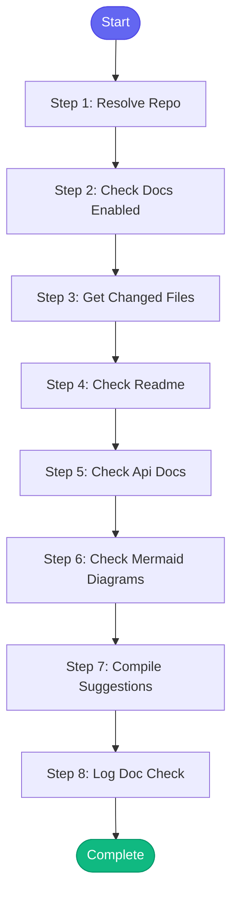

# ⚡ update_docs

> Check and update repository documentation before creating a PR/MR

## Overview

Check and update repository documentation before creating a PR/MR.
- Scans for outdated docs based on code changes
- Updates mermaid diagrams if architecture changed
- Checks README.md for accuracy
- Updates API docs if endpoints changed
- Only runs for repos with docs.enabled=true in config.json

Uses MCP tools: git_log, git_diff, git_status, git_add, git_commit

**Version:** 1.0

## Quick Start

```bash
skill_run("update_docs", '{"issue_key": "AAP-12345"}')
```

## Inputs

| Input | Type | Required | Default | Description |
|-------|------|----------|---------|-------------|
| `repo` | string | No | `""` | Repository path - if not provided, uses current directory |
| `repo_name` | string | No | `-` | Repository name from config (e.g., 'automation-analytics-backend') |
| `issue_key` | string | No | `""` | Jira issue key for commit message |
| `auto_commit` | boolean | No | `False` | Automatically commit doc updates |
| `check_only` | boolean | No | `False` | Only check, don't suggest updates |

## Process Flow



## Detailed Steps

### Step 1: Resolve Repo

**Description:** Determine which repo to check

**Tool:** `compute`

### Step 2: Check Docs Enabled

**Description:** Skip if docs not enabled for this repo

**Tool:** `compute`

### Step 3: Get Changed Files

**Description:** Get list of files changed in this branch

**Tool:** `compute`

**Condition:** `not docs_check.skip`

### Step 4: Check Readme

**Description:** Check if README needs updating based on changes

**Tool:** `compute`

**Condition:** `not docs_check.skip`

### Step 5: Check Api Docs

**Description:** Check if API docs need updating

**Tool:** `compute`

**Condition:** `not docs_check.skip and resolved_repo.api_docs and len(changed_files.get('api', [])) > 0`

### Step 6: Check Mermaid Diagrams

**Description:** Check mermaid diagrams for staleness

**Tool:** `compute`

**Condition:** `not docs_check.skip and resolved_repo.diagrams`

### Step 7: Compile Suggestions

**Description:** Compile all documentation suggestions

**Tool:** `compute`

**Condition:** `not docs_check.skip`

### Step 8: Log Doc Check

**Description:** Log documentation check to session

**Tool:** `memory_session_log`

**Condition:** `not docs_check.skip`


## MCP Tools Used (1 total)

- `memory_session_log`

## Related Skills

_(To be determined based on skill relationships)_
