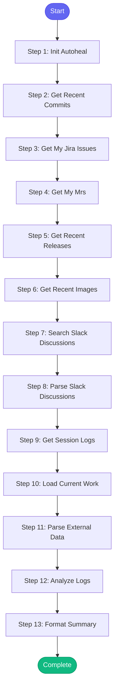

# ⚡ weekly_summary

> Generate a summary of work from session logs

## Overview

Generate a summary of work from session logs.

Aggregates session logs from the past week (or specified period)
and provides a summary of:
- Issues worked on
- MRs created/reviewed
- Deployments and debugging sessions
- Patterns learned

Useful for weekly reports or sprint reviews.

**Version:** 1.1

## Quick Start

```bash
skill_run("weekly_summary", '{"issue_key": "AAP-12345"}')
```

## Inputs

| Input | Type | Required | Default | Description |
|-------|------|----------|---------|-------------|
| `days` | integer | No | `7` | Number of days to look back (default: 7) |
| `format` | string | No | `markdown` | Output format: 'markdown' or 'slack' |
| `repo` | string | No | `automation-analytics-backend` | Repository to get commit history from |
| `slack_format` | boolean | No | `False` | Use Slack link format |

## Process Flow



## Detailed Steps

### Step 1: Init Autoheal

**Description:** Initialize failure tracking

**Tool:** `compute`

### Step 2: Get Recent Commits

**Description:** Get commits from the past week

**Tool:** `git_log`

### Step 3: Get My Jira Issues

**Description:** Get my recently updated Jira issues

**Tool:** `jira_my_issues`

### Step 4: Get My Mrs

**Description:** Get my recent merge requests

**Tool:** `gitlab_mr_list`

### Step 5: Get Recent Releases

**Description:** Get recent Konflux releases

**Tool:** `konflux_list_releases`

### Step 6: Get Recent Images

**Description:** Get recent image tags from Quay

**Tool:** `quay_list_aa_tags`

### Step 7: Search Slack Discussions

**Description:** Search Slack for relevant team discussions

**Tool:** `slack_search_messages`

### Step 8: Parse Slack Discussions

**Description:** Parse Slack discussions

**Tool:** `compute`

### Step 9: Get Session Logs

**Description:** Read session logs from memory directory

**Tool:** `compute`

### Step 10: Load Current Work

**Description:** Load current work state

**Tool:** `memory_read`

### Step 11: Parse External Data

**Description:** Parse data from git, jira, gitlab, konflux

**Tool:** `compute`

### Step 12: Analyze Logs

**Description:** Analyze session logs for summary

**Tool:** `compute`

### Step 13: Format Summary

**Description:** Format summary for output

**Tool:** `compute`


## MCP Tools Used (7 total)

- `git_log`
- `gitlab_mr_list`
- `jira_my_issues`
- `konflux_list_releases`
- `memory_read`
- `quay_list_aa_tags`
- `slack_search_messages`

## Related Skills

_(To be determined based on skill relationships)_
